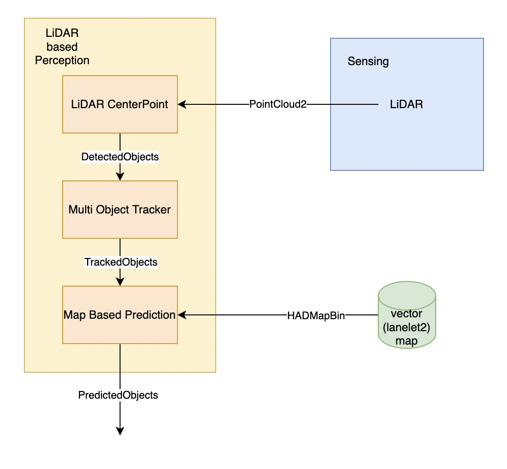
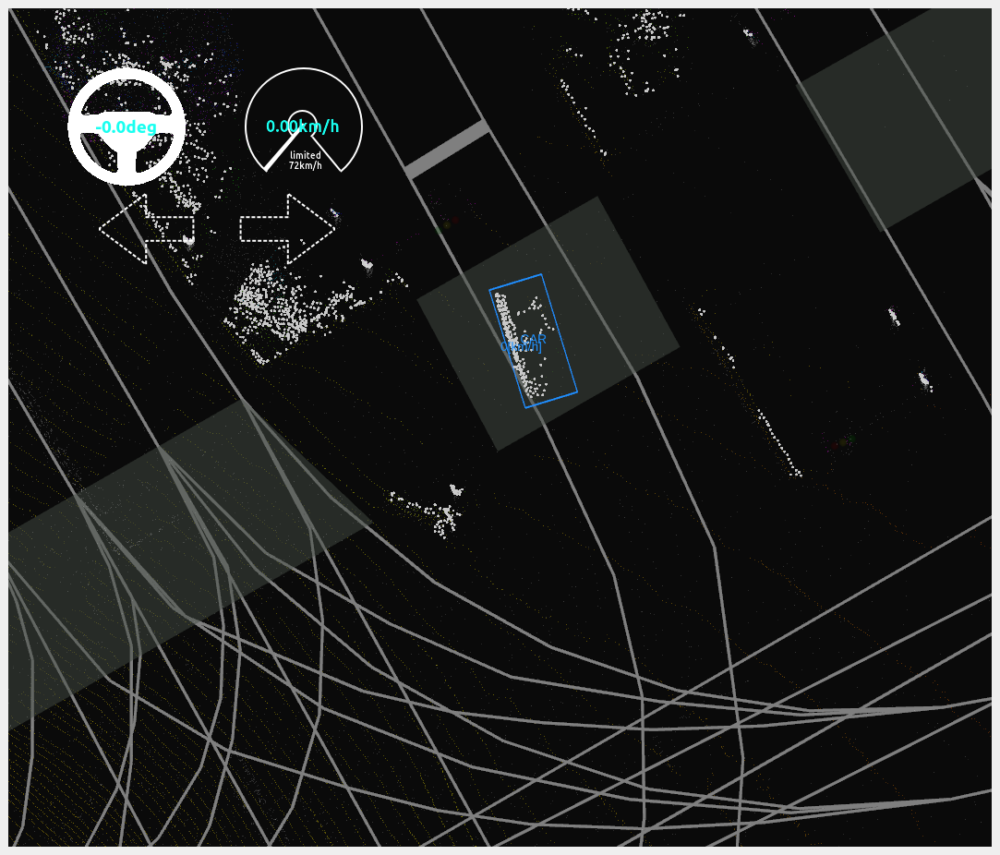
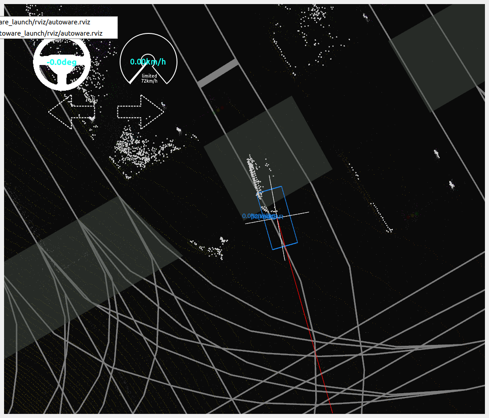
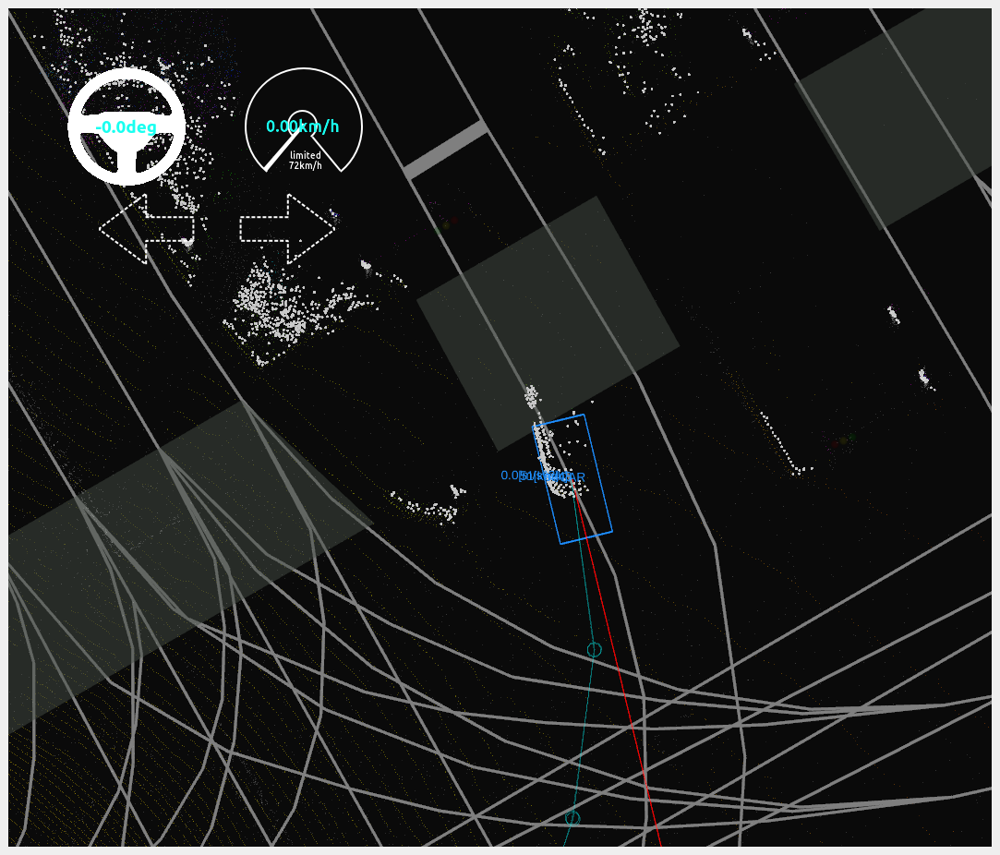

# LiDAR Based Perception

## Overview

1. The pointcloud from LiDAR is received by [LiDAR CenterPoint](https://github.com/autowarefoundation/autoware.universe/tree/main/perception/lidar_centerpoint) for pointcloud object detection, obtaining object classification, position, and size information, and outputting [DetectedObjects](https://github.com/tier4/autoware_auto_msgs/blob/tier4/main/autoware_auto_perception_msgs/msg/DetectedObjects.idl).

2. [Multi Object Tracker](https://github.com/autowarefoundation/autoware.universe/tree/main/perception/multi_object_tracker) receives [DetectedObjects](https://github.com/tier4/autoware_auto_msgs/blob/tier4/main/autoware_auto_perception_msgs/msg/DetectedObjects.idl) and performs object tracking to obtain object classification, position, shape, velocity, and acceleration information. It outputs [TrackedObjects](https://github.com/tier4/autoware_auto_msgs/blob/tier4/main/autoware_auto_perception_msgs/msg/TrackedObjects.idl).

3. [Map Based Prediction](https://github.com/autowarefoundation/autoware.universe/tree/main/perception/map_based_prediction) receives [TrackedObjects](https://github.com/tier4/autoware_auto_msgs/blob/tier4/main/autoware_auto_perception_msgs/msg/TrackedObjects.idl), predicts object trajectories based on [map information](../mapping/lanelet2-map.md), and outputs [PredictedObjects](https://github.com/tier4/autoware_auto_msgs/blob/tier4/main/autoware_auto_perception_msgs/msg/PredictedObjects.idl).

## How To Use

### Launch Perception 
[Launch Autoware](./launch-autoware.md)

### LiDAR CenterPoint

Detect objects in pointcloud using [CenterPoint](https://github.com/tianweiy/CenterPoint), you can see the `CAR` obejct in the blue box.

#### Input Topics
|**Topic**|**Type**|**Description**|
|---------|-------|--------|
|/sensing/lidar/concatenated/pointcloud|sensor_msgs/msg/PointCloud2|realtime pointcloud|

#### Output Topics
|**Topic**|**Type**|**Description**|
|---------|-------|--------|
|/perception/object_recognition/detection/centerpoint/objects|[autoware_auto_perception_msgs/msg/DetectedObjects](https://github.com/tier4/autoware_auto_msgs/blob/tier4/main/autoware_auto_perception_msgs/msg/DetectedObjects.idl)|Detected Objects|

### Multi Object Tracker

multi-frame object association using `Data Association`, use `EKF Tracker` to obtain object tracking with a unique uuid. The speed is visualized by the red line.

#### Data Association
associate the data of the multi-frame perception results, convert it into the `Min Cost Max Flow problem`, and solve it using [mussp](https://github.com/yu-lab-vt/muSSP) to obtain the connection between the multi-frame perception results.

#### EKF Tracker
Choose different models for different classifications to track the perception results and improve tracking stability and accuracy.

#### Input Topics
|**Topic**|**Type**|**Description**|
|---------|-------|--------|
|/perception/object_recognition/detection/centerpoint/objects|[autoware_auto_perception_msgs::msg::DetectedObjects](https://github.com/tier4/autoware_auto_msgs/blob/tier4/main/autoware_auto_perception_msgs/msg/DetectedObjects.idl)|detected objects|

#### Output Topics
|**Topic**|**Type**|**Description**|
|---------|-------|--------|
|/perception/object_recognition/tracking/objects|[autoware_auto_perception_msgs/msg/TrackedObjects](https://github.com/tier4/autoware_auto_msgs/blob/tier4/main/autoware_auto_perception_msgs/msg/TrackedObjects.idl)|Tracked objects without trajectory|

### Map Based Prediction

Predict the object's future trajectory based on the map and the tracked object to improve the safety and stability of [path planning](./lane-driving.md).

#### Remove Old Data in History

store the time series data of objects, which includes the position, speed, and time information, to predict if the objects need to lane change or not.

#### Get Current Lanelet Then Update Objects Data

Detect whether if the object need to change lane or to to do left lane change or right lane change.

#### Generate predicted Trajectories for objects

According to the lane change information and map information, generate the predicted reference trajectories for objects.

#### Input Topics
|**Topic**|**Type**|**Description**|
|---------|-------|--------|
|/perception/object_recognition/tracking/objects|[autoware_auto_perception_msgs/msg/TrackedObjects](https://github.com/tier4/autoware_auto_msgs/blob/tier4/main/autoware_auto_perception_msgs/msg/TrackedObjects.idl)|Tracked Objects without trajectory|
|/map/vector_map|autoware_auto_mapping_msgs/msg/HADMapBin|lanelet2 map|

#### Output Topics
|**Topic**|**Type**|**Description**|
|---------|-------|--------|
|/perception/object_recognition/objects|[autoware_auto_perception_msgs::msg::PredictedObjects](https://github.com/tier4/autoware_auto_msgs/blob/tier4/main/autoware_auto_perception_msgs/msg/PredictedObjects.idl)|objects with predicted trajectories|

## Reference

- [autoware_auto_perception_msgs](https://github.com/tier4/autoware_auto_msgs/tree/tier4/main/autoware_auto_perception_msgs/msg)
- [lidar centerpoint in Autoware](https://github.com/autowarefoundation/autoware.universe/tree/main/perception/lidar_centerpoint)
- [CenterPoint](https://github.com/tianweiy/CenterPoint)
- [multi object tracker in Autoware](https://github.com/autowarefoundation/autoware.universe/tree/main/perception/multi_object_tracker)
- [muSSP](https://github.com/yu-lab-vt/muSSP)
- [map based prediction](https://github.com/autowarefoundation/autoware.universe/tree/main/perception/map_based_prediction)

