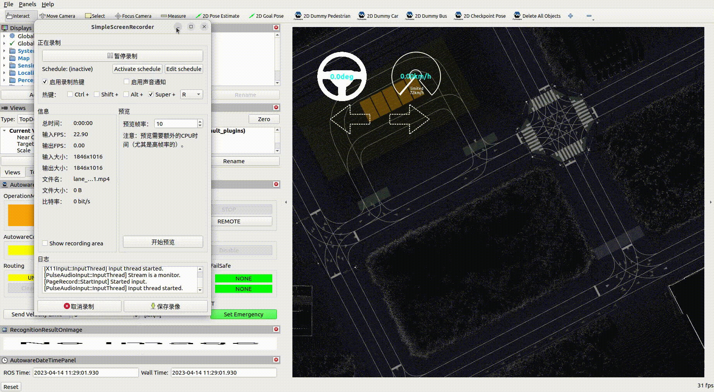

# Lane Driving

## overview

This tutorial describes how to use Autoware to implement lane driving mode. The page will cover the following aspects: the overall process, command operation and debugging parameters of lane driving. 
## overall process
The overall process of lane driving is shown in the figure below.
 

> * This function needs to a lanlet map so that the vehivle can implement mode of lane drving，Therefore, please use the lanlet2 map drawing tool for map drawing. For specific drawing methods, please refer to[lanelet2-map](../mapping/lanelet2-map.md)。
> * If you need to use it in a real car, please make sure that the vehicle's lidar, camera and gnss can work normally. For specific hardware configuration, please refer to[LiDAR-installation](../install-sensors/LiDAR-installation.md)、[camera-installation](../install-sensors/camera-installation.md)、[GNSS-installation](../install-sensors/GNSS-installation.md)。

For lane driving, it contains the follow modules：Missison Planner(mission_planner), Behavior Planner(behavior_path_planner、behavior_velocity_planner), Motion Planner(obstacle_avoidance_planner、obstacle_veocity_limit、obstacle_stop_planner)

**mission_planner** : it will receive the initial pose, the goal pose of the vehicle, and the lanelet2 map, then will plan a global route which from the initial pose to the goal pose.   
**behavior_path_planner** ： After received the global route from the mission planning, it will combined with the sensor data of the vehicle and road traffic conditions and generate the drivable path, the drivable area of the vehicle.   
**behavior_velocity_planner** : After obtained the drivable path, the velocity of path will be calculated further base on the traffic rules   
**obstacle_avoidance_planner** : When received the drivable path, it will plan a collision-free trajectory according to the vehicle's sensors and surrounding obstacle.  
**obstacle_velocity_limit** : Further optimize the velocity of the trajectory. For example: the optimized trajectory will reduce the speed during the curve driving   
**obstacle_stop_planner** : According to the surrounding obstacle and vehicle status, this module realizes stop, slowing down, or adaptive cruise when encountering obstacles.    
**scenario_selector** : it will select the corresponding trajectory according to different scenarios. As we know autoware divided the scene into two categories: lane driving and freespace. But we only consider the lane driving scenario, we can ignored it.   
**motion_velocity_optimizer** : Smooth the output trajectory and send it to the control module    

Main Subscription Topics

| Input                             | topic name(type of data)                                                                                            | Instruction                                                                                                             |
| ------------------------------- | --------------------------------------------------------------------------------------------------------------------- | --------------------------------------------------------------------------------------------------------------- |
| goal pose        | `/planning/mission_planning/goal`<br>(geometry_msgs::PoseStamped)                                                                    | It is specified by the user and obtained through the ui interface or command                                                                        |
| initial pose      | `/initialpose`<br>(geometry_msgs::PoseWithCovarianceStamped)                                                                        | It is specified by the user and obtained through the UI interface or commands |
| odometer         | `/localization/kinematic_state`<br>(nav_msgs/msg/Odometry)                                                                           | It includes the vehicle's pose and velocity information                                               |
| lanelet2 map   | `/map/vector_map`<br>(autoware_auto_mapping_msgs/msg/HADMapBin)                                                                        | This includes all static information about the environment, such as: <ul><li>Information about lane connections on maps</li> <li>Information about traffic rules (lane speed limits, etc.) </li>|</ul>  |
| Dynamic Obstacles      | `/perception/object_recognition/objects`<br>(autoware_auto_perception_msgs/msg/PredictedObjects)                               | The perception module analyzes sensor data such as point clouds (LIDAR) and images (camera) and pre-processes them to obtain                                                          |
| Traffic Light Recognition Results   | `/perception/traffic_light_recognition/traffic_signals`<br>(autoware_auto_perception_msgs/msg/TrafficSignalArray) | The perception module analyzes images data (camera) and pre-processes them to obtain

Main Publish Topics

| Output               | topic(type of data)                                                                         | Instruction                                                                                                                                                                     |
| -------------------- | ------------------------------------------------------------------------------------------- | ------------------------------------------------------------------------------------------------------------------------------------------------------------------------------- |
| output trajectory    | `/planning/scenario_planning/trajectory`<br>(_autoware_auto_planning_msgs/msg/Trajectory_)  | The trajectory is a set of sequences including pose, velocity and acceleration. It needs to be executed by the control module. The trajectory must be smooth and meet the vehicle kinematics requirements (can be executed by the controller) |
| turn signal          | `/planning/turn_indicators_cmd`<br>(_autoware_auto_vehicle_msgs/msg/TurnIndicatorsCommand_) | This is the output used to control the turn signal of the vehicle. The planning module needs to ensure that the turn signal will be turned on according to the planning results |


## Get started quickly
This section will introduce how to implement autoware's lane driving mode through UI interface or command line.
> Note: The following will use the map file and vehicle simulation model provided by autoware. If the user uses own's map or vehicle model, please modify it by yourself.     
 
1. Start the autoware simulation program and execute the following command：
```bash
$ ros2 launch autoware_launch planning_simulator.launch.xml map_path:=$HOME/autoware_map/sample-map-planning vehicle_model:=sample_vehicle sensor_model:=sample_sensor_kit
```

Note: the parameter map path needs to fill in the specific location of the map file. In this example, `$home/autoware map/sample map planning` indicates that the map is actually stored in the autoware_map folder under the home directory, and the map file name is sample_map_planning.   
2. In the RVIZ interface, setting the initial pose of the vehicle and the goal pose, then it will plan a global route according to these information for vehicle.

Note: The planning will fail if the orientation of goal pose is the opposite of lane direction. As shown in the example below.

3. In the RVIZ interface, select the `AutowareStatePanel` panel, click `AUTO`, the vehicle will start to drive automatically.
Or use the following command
```bash
$ ros2 topic pub -1 /autoware/engage autoware_auto_vehicle_msgs/msg/Engage engage:\ true
```
Note: During the real vehicle test, due to the changeable environment, the vehicle initialization process won't go so well, In Rviz, Maybe the word `uninitialized` will appear in the column of localization that indicating the initialization positioning has not been successful. At this time, `AUTO` is not available. Usually, it's okay to  wait a while, but if it still fails for a long time, please check whether the sensor is working normally.    
4. Place dynamic obstacles on the map (take pedestrians as an example).

Set up properties of dynamic obstacles (take pedestrians as an example)


## Debug parameters
This section will introduce how to adjust the driving effect of the vehicle by modifying the configuration file in the planning module    
**To be continue**
