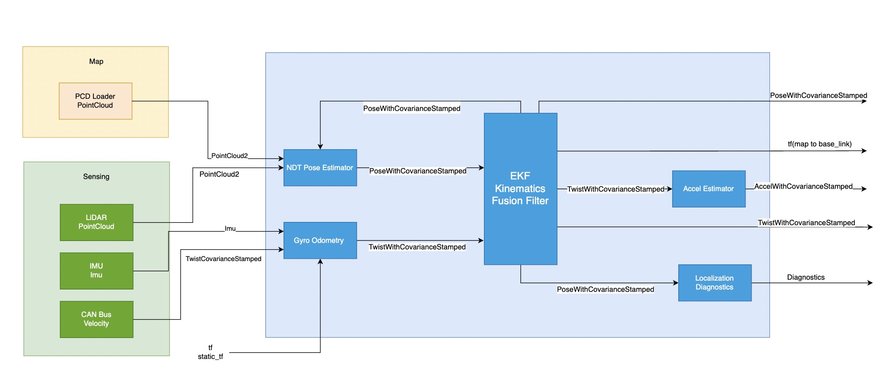

# Multi-Sensor Fusion Localization

## Overview

1. The wheel speed feedback of the chassis and the angular velocity of the IMU need to be fused to output `TwistWithCovarianceStamped` in the base_link coordinate system.
2. Use the pointcloud map and LiDAR pointcloud for matching to output `PoseWithCovarianceStamped` in the `map` coordinate system.
3. Use EKF to filter the fused `TwistWithCovarianceStamped` and `PoseWithCovarianceStamped` from the pointcloud map to obtain high-frequency and smooth positioning information.
4. Use the fused `PoseWithCovarianceStamped` as the initial pose for pointcloud matching.

## Input Data
|**topic**|**type**|**description**|
|-------------------|---------------------------|---------------------|
|/map/pointcloud_map|sensor_msgs/msg/PointCloud2|pointcloud map|
|/localization/util/downsample/pointcloud|sensor_msgs/msg/PointCloud2|Real-time downsampled pointcloud|
|/sensing/vehicle_velocity_converter/twist_with_covariance|geometry_msgs/msg/TwistCovarianceStamped|Chassis wheel speed feedback, providing linear velocity|
|/sensing/imu/imu_data|sensor_msgs/msg/Imu|IMU data, providing angular velocity|

## Output Data

|**topic**|**type**|**description**|
|-------------------|---------------------------|---------------------|
|/localization/kinematic_state|nav_msgs/msg/Odometry|Fused Odometry data|
|/localization/pose_with_covariance|geometry_msgs/msg/PoseWithConvarianceStamped|Fused pose data|

## Fusion Localization Demo

## Reference
[https://autowarefoundation.github.io/autoware-documentation/main/design/autoware-architecture/localization/](https://autowarefoundation.github.io/autoware-documentation/main/design/autoware-architecture/localization/)