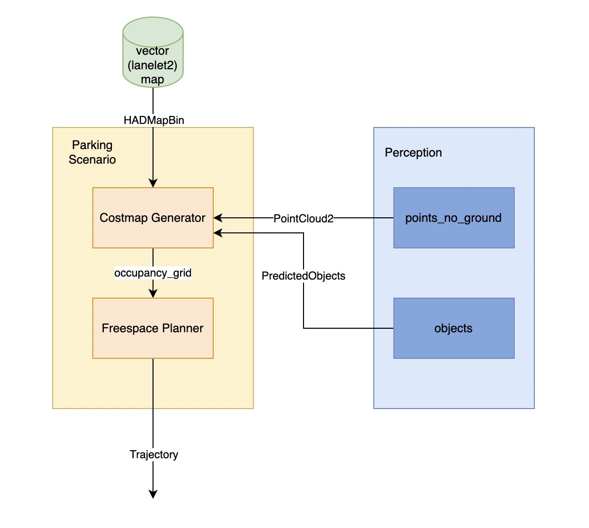
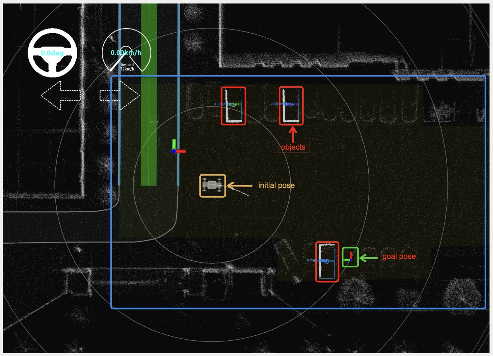
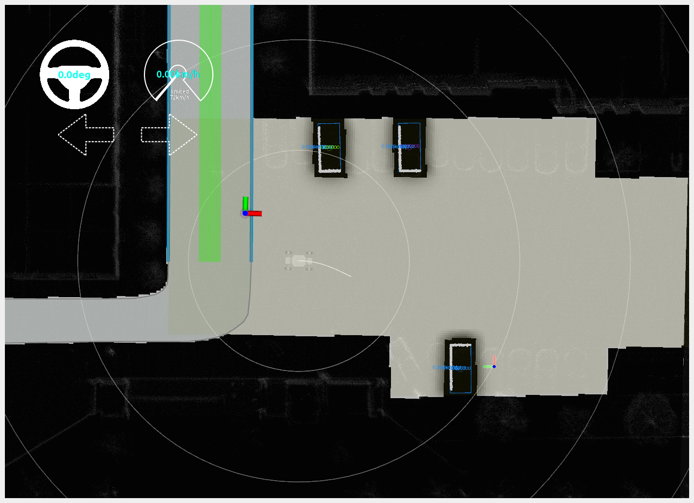
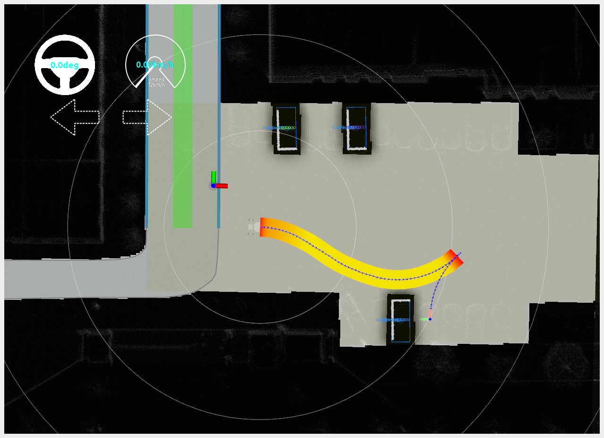

# Parking

## Overview

### How TO Use

1. Prepare a lanelet2 map and draw the `polygon` for the `parking_lot` area in the map. For reference on how to draw a lanelet2 map, see [lanelet2 map](../mapping/lanelet2-map.md).
2. When the vehicle is within the `parking_lot` area, the planner will switch to `Parking scenario`, and the `costmap_generator` and `freespace_planner` will start working.
3. The `costmap_generator` generates an `occupancy_grid` as the cost map for the `freespace_planner`.
4. The `freespace_planner` uses the cost map for path searching and planning.
5. The final `trajectory` is passed to the [trajectory following](./trajectory-follower.md) module to generate control commands.

## Costmap Generator
As shown in the figure below, when the vehicle is within the `parking_lot` area (the light-yellow polygon inside the blue box), the `goal_pose`(the green box with the coordinate axis) is set, and there are `objects` (the red box).

After setting the target within the `parking_lot` area, the `occupancy_grip` cost map can be visualized. The drivable area has a lower cost, shown in gray, while the area occupied by obstacles has a higher cost, shown in black. It can be seen that the `lanelet` that overlaps with the `parking_lot` is also considered in the calculation of the `occupancy_grip`, as the vehicle may have to drive within the [lane_driving](./lane-driving.md) lane to reach the `parking_lot` while performing autonomous driving tasks. To avoid a gap in the map, the `lanelet` and `parking_lot` are connected by overlapping.

### Key Parameters

|**Parameter**|**Description**|**Default Value**|
|-------|-------|----------|
|grid_min_value|minimum cost for gridmap|0.0|
|grid_max_value|maximum cost for gridmap|1.0|
|grid_resolution|resolution for gridmap|0.2(m)|
|grid_length_x|size of gridmap for x direction|70.0(m)|
|grid_length_y|size of gridmap for y direction|70.0(m)|
|grid_position_x|offset from coordinate in x direction|0.0(m)|
|grid_position_y|offset from coordinate in y direction|0.0(m)|
|maximum_lidar_height_thres|maximum height threshold for pointcloud data|0.3(m)|
|minimum_lidar_height_thres|minimum height threshold for pointcloud data|-2.2(m)|
|expand_rectangle_size|expand object's rectangle with this value|1.0(m)|

## Freespace Planner
Given the vehicle's position `initial_pose` and `goal_pose`, the freespace_planner uses [A* Search](https://github.com/autowarefoundation/autoware.universe/tree/main/planning/freespace_planning_algorithms) to plan a feasible trajectory for the vehicle to reach the `goal_pose`.

Because the `freespace planner` may generate overlapping trajectories that can not be handled by the [controller](./trajectory-follower.md), so `freespace planner` split trajectory into serveral `partial trajectories` in order to make sure they can be used by `controller`. 

### Key Parameters 
#### Node Parameters

| **Parameter**                       | **Description**                          | **Default Value**     |
| ---------------------------- | ------------------------------| --------- |
| `vehicle_shape_margin_m`     | collision margin in planning algorithm | 1.0(m) |
| `waypoints_velocity`         | velocity in output trajectory | 5.0(km/h) |
| `th_arrived_distance_m`      | threshold distance to check if vehicle has arrived at the trajectory's endpoint | 1.0(m)    |
| `th_stopped_time_sec`        | threshold time to check if vehicle is stopped         | 1.0(s)    |
| `th_stopped_velocity_mps`    | threshold velocity to check if vehicle is stopped         | 0.01(m/s) |
| `th_course_out_distance_m`   | threshold distance to check if vehicle is out of course      | 1.0(m)    |
| `replan_when_obstacle_found` | whether replanning when obstacle has found on the trajectory   | true     |
| `replan_when_course_out`     | whether replanning when vehicle is out of course      | true      |

#### Planner Parameters

| **Parameter**               | **Description**        | **Default Value**    |
| -------------------------    | -------------------------- | ---------- |
| `time_limit`                 | time limit of planning  | 30000.0(s) |
| `minimum_turning_radius`     | minimum turning radius of robot            |9.0(m)      |
| `maximum_turning_radius`     | maximum turning radius of robot            |9.0(m)      |
| `theta_size`                 | the number of angle's discretization           |144        |
| `lateral_goal_range`         | goal range of lateral position         | 0.5       |
| `longitudinal_goal_range`    | goal range of longitudinal position         | 2.0        |
| `angle_goal_range`           | goal range of angle          | 6.0(deg)   |
| `curve_weight`               | additional cost factor for curve actions            | 1.2        |
| `reverse_weight`             | additional cost factor for reverse actions            | 2.0        |
| `obstacle_threshold`         | threshold for regarding a certain grid as obstacle    | 100        |

## Reference 
- [planning design](https://autowarefoundation.github.io/autoware-documentation/main/design/autoware-architecture/planning/)
- [costmap generator](https://github.com/autowarefoundation/autoware.universe/tree/main/planning/costmap_generator)
- [freespace planner](https://github.com/autowarefoundation/autoware.universe/tree/main/planning/freespace_planner)
- [freespace planner algorithm](https://github.com/autowarefoundation/autoware.universe/tree/main/planning/freespace_planning_algorithms)
