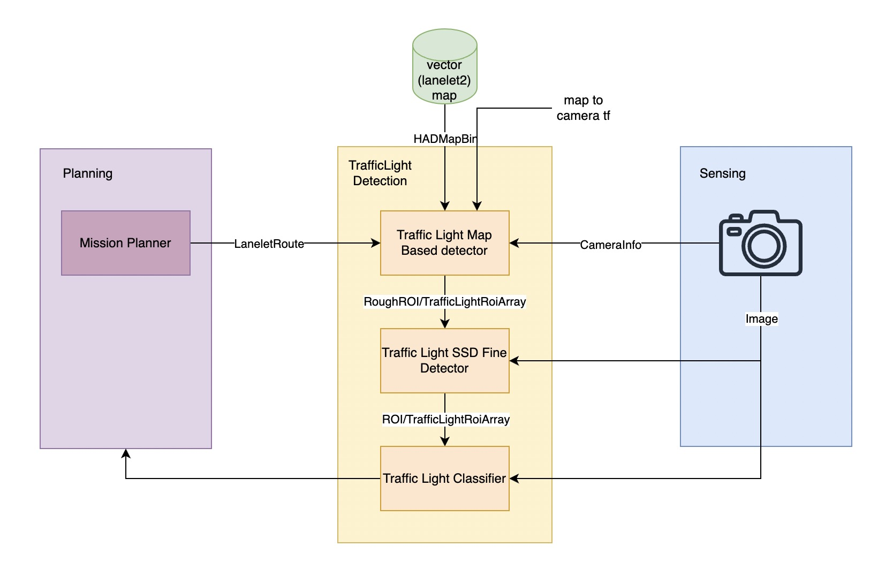
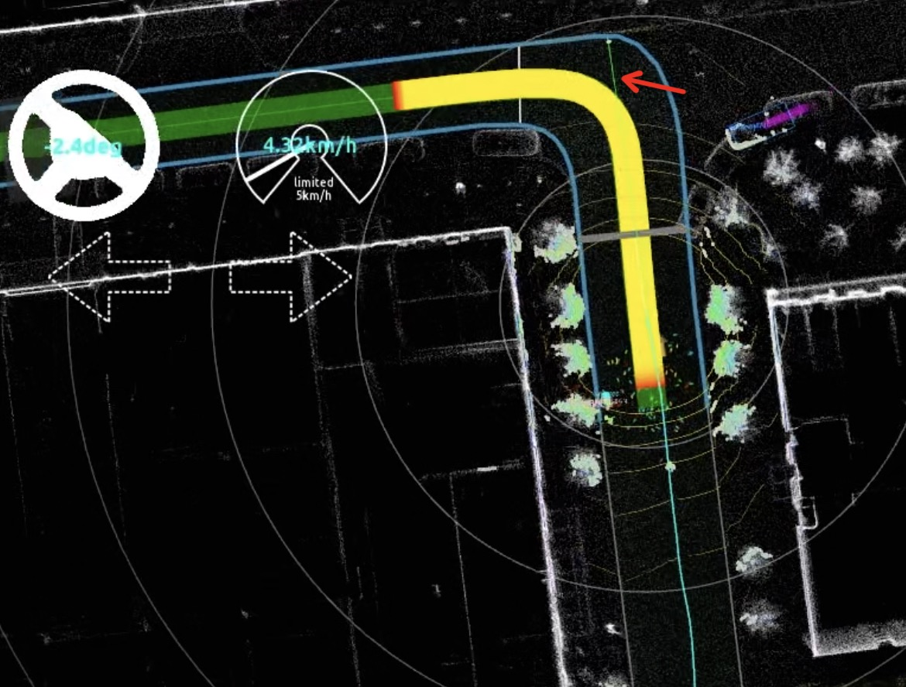
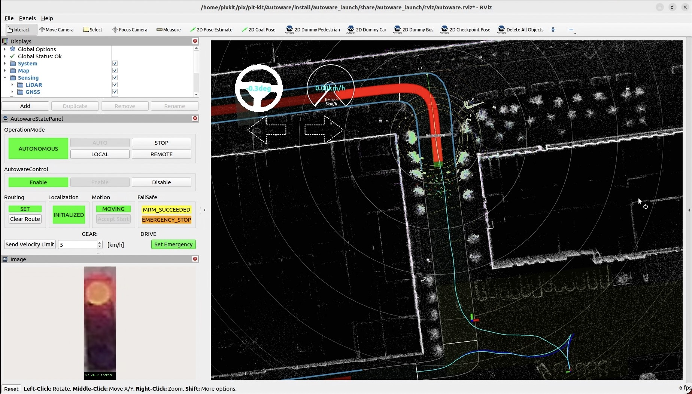
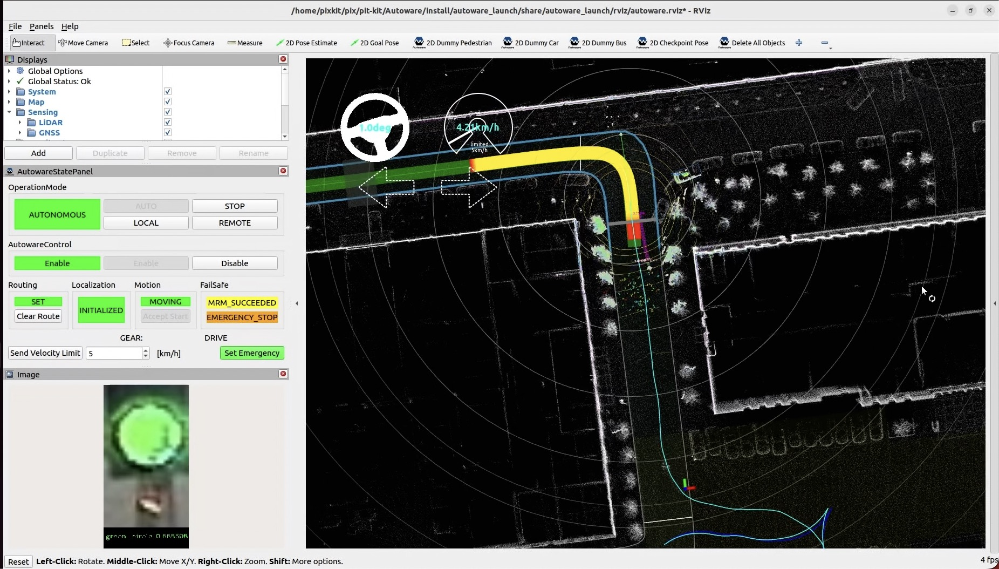

# Traffic Light Detection
## Overview

1. Obtain the rough ROI of the current traffic lights on the road through [traffic light map based detector](https://github.com/autowarefoundation/autoware.universe/tree/main/perception/traffic_light_map_based_detector), [camera intrinsics](../sensor-calibration/camera-intrisics-calibration.md), [camera extrinsics](../sensor-calibration/LiDAR-camera-calibration.md), and [vector map](../mapping/lanelet2-map.md).
2. obtain the fine ROI through [traffic light SSD fine detector](https://github.com/autowarefoundation/autoware.universe/tree/main/perception/traffic_light_ssd_fine_detector) based on rough ROI.
3. classify the traffic lights using [traffic light classifier](https://github.com/autowarefoundation/autoware.universe/tree/main/perception/traffic_light_classifier) based on the fine ROI.
4. Return the traffic light classification results to [behavior velocity planner](https://github.com/autowarefoundation/autoware.universe/tree/main/planning/behavior_velocity_planner) in the Planning module to modify the trajectory speed.

## How To Use
### Draw Lanelet2 Map
You need to draw `lanelet` and their referenced traffic_light in the Lanelet2 map. Refer to [lanelet2 map](../mapping/lanelet2-map.md).

### Calibrate Camera Intrinsics and Extrinsics
1. For intrinsics calibration, refer to [camera intrinsics calibration](../sensor-calibration/camera-intrisics-calibration.md) and save the parameters in `~/pix/pix-kit/Autoware/src/sensor_kit/external/pixkit_sensor_kit_launch/data/camera_info.yaml`.
2. For extrinsic calibration, refer to [LiDAR-Camera extrinsics calibration](../sensor-calibration/LiDAR-camera-calibration.md) and save the parameters in `~/pix/pix-kit/Autoware/src/param/autoware_individual_params/individual_params/config/default/pixkit_sensor_kit/sensors_calibration.yaml`.

### Set Goal Pose
Set the Goal Pose to generate a `LaneletRoute`. You can see a green line connecting the `traffic light` and the `vehicle` in the image below:

### Traffic Light Detection
- When a red signal is detected, the trajectory after the stop line becomes red, indicating that the vehicle will stop before the stop line

- When a green signal is detected, the trajectory after the stop line becomes yellow or green, indicating that the vehicle will pass the intersection with traffic lights. 

## Reference
- [traffic light map based detector](https://github.com/autowarefoundation/autoware.universe/tree/main/perception/traffic_light_map_based_detector)
- [traffic light SSD fine detector](https://github.com/autowarefoundation/autoware.universe/tree/main/perception/traffic_light_ssd_fine_detector)
- [traffic light classifier](https://github.com/autowarefoundation/autoware.universe/tree/main/perception/traffic_light_classifier)
- [behavior velocity planner](https://github.com/autowarefoundation/autoware.universe/tree/main/planning/behavior_velocity_planner)
- [design of planning in Autoware](https://autowarefoundation.github.io/autoware-documentation/main/design/autoware-architecture/planning/)