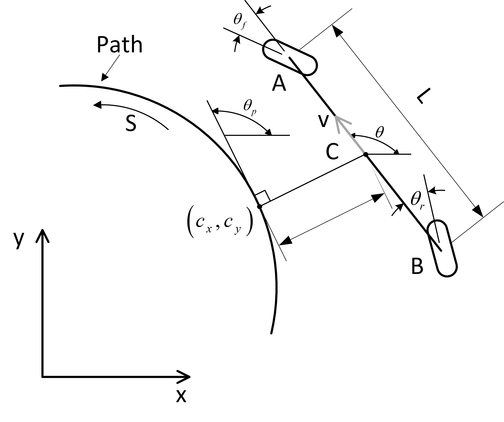

# Trajectory Tracking
> This document will introduce the file structure of the trajectory tracking module, the data interaction between various communication nodes, as well as the configuration of startup files and algorithm parameters.

## Overview
The trajectory tracking is a core module in Autoware. It is responsible for tracking the reference trajectory by using the lateral and longitudinal controllers to follow the trajectory points sent by the trajectory planning module.

## File Structure
The trajectory tracking module is located in [autoware.universe/control](https://github.com/autowarefoundation/autoware.universe/tree/main/control) and has the following structure:

|Directory                         | Brief Description  
|----------------------------------|------------------------------------------------------------------------------------------------------------------------  
|autonomous_emergency_braking      | Automatic Emergency Braking (AEB), which prevents collisions between the predicted trajectory (provided by the lateral controller) and obstacles
|control_performance_analysis      | Control performance analysis, which analyzes the tracking performance of the trajectory tracking module and monitors the driving status of the vehicle
|external_cmd_selector             | External command selector, switches vehicle mode (remote control mode/autonomous driving mode) according to input commands and current mode
|joy_controller                    | Joy controller, which converts remote control messages into vehicle control commands required by Autoware (such as steering angle, gear, turn signal, start key, etc.)
|mpc_lateral_controller            | Implementation of the MPC (Model Predictive Control) algorithm for lateral control. It generates lateral control commands (steering angle and steering rate) to follow the path and uses the vehicle model to simulate the trajectory generated by the control commands.
|obstacle_collision_checker        | Obstacle collision checker, which checks for collisions with obstacles using the predicted trajectory generated by the lateral controller and publishes diagnostic errors when a collision is detected.
|operation_mode_transition_manager | Operation mode transition manager, responsible for managing different operation modes of Autoware system. Possible modes are: `Autonomous`, `Local`, `Remote`, and `Stop`.
|pid_longitudinal_controller       | PID longitudinal controller, which uses the trajectory points speed sent by the Planner module as the reference speed, calculates the vehicle acceleration control signal using the PID algorithm, and achieves the specified target speed when passing through the target trajectory.
|pure_pursuit                      | Pure pursuit lateral controller, which implements the pure pursuit algorithm to generate lateral control commands (steering angle and steering rate) to track the path. 
|shift_decider                     | Shift decider, determines the size of the gear based on the control instructions output by controller.
|trajectory_follower_base          | Trajectory tracking controller interface, which provides a unified interface for lateral and longitudinal controllers for trajectory_follower_node.
|trajectory_follower_node          | Trajectory tracking controller node, which is a functional node implemented in the controller class derived from trajectory_follower_base, generating control commands to track the reference trajectory.
|vehicle_cmd_gate                  | Vehicle command throttle, a package that obtains information from emergency processing programs, planning modules, and external controllers and sends messages to the vehicle.

  
## Data Interaction

#### Subscribed Topics
|Topic Name | Message Type | Subscribed Node
|----------------------------------------------------------|--------------------------------------------------------|----------------------------------------------
|/autoware/state                                           | autoware_auto_system_msgs/msg/AutowareState            | shift_decider
|/control/command/control_cmd                              | autoware_auto_control_msgs/msg/AckermannControlCommand | operation_mode_transition_manager
|/control/gate_mode_cmd                                    | tier4_control_msgs/msgs/GateMode                       | vehicle_cmd_gate
|/control/shift_decider/gear_cmd                           | autoware_auto_vehicle_msgs/msg/GearCommand             | vehicle_cmd_gate
|/control/trajectory_follower/control_cmd                  | autoware_auto_control_msgs/msg/AckermannControlCommand | shift_decider
|/control/trajectory_follower/lateral/predicted_trajectory | autoware_auto_planning_msgs/msg/Trajectory             | autonomous_emergency_braking  lane_departure_checker  obstacle_collision_checker  
|/control/vehicle_cmd_gate/operation_mode                  | autoware_adapi_v1_msgs/msg/OperationModeState          | operation_mode_transition_manager
|/external/selected/control_cmd                            | autoware_auto_control_msgs/msg/AckermannControlCommand | vehicle_cmd_gate
|/external/selected/hazard_lights_cmd                      | autoware_auto_vehicle_msgs/msg/HazardLightsCommand     | vehicle_cmd_gate
|/external/selected/gear_cmd                               | autoware_auto_vehicle_msgs/msg/GearCommand             | vehicle_cmd_gate
|/external/selected/heartbeat                              | tier4_external_api_msgs/msg/Heartbeat                  | vehicle_cmd_gate
|/localization/acceleration                                | geometry_msgs/msgs/AccelWithCovarianceStamped          | trajectory_follower_node  vehicle_cmd_gate
|/localization/kinematic_state                             | nav_msgs/msgs/Odometry                                 | autonomous_emergency_braking  lane_departure_checker  obstacle_collision_checker  operation_mode_transition_manager   trajectory_follower_node  vehicle_cmd_gate  
|/map/vector_map                                           | autoware_auto_mapping_msgs/msg/HADMapBin               | lane_departure_checker  obstacle_collision_checker
|/perception/obstacle_segmentation/pointcloud              | sensor_msgs/msg/PointCloud2                            | autonomous_emergency_braking  obstacle_collision_checker
|/planning/hazard_lights_cmd                               | autoware_auto_vehicle_msgs/msg/HazardLightsCommand     | vehicle_cmd_gate 
|/planning/mission_planning/route                          | autoware_auto_planning_msgs/msg/LaneletRoute           | lane_departure_checker  obstacle_collision_checker
|/planning/scenario_planning/trajectory                    | autoware_auto_planning_msgs/msg/Trajectory             | trajectory_follower_node  obstacle_collision_checker  operation_mode_transition_manager   lane_departure_checker
|/planning/turn_indicators_cmd                             | autoware_auto_vehicle_msgs/msg/TurnIndicatorsCommand   | vehicle_cmd_gate
|/sensing/imu/imu_data                                     | sensor_msgs/msg/Imu                                    | autonomous_emergency_braking
|/system/emergency/control_cmd                             | autoware_auto_control_msgs/msg/AckermannControlCommand | vehicle_cmd_gate
|/system/emergency/gear_cmd                                | autoware_auto_vehicle_msgs/msg/GearCommand             | vehicle_cmd_gate
|/system/emergency/hazard_lights_cmd                       | autoware_auto_vehicle_msgs/msg/HazardLightsCommand     | vehicle_cmd_gate
|/system/fail_safe/mrm_state                               | autoware_adpi_v1_msgs/msgs/MrmState                    | vehicle_cmd_gate 
|/system/operation_mode/state                              | autoware_adpi_v1_msgs/msgs/OperationModeState          | vehicle_cmd_gate  trajectory_follower_node
|/vehicle/status/control_mode                              | autoware_auto_vehicle_msgs/msg/ControlMoedReport       | operation_mode_transition_manager
|/vehicle/status/gear_status                               | autoware_auto_vehicle_msgs/msg/GearReport              | vehicle_cmd_gate
|/vehicle/status/steering_status                           | autoware_auto_vehicle_msgs/msgs/SteeringReport         | operation_mode_transition_manager  trajectory_follower_node  vehicle_cmd_gate  
|/vehicle/status/velocity_status                           | autoware_auto_vehicle_msgs/msgs/VelocityReport         | autonomous_emergency_braking

#### Published Topic
| Topic Name | Message Type | Publishing Node
|----------------------------------------------------------|--------------------------------------------------------|----------------------------------------------
|/api/autoware/get/engage                                  | autoware_auto_vehicle_msgs/msg/Engage                  | vehicle_cmd_gate
|/api/autoware/get/emergency                               | autoware_auto_vehicle_msgs/msg/Emergency               | vehicle_cmd_gate
|/control/command/emergency_cmd                            |tire4_vehicle_msgs/msg/VehicleEmergencyStamped          | vehicle_cmd_gate      
|/control/command/control_cmd                              | autoware_auto_control_msgs/msg/AckermannControlCommand | vehicle_cmd_gate
|/control/command/gear_cmd                                 |autoware_auto_vehicle_msgs/msg/GearCommand              | vehicle_cmd_gate
|/control/command/turn_indicators_cmd                      |autoware_auto_vehicle_msgs/msg/TurnIndicatorsCommand    | vehicle_cmd_gate
|/control/command/hazard_lights_cmd                        | autoware_auto_vehicle_msgs/msg/HazardLightsCommand     | vehicle_cmd_gate
|/control/current_gate_mode                                |tire4_control_msgs/msg/GateMode                         | vehicle_cmd_gate
|/control/shift_decider/gear_cmd                           |autoware_auto_vehicle_msgs/msg/GearCommand              | shift_decider
|/control/trajectory_follower/control_cmd                  |autoware_auto_control_msgs/msg/AckermannControlCommand  | trajectory_follower_node
|/control/trajectory_follower/lateral/predicted_trajectory |autoware_auto_planning_msgs/msg/Trajectory              | trajectory_follower_node
|/control/trajectory_follower/lateral/diagnostic           |tier4_debug_msgs/Float32MultiArrayStamped               | trajectory_follower_node
|/control/trajectory_follower/longitudinal/slope_angle     |tier4_debug_msgs/Float32MultiArrayStamped               | trajectory_follower_node
|/control/trajectory_follower/longitudinal/diagnostic      |tier4_debug_msgs/Float32MultiArrayStamped               | trajectory_follower_node
|/control/vehicle_cmd_gate/operation_mode | autoware_adapi_v1_msgs/msgs/OperationModeState                          | vehicle_cmd_gate

## Parameter Configuration
The configuration file location of each node in this module: [autoware_launch/config/control](https://github.com/autowarefoundation/autoware_launch/tree/main/autoware_launch/config/control)
> Note: autoware.universe/control/*/config has the same configuration files as autoware_launch/config/control, but is loaded by default from autoware_launch/config/control

#### Key Configuration Parameters
|Parameter name | Parameter type | Parameter description | Optional value
|----------------------------------|--------|------------------------------------------------------------------------------------------------------------------------------------------------------------------------------------------------------------------------------|-------------------
|lateral_controller_mode           | string | When [starting launch file](https://github.com/autowarefoundation/autoware_launch/blob/main/autoware_launch/launch/components/tier4_control_component.launch.xml)，can specify the lateral controller to be loaded                                                         | mpc（by default），pure_pursuit 
|mpc_weight_steering_input         | double | For [mpc_lateral_controller](https://github.com/autowarefoundation/autoware_launch/blob/main/autoware_launch/config/control/trajectory_follower/lateral/mpc.param.yaml), it indicates the weight of the steering input. When the weight increases, the steering will be more stable, but the state error between the vehicle and the reference trajectory will increase.           | 0~inf
|mpc_weight_lat_error              | double | For [mpc_lateral_controller](https://github.com/autowarefoundation/autoware_launch/blob/main/autoware_launch/config/control/trajectory_follower/lateral/mpc.param.yaml), it indicates the weight of lateral error. When the weight increases, the vehicle is closer to the reference trajectory, but it is prone to oscillation                          | 0~inf
|mpc_weight_heading_error          | double | For [mpc_lateral_controller](https://github.com/autowarefoundation/autoware_launch/blob/main/autoware_launch/config/control/trajectory_follower/lateral/mpc.param.yaml), it indicates the heading error weight, when the weight is larger, the vehicle is more parallel to the trajectory, but it may make the lateral error convergence speed lower         | 0~inf
|mpc_weight_terminal_lat_error     | double | For [mpc_lateral_controller](https://github.com/autowarefoundation/autoware_launch/blob/main/autoware_launch/config/control/trajectory_follower/lateral/mpc.param.yaml), it indicates the lateral error at the end of the trajectory, when the weight is larger, the lateral error at the end of the vehicle is smaller, but it may affect the stability of the driving process      | 0.0~inf
|mpc_weight_terminal_heading_error | double | For [mpc_lateral_controller](https://github.com/autowarefoundation/autoware_launch/blob/main/autoware_launch/config/control/trajectory_follower/lateral/mpc.param.yaml), it indicates the heading error at the end of the trajectory, when the weight is larger, the heading error at the end of the vehicle is smaller, but it may affect the stability of the driving process       | 0.0~inf
|mpc_prediction_horizon            | double | For [mpc_lateral_controller](https://github.com/autowarefoundation/autoware_launch/blob/main/autoware_launch/config/control/trajectory_follower/lateral/mpc.param.yaml), It indicates the prediction time range, the larger the parameter, the longer the prediction time of the vehicle, improving the tracking performance, but the calculation cost will increase               | 0.0~inf [s]
|mpc_prediction_dt                 | double | For [mpc_lateral_controller](https://github.com/autowarefoundation/autoware_launch/blob/main/autoware_launch/config/control/trajectory_follower/lateral/mpc.param.yaml), It indicates the prediction time interval, the smaller the parameter, the smaller the prediction time interval of the vehicle, improving the tracking performance, but the computational cost will increase           | 0.0~inf [s]
|kp                                | double | For [pid_longitudinal_controller](https://github.com/autowarefoundation/autoware_launch/blob/main/autoware_launch/config/control/trajectory_follower/longitudinal/pid.param.yaml),  it indicates the weight of the longitudinal error, the larger the parameter, the smaller the error, but too large will make the motor output too large, you need to set a reasonable range | 0.0~inf
|ki                                | double | For [pid_longitudinal_controller](https://github.com/autowarefoundation/autoware_launch/blob/main/autoware_launch/config/control/trajectory_follower/longitudinal/pid.param.yaml), it indicates the weight of the longitudinal integration error, this parameter will make the longitudinal error smaller and smaller, need to set the range reasonably              | 0.0~inf
|kd                                | double | For [pid_longitudinal_controller](https://github.com/autowarefoundation/autoware_launch/blob/main/autoware_launch/config/control/trajectory_follower/longitudinal/pid.param.yaml), it indicates the weight of the rate of change of the longitudinal error, and this parameter can reduce the oscillation of the longitudinal error and needs to be set reasonably in the range           | 0.0~inf

#### Detailed configuration parameters
The detailed configuration of each node is shown below.  

|Node Name | Configure File Location |
|--------|---------|
|autonomous_emergency_braking      | <https://autowarefoundation.github.io/autoware.universe/main/control/autonomous_emergency_braking/#parameters>
|control_performance_analysis      | <https://autowarefoundation.github.io/autoware.universe/main/control/control_performance_analysis/#parameters> 
|joy_controller                    | <https://autowarefoundation.github.io/autoware.universe/main/control/joy_controller/#parameters>
|lane_departure_checker            | <https://autowarefoundation.github.io/autoware.universe/main/control/lane_departure_checker/#parameters>
|mpc_lateral_controller            | <https://autowarefoundation.github.io/autoware.universe/main/control/mpc_lateral_controller/#parameter-description>
|obstacle_collision_checker        | <https://autowarefoundation.github.io/autoware.universe/main/control/obstacle_collision_checker/#parameters>
|operation_mode_transition_manager | <https://autowarefoundation.github.io/autoware.universe/main/control/operation_mode_transition_manager/#parameters>
|pid_longitudinal_controller       | <https://autowarefoundation.github.io/autoware.universe/main/control/pid_longitudinal_controller/#parameter-description>
|pure_pursuit                      | None
|shift_decider                     | None
|vehicle_cmd_gate                  | <https://autowarefoundation.github.io/autoware.universe/main/control/vehicle_cmd_gate/#parameters>

## Four-Wheel Steering Vehicle Kinematic Model
Vehicles equipped with a four-wheel steering system are more agile than vehicles with the front-wheel steering system. Compared to vehicles with the same size but front-wheel steering structure, they have a smaller turning radius. This means they can maneuver or change direction in tighter spaces. When driving on highways, vehicles with a four-wheel steering system can improve the stability of the vehicle by adjusting the steering of the rear wheels to achieve a larger turning radius.

### Four-Wheel Steering Kinematic Model Based on Cartesian Coordinate System

As shown in the above figure, $A$ 、$B$、$C$ represent the centers of the front and rear wheels, as well as the vehicle's center of gravity respectively. $V$ denotes the vehicle's velocity,$\ell_f$ and $\ell_r$ represent the distances from the front and rear wheels to the vehicle's center of gravity, and $\delta_f$ and $\delta_r$ indicate the front and rear wheel steering angles respectively. $\psi$ represents the vehicle's heading angle, and $\beta$  represents the vehicle's sideslip angle. $O$  represents the vehicle's rotation center, and $R$ denotes the vehicle's turning radius.  
Decomposing the current velocity $V$ of the vehicle along the global coordinate system, we can denote it as $\dot{X}$ and $\dot{Y}$, $\dot{X}$represents the velocity of the vehicle along the global coordinate X-axis, and $\dot{Y}$ represents the velocity of the vehicle along the global coordinate y-axis. Therefore, we have the following equations:

\[
\begin{align}
\dot{X}=V \cos(\psi+\beta) \\
\dot{Y}=V \sin(\psi+\beta)
\end{align} 
\tag{1.1}
\]

 

According to the sine theorem, we have the following relation in angle $\angle OCA$:
$$
\frac{\sin \left(\delta_f-\beta\right)}{\ell_f}=\frac{\sin \left(\frac{\pi}{2}-\delta_f\right)}{R} \tag{1.2}
$$

Similarly, in angle $\angle OCB$, we have:
$$
\frac{\sin \left(\beta-\delta_r\right)}{\ell_r}=\frac{\sin \left(\frac{\pi}{2}+\delta_r\right)}{R} \tag{1.3}
$$

Expanding equation (1.2) using the  product-to-sum and sum-to-product formulas, we have:
$$
\frac{\sin(\delta_f) \cos(\beta) - \cos(\delta_f) \sin(\beta)}{\ell_f} = \frac{\cos(\delta_f)}{R} \tag{1.4}
$$

Similarly, expanding equation (1.3) using the product-to-sum formulas, we have:
$$
\frac{\sin(\beta) \cos(\delta_r) - \cos(\beta) \sin(\delta_r)}{\ell_r} = \frac{\cos(\delta_r)}{R} \tag{1.5}
$$

Multiplying both sides of equation (1.4) by $\frac{\ell_f}{\cos(\delta_f)}$, we have:
$$
\tan(\delta_f) \cos(\beta) - \sin(\beta) = \frac{\ell_f}{R} \tag{1.6}
$$

Multiplying both sides of equation (1.5) by $\frac{\ell_r}{\cos(\delta_r)}$, we have:
$$
\sin(\beta) - \cos(\beta) \tan(\delta_r) = \frac{\ell_r}{R} \tag{1.7}
$$

Adding equations (1.6) and (1.7), we have:
$$
\cos(\beta)(\tan(\delta_f) - \tan(\delta_r)) = \frac{\ell_f + \ell_r}{R}  \tag{1.8}
$$

When the vehicle is traveling at low speeds, the angular velocity of the vehicle can be expressed as follows:
$$
\dot{\psi} =\frac{V}{R} \tag{1.9} 
$$

Combining equations (1.8) and (1.9), we have:
$$
\dot{\psi} = \frac{V\cos(\beta)}{\ell_f + \ell_r} (\tan(\delta_f) - \tan(\delta_r)) \tag{1.10}
$$

Therefore, the kinematic equation of the vehicle can be expressed as follows:

\[
\begin{aligned}
\dot{X} & =V \cos (\psi+\beta) \\
\dot{Y} & =V \sin (\psi+\beta) \\
\dot{\psi} & =\frac{V \cos (\beta)}{\ell_f+\ell_r}\left(\tan \left(\delta_f\right)-\tan \left(\delta_r\right)\right)
\end{aligned} \tag{1.11}
\]

 

Where $\dot{X}$, $\dot{Y}$, and $\dot{\psi}$ represent the velocity of the vehicle along the $X$-axis, $Y$-axis and the angular velocity of the heading angle in the global coordinate system, respectively.

Assuming that the front and rear wheels steer in the same magnitude but opposite directions, i.e., when the vehicle turns, the steering angles of the front and rear wheels are equal in magnitude but opposite in direction. Furthermore, when the vehicle is traveling at low speeds, the influence of the sideslip angle on the vehicle's motion can be neglected, so we have $\beta=0$. In this case, the heading angle of the vehicle aligns with the direction of motion. Based on these assumptions, the kinematic equation for the vehicle regarding equation (1.11) can be simplified to:

\[
\begin{align*}
\dot{X} & =V \cos (\psi) \\  
\dot{Y} & =V \sin (\psi) \\
\dot{\psi} & =\frac{2 V \tan \left(\delta_f\right)}{\ell_f+\ell_r} 
\end{align*} \tag*{1.12}
\]

### Four-Wheel Steering Kinematic Model Based on Path Coordinate System
From the previous derivation, it is evident that the description of the vehicle's motion state depends on the coordinate system itself. When the vehicle is traveling on the road, we prefer to use a coordinate system based on the road to describe the vehicle's motion state. 

   

In the above figure, $e_{ra}$ represents the lateral distance of the vehicle to the road, $\theta$ represents the heading angle of the vehicle in the global coordinate system, $v$ represents the current velocity of the vehicle, and $\delta$ represents the steering angle of the vehicle. $(c_x, c_y)$ represents the projection point of the vehicle on the road (i.e., the nearest point of the vehicle on the road), and $\theta_p$ represents the angle between the tangent line at the projection point and the $x$-axis of the global coordinate system. $s$ represents the distance from the start point of the road to the projection point, and we will use $\kappa(s)$ to denote the curvature of the road at the projection point.
The curvature of the road at the projection point can be expressed as:
$$
\kappa(s)=\frac{d\theta_p}{ds} \tag{2.1}
$$
Establishing a coordinate system at the projection point along the tangent direction and its perpendicular direction, the distance from the perpendicular direction to the vehicle is denoted as $e_{ra}$  which is the lateral distance of the vehicle with respect to the road coordinate system. In this case, $\theta_{e}$ is denoted as the rotation angle of the vehicle relative to the road coordinate system, can be expressed as:
$$
\theta_e = \theta - \theta_p \tag{2.2}
$$

Therefore, the state variables of the vehicle in the road coordinate system can be represented as $\begin{bmatrix} s & e_{ra} & \theta_e \end{bmatrix}^\mathrm{T}$.

According to equation $(2.1)$, taking the derivative of $\theta_p$ with respect to time $t$, we have:
$$
\dot{\theta}_p=\kappa(s)\dot{s} \tag{2.3}
$$

According to the analysis in reference [2], it is known that:

\[
\dot{s}=v{\rm{cos}}(\theta_e)+\dot{\theta}_pe_{ra} \tag{2.4}
\]

Substituting equation (2.3) into equation (2.4) and rearranging, we have:
$$ 
\dot{s}=\frac{v\rm{cos}(\theta_e)}{1-e_{ra}\kappa(s)} \tag{2.5}
$$ 

Therefore, the lateral velocity of the vehicle in the Frenet coordinate system can be expressed as:

\[
\dot{e}_{ra}= v_{x_{car}} - v_{x_{traj}} \tag{2.6}
\]

$v_{x_{car}}$ represents the lateral velocity of the vehicle in the Frenet coordinate system, while $v_{x_{traj}}$ represents the lateral velocity of the projection point (reference trajectory) in the Frenet coordinate system. Since the projection point has a zero velocity in the perpendicular direction (Frenet coordinate), we have $v_{x_{traj}} = 0$. In other words:

\[
\dot{e}_{ra}=v{\rm{sin}}(\theta_e) \tag{2.7}
\]

According to equation (2.2), the angular velocity of the vehicle relative to the road is given by:
$$
\dot{\theta}_e=\dot{\theta}-\dot{\theta}_p \tag{2.8}
$$

From equation (1.12), we know that $\dot{\theta}=\frac{2 v \tan(\delta_f)}{L}$. According to reference [2], $\dot{\theta}p=\frac{v \kappa(s)\cos(\theta_e)}{1-e{ra}\kappa(s)}$. Substituting this into equation (2.8), we have:

\[
\dot{\theta}_e=\frac{2 v \tan \left(\delta_f\right)}{L}-\frac{ v \kappa(s){\rm{cos}}(\theta_e)}{1-e_{ra}\kappa(s)} \tag{2.9}
\]

By combining the above equations, we can obtain the kinematic model of a four-wheel steering vehicle in the road coordinate system as follows:

\[
\left[ \begin{array}{c} \dot{s} \\ \dot{e}_{ra} \\ \dot{\theta}_e  \end{array} \right] =\left[ \begin{array}{c} \frac{v\rm{cos}(\theta_e)}{1-e_{ra}\kappa(s)} \\ {v \rm{sin}(\theta_e)} \\ \frac{2 v \rm{tan}(\delta)}{L} - \frac{v \kappa(s)\rm{cos}(\theta_e)}{1-e_{ra}\kappa(s)} \end{array}  \right]\tag{2.10}
\]

## Control Algorithm
In Autoware.core/universe, vehicle control is divided into lateral control and longitudinal control. By decoupling the control problems, the algorithm complexity is reduced to meet the requirements of control performance. Longitudinal control is used for acceleration and deceleration of the vehicle's speed. Lateral control is used for steering control of the vehicle.
## Longitudinal Control Algorithm for Vehicle based on Road Coordinate System
**To be completed**

## Lateral Control Algorithm for Vehicle based on Road Coordinate System
Currently, vehicle lateral control algorithms can be broadly categorized into three types:    

1. Geometry-based lateral control algorithms, such as Pure Pursuit and Stanley. These algorithms utilize geometric principles to control the vehicle's lateral movement, determining the appropriate steering angle based on the desired trajectory.   
2. Model-based lateral control algorithms, such as LQR (Linear Quadratic Regulator) and MPC (Model Predictive Control). These algorithms employ mathematical models of the vehicle and the environment to optimize control inputs and achieve desired lateral behavior.
3. Machine learning-based lateral control algorithms, such as Reinforcement Learning and Deep Learning. These algorithms leverage machine learning techniques to learn and adapt control policies based on observed data, enabling the vehicle to make lateral control decisions autonomously.

In Autoware.core/universe, two lateral control algorithms are provided: Pure Pursuit and MPC (Model Predictive Control). Users can choose the appropriate algorithm based on their specific requirements and needs.

### Model Predictive Control
Model Predictive Control (MPC) is an algorithm based on the idea of using a mathematical model of the target system to make predictions and optimize control inputs over a future time horizon. It involves formulating an optimization problem to find the optimal control inputs that minimize a cost function while satisfying system constraints. By solving this optimization problem, MPC obtains the best control outputs for the current time step based on the predicted behavior of the model over a certain future time period.

> The following section provides a general overview and summary of the basic principles of the MPC algorithm. Please note that there may be differences between this conceptual description and the specific implementation of the MPC algorithm in Autoware.core/universe. Further details and additions related to the specific implementation will be provided later on.
#### Selection of Control Variables

Given that the reference trajectory is known, the angular velocity at the projection point can be expressed as $\dot{\theta}p = v{y_{traj}} \cdot k(s)$, where $v_{y_{traj}}$ represents the longitudinal velocity at the projection point along the reference trajectory, and $k(s)$ denotes the curvature of the reference trajectory at the projection point. By combining equations (1.12), (2.3), (2.7), and (2.8), we can obtain the following expressions:

\[             
\left[ \begin{array}{c} \dot{e}_{ra} \\ \dot{\theta}_e  \end{array} \right]= \left[ \begin{array}{c} v\rm{sin}(\theta_e) \\ \frac{2v \tan(\delta)}{L} - v_{ref}k(s) \end{array} \right] \tag{3.1}
\]

Let's define the state variables as $x = \begin{bmatrix} e_{ra} \ \theta_e \end{bmatrix}$ and the input variable as $u = \delta$. The state equation can then be expressed as:
$$
\dot{x}=f(x,u) \tag{3.2}
$$

#### Linearization of the Motion Model

Assuming that the vehicle is operating near the projection point on the road during tracking, we can linearize the model by performing a first-order Taylor expansion at the projection point. We have:
$$
\dot{x}=f(x_{ref},u_{ref})+\frac{\partial f(x,u)}{\partial x}(x-x_{ref})+\frac{\partial f(x,u)}{\partial u}(u-u_{ref})
 \tag{3.3}
$$

where

\[             
\frac{\partial f(x,u)}{\partial x} = \begin{bmatrix} 0 & vcos \theta_{e}\\  0 & 0 \end{bmatrix}, \frac{\partial f(x,u)}{\partial u} = \begin{bmatrix} 0 \\ \frac{2v}{Lcos^2 \delta} \end{bmatrix} \tag{3.14}
\]

Furthermore, let $A=\frac{\partial f(x,u)}{\partial x}$ and $B=\frac{\partial f(x,u)}{\partial u}$, then we have:
$$
\dot{x}=f(x_{ref},u_{ref})+A(x-x_{ref})+B(u-u_{ref}) \tag{3.5}
$$

Thus, we have obtained the linearized state equation for a four-wheel steering vehicle.

#### Constructing Error Model

We can construct an error state equation at the reference point, which can be expressed as:

\[   
\begin{align*}
\dot{x}-\dot{x}_{ref} &= f(x_{ref},u_{ref})+A(x-x_{ref})+B(u-u_{ref}) - f(x_{ref},u_{ref}) \\
\dot{\bar{x}} &= A\bar{x} +B\bar{u}
\end{align*}  \tag{3.6}
\]

where $\dot{\bar{x}}=\dot{x}-\dot{x}_{ref}$，$\bar{x} = x-x_{ref}$，$\bar{u} = u-u_{ref}$

#### Discretization of Error Model
Discretizing equation (3.6), we obtain:

\[ 
\bar{x}_{k+1}-\bar{x}_k = A\bar{x}_k + B\bar{u}_k \tag{3.7}
\]

Simplifying the expression, we have:
$$
\bar{x}_{k+1} = (I+AT)\bar{x}_k+BT\bar{u}_k \tag{3.8}
$$

Let's define $\bar{A}=(I+AT)$ and $\bar{B}=BT$. We can rewrite the equation as follows:
$$
\bar{x}_{k+1}=\bar{A}\bar{x}_k+\bar{B}\bar{u}_k \tag{3.9}
$$

#### Model Prediction
To predict the future states of the vehicle, we need to perform model predictions. Assuming we want to predict the states for the next n steps, we have:

\[   
\begin{bmatrix} \bar{x}_0 \\ \bar{x}_1 \\ \bar{x}_2 \\ \bar{x}_3 \\ \vdots \\ \bar{x}_n\end{bmatrix} = \begin{bmatrix}I \\ \bar{A} \\\bar{A}^2 \\\bar{A}^3 \\\vdots\\\bar{A}^n \\\end{bmatrix}\bar{x}_0 + \begin{bmatrix}0 & 0 & 0 & \cdots & 0 \\ \bar{B} & 0 & 0 & \cdots & 0\\\bar{A}\bar{B} & \bar{B} & 0 & \cdots & 0\\\bar{A}^2\bar{B} & \bar{A}\bar{B} & \bar{B} & \cdots & 0\\\vdots & \vdots & \vdots & \ddots & \vdots\\\bar{A}^{n-1}\bar{B} & \bar{A}^{n-2}\bar{B} & \bar{A}^{n-3}\bar{B} & \cdots & \bar{B}\end{bmatrix}\begin{bmatrix} \bar{u}_0 \\ \bar{u}_1 \\ \bar{u}_2 \\ \vdots \\ \bar{u}_{n-1}\end{bmatrix} \tag{3.10}
\]

Simplified, we can write it as:
$$
\tilde{X}=\tilde{A}\bar{x}_0+\tilde{B}\tilde{U} \tag{3.11}
$$

#### Formulating Constrained Quadratic Programming Problem
Our objective is to minimize a cost function while satisfying certain physical constraints. The goal is to minimize the errors between the current state sequence $\bar{x}_i, i \in [0, n]$ and the desired state sequence $\bar{x}_{i_{ref}}, i \in [0, n]$, as well as the predicted inputs $\bar{u}_j, j \in [0, n-1]$.

\[ 
J = min\sum_{i=0}^{n-1}((\bar{x}_i-\bar{x}_{i_{ref}})^\mathrm{T}Q(\bar{x}_i-\bar{x}_{i_{ref}}) + \bar{u}_{i}^\mathrm{T}R\bar{u}_{i}) + (\bar{x}_n-\bar{x}_{n_{ref}})^\mathrm{T}F(\bar{x}_n-\bar{x}_{n_{ref}}) \tag{3.12}
\]

Since $\bar{x}_i$ represents the error state, it is evident that the desired error state is $\bar{x}_{i_{ref}} = 0$. Therefore, we can simplify the formulation as follows:

\[ 
J =\text{min} \begin{bmatrix} \bar{x}_0 \\ \bar{x}_1 \\ \bar{x}_2 \\ \bar{x}_3 \\ \vdots \\ \bar{x}_n \end{bmatrix}^T \begin{bmatrix} Q & 0 & 0 & 0 & \cdots & 0\\ 0 & Q & 0 & 0 & \cdots & 0 \\ 0 & 0 & Q & 0 & \cdots & 0 \\ 0 & 0 & 0 & Q & \cdots & 0 \\ \vdots & \vdots & \vdots & \vdots & \ddots & \vdots \\ 0 & 0 & 0 & 0 & \cdots & F \end{bmatrix} \begin{bmatrix} \bar{x}_0 \\ \bar{x}_1 \\ \bar{x}_2 \\ \bar{x}_3 \\ \vdots \\ \bar{x}_n \end{bmatrix} + \begin{bmatrix} \bar{u}_0  \\ \bar{u}_1 \\ \bar{u}_2 \\ \vdots \\ \bar{u}_{n-1} \end{bmatrix}^T \begin{bmatrix} R & 0 & 0 & \cdots & 0 \\ 0 & R & 0 & \cdots & 0 \\ 0 & 0 & R & \cdots & 0 \\ \vdots & \vdots & \vdots & \ddots & \vdots \\ 0 & 0 & 0 & \cdots & R\end{bmatrix} \begin{bmatrix} \bar{u}_0  \\ \bar{u}_1 \\ \bar{u}_2 \\ \vdots \\ \bar{u}_{n-1} \end{bmatrix} \tag{3.13}
\]

Simplified, we can write it as:

\[ 
\begin{align*}
J = \text{min} \quad &  \mathbf{\tilde{X}}^\top \mathbf{\tilde{Q}} \mathbf{\tilde{X}} + \mathbf{\tilde{U}}^\top \mathbf{\tilde{R}} \mathbf{\tilde{U}} 
\end{align*} \tag{3.14}
\]

Now let's transform equation (3.14) into the following standard form:

$$
\begin{align*}
\text{minimize} \quad & \frac{1}{2} \mathbf{x}^\top \mathbf{H} \mathbf{x} + \mathbf{c}^\top \mathbf{x} \\
\text{subject to} \quad & \mathbf{A} \mathbf{x} \leq \mathbf{b} \\
& \mathbf{G} \mathbf{x} = \mathbf{h}
\end{align*}
$$

Substituting equation (3.11) into equation (3.14) and expanding, we have:

\[ 
\begin{align*}
J &= \text{min} \quad \mathbf{\bar{x}_0^\top\tilde{A}^\top \tilde{Q} \tilde{A}\bar{x}_0 +\tilde{U}^\top\tilde{B}^\top \tilde{Q} \tilde{B}\tilde{U} + \bar{x}_0^\top\tilde{A}^\top \tilde{Q} \tilde{B}\tilde{U} + \tilde{U}^\top\tilde{B}^\top \tilde{Q} \tilde{A}\bar{x}_0 + \tilde{U}^\top\tilde{R}\tilde{U}}
\end{align*} \tag{3.15}
\]

Where $\bar{x}_0^\top \tilde{A}^\top \tilde{Q} \tilde{A} \bar{x}_0$ is only dependent on the initial state and can be considered as a constant $C$, and $\tilde{U}^\top \tilde{B}^\top \tilde{Q} \tilde{A} \bar{x}_0$ is the transpose of $\bar{x}_0^\top \tilde{A}^\top \tilde{Q} \tilde{B} \tilde{U}$, and it is a 1x$n$ dimensional vector. The sum of the two terms is $2 \bar{x}_0^\top \tilde{A}^\top \tilde{Q} \tilde{B} \tilde{U}$. Therefore, we can simplify the expression as follows:

\[ 
\begin{align*}
J &= \text{min} \quad \mathbf{ \frac{1}{2} \tilde{U}^\top (\tilde{B}^\top \tilde{Q} \tilde{B} + \tilde{R}) \tilde{U} + \bar{x}_0^\top\tilde{A}^\top\tilde{Q}\tilde{B}\tilde{U}}
\end{align*} \tag{3.16}
\]

Where $H = \tilde{B}^\top \tilde{Q} \tilde{B} + \tilde{R}$ and $c^\top = \bar{x}_0^\top \tilde{A}^\top \tilde{Q} \tilde{B}$. We can introduce inequality constraints on the predicted inputs. Therefore, we have:

\[ 
\begin{aligned}
&min \quad \frac{1}{2} \tilde{U}^\top (\tilde{B}^\top \tilde{Q} \tilde{B} + \tilde{R}) \tilde{U} + \bar{x}_0^\top\tilde{A}^\top\tilde{Q}\tilde{B}\tilde{U} \\
&s.t. \quad \tilde{U}_{min} \leq \tilde{U} \leq \tilde{U}_{max} 
\end{aligned} \tag{3.17}
\]

The equation (3.17) can be solved using a solver, and the obtained optimal solution is directly used as the control signal for the vehicle, which is sent to the vehicle control unit to achieve lateral control of the vehicle.

## References
[1]: Rajamani, Rajesh. Vehicle dynamics and control. Springer Science & Business Media, 2011.  
[2]: A. De Luca, G.Oriolo, and C. Samson.  Feedback control of anonholonomic car-like robot.  InRobot MotionPlanning and Control, pages 171–249. 1998