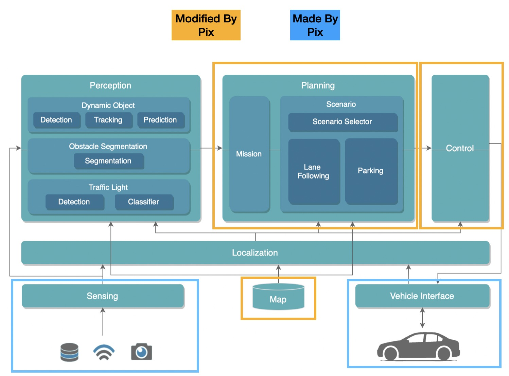
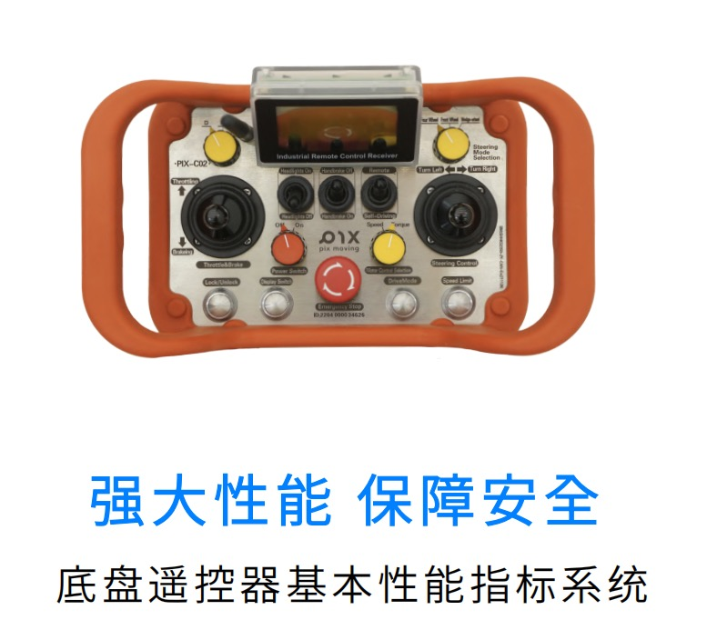
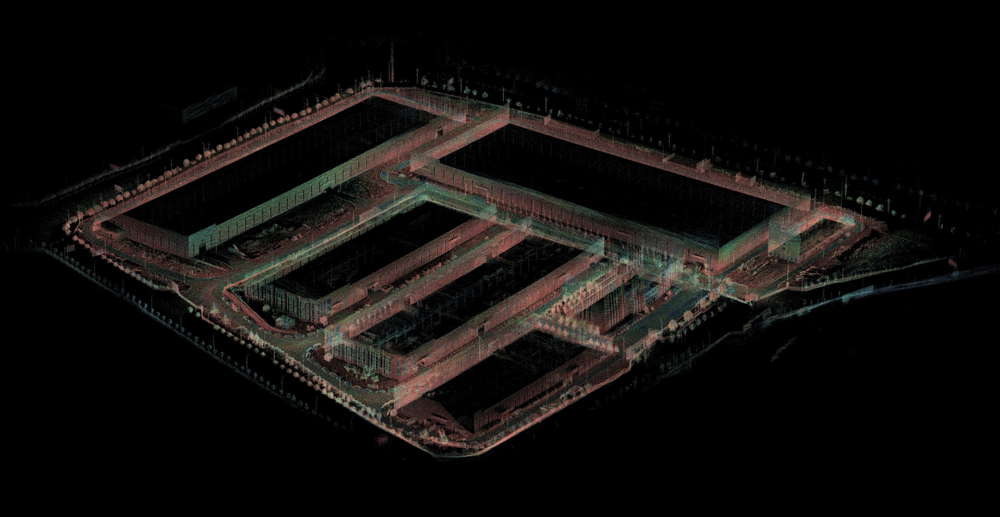

<!--
 Copyright 2023 Pixmoving, Inc.
 
 Licensed under the Apache License, Version 2.0 (the "License");
 you may not use this file except in compliance with the License.
 You may obtain a copy of the License at
 
     http://www.apache.org/licenses/LICENSE-2.0
 
 Unless required by applicable law or agreed to in writing, software
 distributed under the License is distributed on an "AS IS" BASIS,
 WITHOUT WARRANTIES OR CONDITIONS OF ANY KIND, either express or implied.
 See the License for the specific language governing permissions and
 limitations under the License.
-->

# PIXKIT开源自动驾驶开发教学套件
## Pixmoving Inc

### Who Are We
[PIX Moving](http://www.pixmoving.city) is forged by an interdisciplinary and innovative team of around 200 members from diverse cultural backgrounds with in-depth expertise in various fields.  Software engineer, algorithm engineer, electronic engineer, designer, architect, entrepreneur and artist from 7 countries including Italy, the US, Pakistan, India and Japan are bound together with the same vision to build the bridge between future mobility and digital manufacturing. Currently PIX Moving has got fundings from various investors around the globe including VC SOSV, A-listed company Guizhou Transportation Planning Survey&design Academe Co.,ltd. and TIS from Japan. 

## PIXKIT


- Provide a one-stop autonomous driving development solution, offering customers a 0-1 autonomous driving development platform.
- Complete the integration of computing platform, wire-controlled chassis, sensors, and autonomous driving systems for customers, allowing them to focus on algorithm development.
- Provide mapping and sensor calibration toolchains to reduce the development threshold.
- Open-source all source code and provide detailed documentation to make development easier.
- Continuously update and iterate software and algorithms to stay at the forefront of technology.
- Benefit from the resources of ROS/Autoware community, providing continuous motivation for development.
- Provide different ODD examples to expand Autoware to different scenarios (support to be provided in the future).

### Hardware component

#### 1.[Electric Open-source Pix Ultra-Skateboard DBW Chassis](http://www.pixmoving.city/?page_id=673)

#### 2.Sensor Package And Modular Sensor Brancket

#### 3.Industrial Remote Controller For The Chassis


### Tool Chains for Autonomous Driving Development
#### Sensor Calibration
- [camera Intrisics calibration](./sensor-calibration/camera-intrisics-calibration.md)
````yaml
image_width: 1920
image_height: 1080
camera_name: trafficlight
camera_matrix:
  rows: 3
  cols: 3
  data: [1010.2744 ,    0.     ,  941.65588,
            0.     , 1008.70001,  517.61131,
            0.     ,    0.     ,    1.     ]
distortion_model: plumb_bob
distortion_coefficients:
  rows: 1
  cols: 5
  data: [-0.336502, 0.091380, -0.001975, 0.000444, 0.000000]
rectification_matrix:
  rows: 3
  cols: 3
  data: [1., 0., 0.,
         0., 1., 0.,
         0., 0., 1.]
projection_matrix:
  rows: 3
  cols: 4
  data: [723.01111,   0.     , 947.26543,   0.     ,
           0.     , 895.51398, 508.08632,   0.     ,
           0.     ,   0.     ,   1.     ,   0.     ]
````
- [LiDAR-camera calibration](./sensor-calibration/LiDAR-camera-calibration.md)
```yaml
rs162camera:
  x: 0.5789871
  y: -0.08247789
  z: -0.3453706
  roll: -1.55877693
  pitch: 0.00713767
  yaw: -1.55820481
```

- [IMU calibration](./sensor-calibration/IMU-calibration.md)
```yaml
Gyr:
    unit: " rad/s"
    avg-axis:
    gyr_n: 1.5059072284923697e-03
    gyr_w: 4.3430855283551206e-05
    x-axis:
    gyr_n: 1.6901233770452774e-03
    gyr_w: 5.0850707578827144e-05
    y-axis:
    gyr_n: 1.3392742394140514e-03
    gyr_w: 3.7654685426892668e-05
    z-axis:
    gyr_n: 1.4883240690177805e-03
    gyr_w: 4.1787172844933785e-05
Acc:
    unit: " m/s^2"
    avg-axis:
    acc_n: 5.9215155351791055e-03
    acc_w: 1.3379378640306186e-04
    x-axis:
    acc_n: 6.0017230453598448e-03
    acc_w: 1.0726720420556991e-04
    y-axis:
    acc_n: 6.7689914243794181e-03
    acc_w: 1.6961241589651517e-04
    z-axis:
    acc_n: 4.9938321357980535e-03
    acc_w: 1.2450173910710051e-04
```

#### HD Map 
- [Pointcloud Map](./mapping/pointcloud-map.md)

- [Lanelet2 Map](./mapping/lanelet2-map.md)


### Documentation For Autonomous Driving Development
- [Flash OS](./flash-operating-system/flash-OS-image.md)
- [Hardware Integration](./install-sensors/index.md)
- [Hands on Chassis](./hands-on-pix-chassis/index.md)
- [Sensor Calibration](./sensor-calibration/IMU-calibration.md)
- [Mapping](./mapping/index.md)
- [Hands on Autoware](./hands-on-Autoware/launch-autoware.md)

## Contack Us
If you are interested in our products, please contack us.

- <nancy@pixmoving.com>