# GNSS Installation
## Hardware Installation
## Device Wiring
## Hardware Configuration Parameters
### Device Information Detection
- After the installation of the antenna and cables is completed, power on the receiver. Once the receiver is powered on, you can use WiFi to access, configure, and monitor the receiver without the need for a wired connection to the receiver. Please follow the steps below to begin accessing the receiver via WiFi from a web page.
- Turn on your computer's WiFi and search for a wireless network named "GNSS-XXXXXXX" (where XXXXXXX represents the SN number of your receiver, which can be found on the main device). Connect to this network and enter the password "12345678". Open your web browser and enter "192.168.200.1" in the address bar. A login page will appear. Enter the username "admin" and the password "password". If you select the "Remember me" option, your browser will remember the login credentials for your next login.

**Note**：Do not use the Firefox browser to open it, otherwise the parameters cannot be successfully modified.
   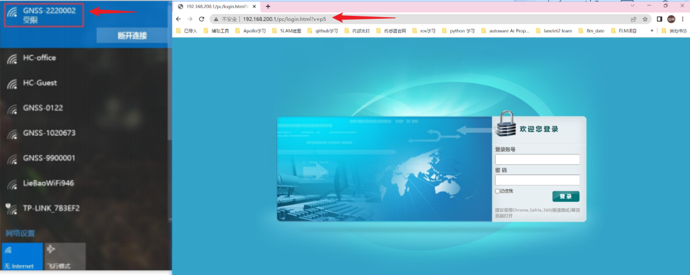

- The interface is displayed in Chinese, and you can switch to English and Russian by clicking on the upper right corner.
   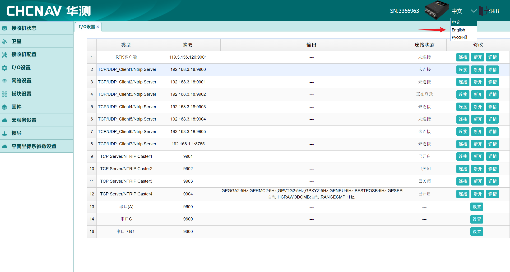
- Click on "Firmware Upgrade" and in the pop-up dialog box, select the local firmware upgrade package. Click "OK" to start the automatic upgrade.

> By default, you can skip this step. Only perform this step when there is a need for "Firmware Upgrade".
   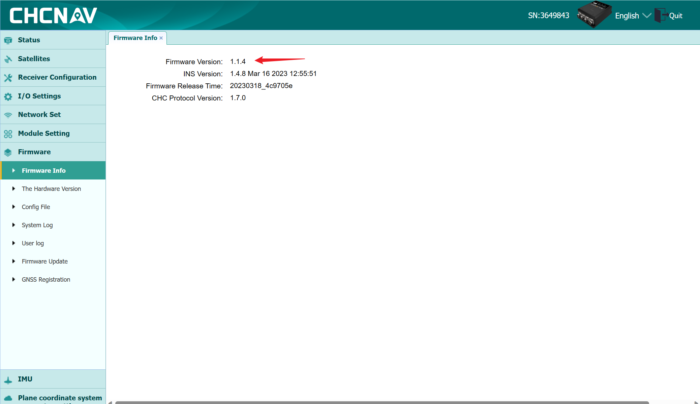

- Click on "Receiver Registration" and register the receiver using the registration code provided by the registration software. This will enable the receiver to function properly within the current registration period. Please contact your PIX colleague to register the device after receiving it.

> By default, you can skip this step. Only perform this step when there is a prompt indicating that the receiver has expired.
   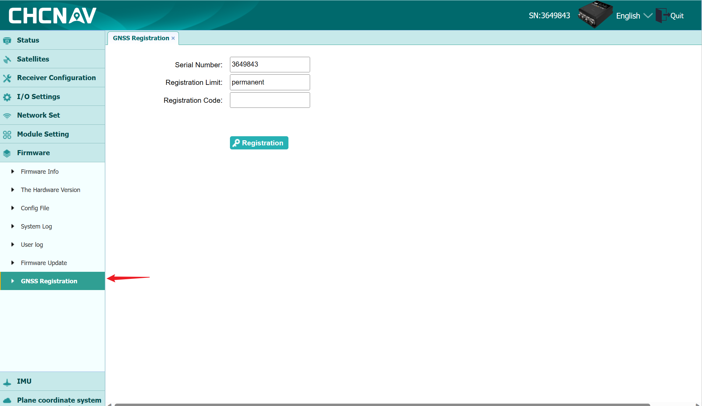

- Confirm the wired network IP address as 192.168.1.110 (factory default IP, do not modify).

> By default, do not modify the IP address. Only perform this step when there is a need to "Modify IP".
    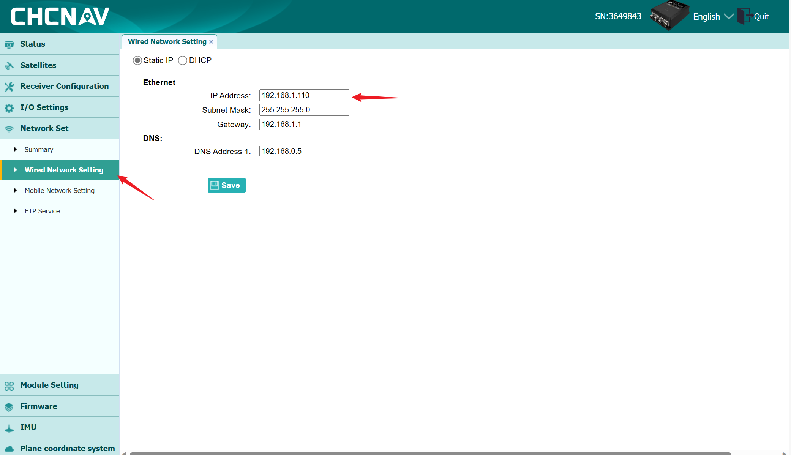

### Parameter Configuration

#### Vehicle Parameter Settings

> When purchasing the PIXKIT kit, there is no need for "Vehicle Parameter Settings" as it has already been preconfigured at the factory.

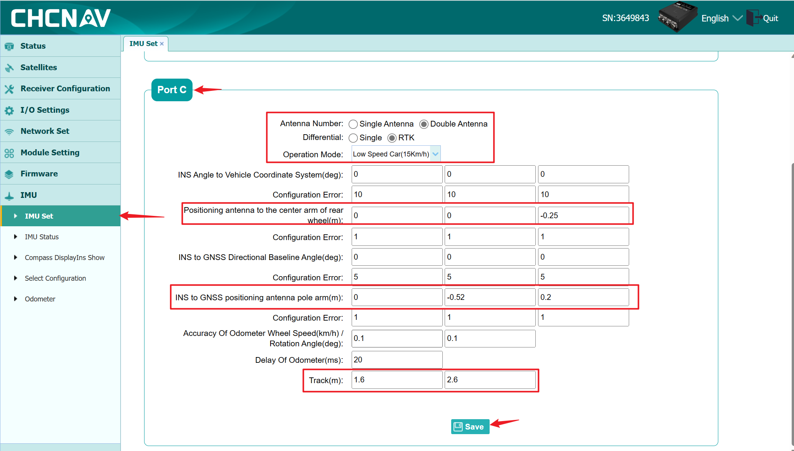

- Number of antennas used: Connect the rear antenna to the GNSS1 device for positioning, and connect the front antenna to the GNSS2 device for heading;
- Operating mode: Select "Mobile Robot" and choose the low-speed mode;
- IMU to Vehicle Coordinate System Angle: Standard installation with all parameters set to 0;
- `Positioning Antenna to Rear Wheel Center Arm`：Use the positioning antenna as the origin coordinate. Provide values for x, y, and z directions: x represents left and right (positive for right, negative for left), y represents front and back (positive for front, negative for back), z represents up and down (positive for up, negative for down) in meters. For example, if the antenna is 0.3 meters to the left of the rear wheel center (usually placed on the vehicle's centerline, so it would be 0), 0.5 meters to the front, and 1 meter above, the input values would be 0.3, -0.5, -1;
- GNSS Heading Baseline to Vehicle Coordinate System Angle: Standard installation with all parameters set to 0;
- `IMU to Positioning Antenna Arm`：Use the IMU device as the origin coordinate. Provide values for x, y, and z directions: x represents left and right (positive for right, negative for left), y represents front and back (positive for front, negative for back), z represents up and down (positive for up, negative for down) in meters. If the positioning antenna is located to the right, front, and above the device, then x, y, and z values should all be positive;
- Odometry Wheel Speed Accuracy (km/h) / Steering Angle Accuracy (deg) and Odometry Delay: Leave the default values at 0;
- `Wheelbase`：Measure and fill in the wheelbase value based on the received vehicle;
- Once the configuration is complete, click "Save" to apply the settings.

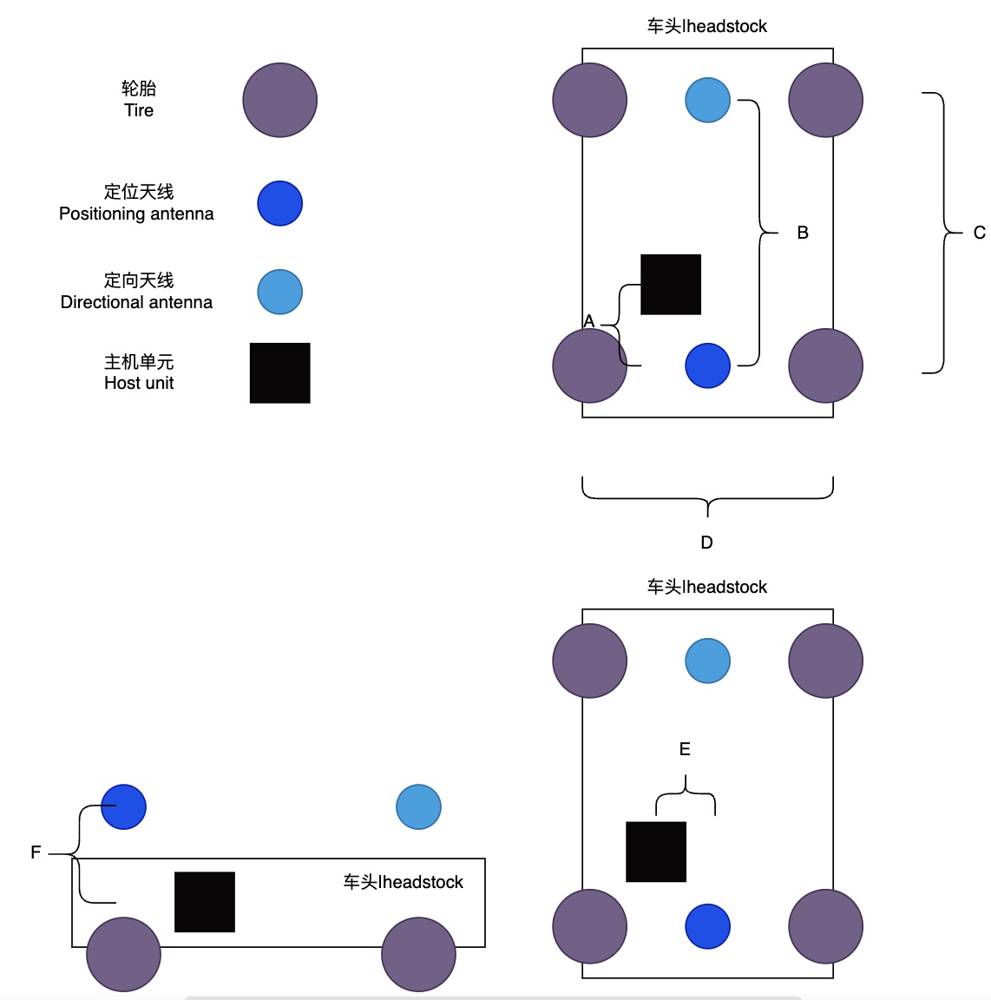

1. "Wheelbase": The distance between the centers of the two rear wheels, represented by length "D" in the diagram.
2. "IMU to Positioning Antenna Arm": Consider the "Main Unit" as the origin of the coordinate system. The "Positioning Antenna" is considered as a point in this coordinate system. Provide the x, y, and z values of the "Positioning Antenna" in the coordinate system of the "Main Unit." For example, (E, -A, F).
3. "Positioning Antenna to Rear Wheel Center Arm": Consider the "Positioning Antenna" as the origin of the coordinate system. The "Rear Wheel Center" is considered as a point. Provide the x, y, and z values of the "Rear Wheel Center" in the coordinate system of the "Positioning Antenna."

#### RTK Account Login

- Go to the IO Configuration page and select "RTK Client". Click on "Connect" and choose the connection protocol, which can be NTRIP, TCP, or APIS. Enter the relevant account and password information, and finally, click "OK" to confirm.
    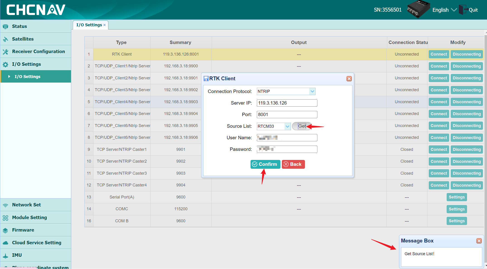

**Note 1**：When obtaining the source list, make sure to check for a successful source list retrieval notification in the bottom-right corner. Failure to retrieve the source list will result in an unsuccessful RTK login. Verify if the device has internet access.

**Note 2**：CGI-410 supports international differentials, but it is necessary to ensure that the base station broadcasts standard RTCM messages. Both domestic and international systems support the following satellite systems: GPS, Beidou (BDS), Galileo, GLONASS, and Quasi-Zenith Satellite System (QZSS).

#### Device Calibration
Real Vehicle Operation: In the INS mode, start with GNSS, then initialize, and finally combine with the inertial navigation system. The vehicle must be driven outdoors in an open area with no tall obstructions. Move the vehicle back and forth, drive in a figure-eight pattern, and make turns. It will take approximately twenty minutes for the calibration process to be successful. If the INS mode remains unchanged, please check if the RTK account has logged in successfully.

- Inertial Navigation Status 1: INS mode set to GNSS；
    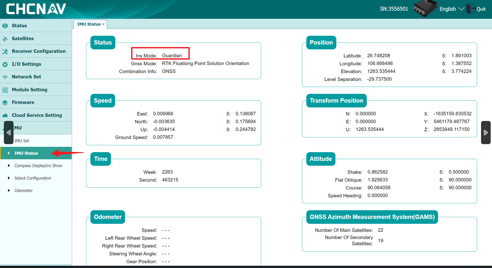
- Inertial Navigation Status 2: INS mode set to Initialization；
    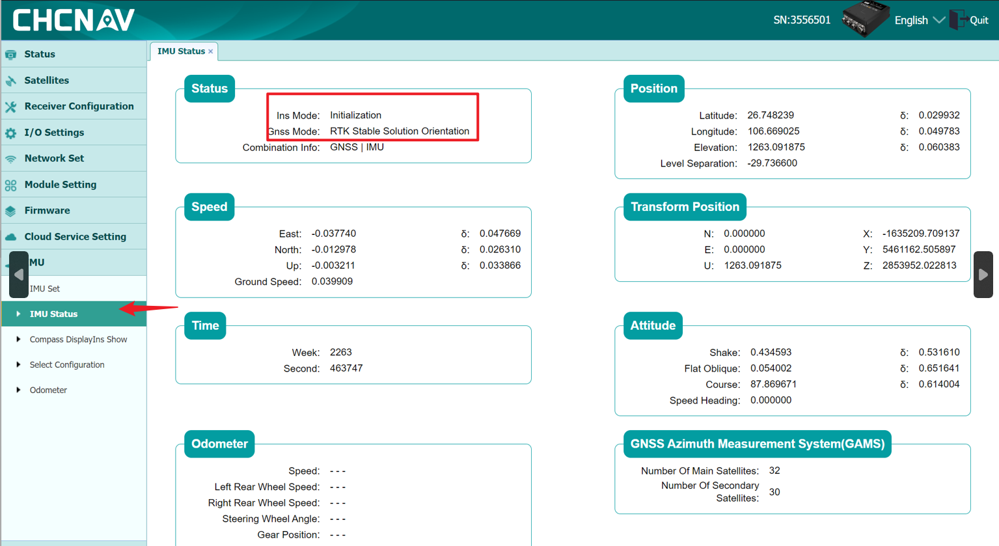
- Inertial Navigation Status 3: INS mode set to Combined Inertial Navigation, with the combination information as GNSS | MIU.
    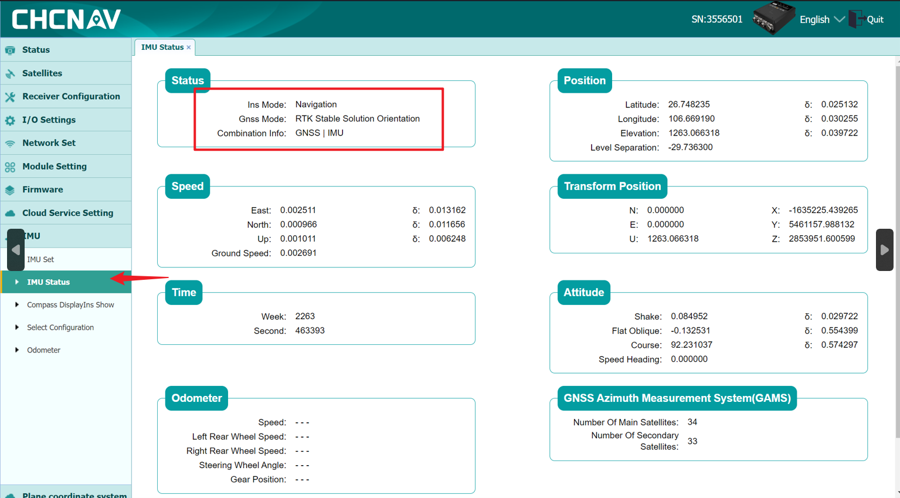
**Note**：Calibration takes about 30 minutes. If the INS mode initializes but the GNSS mode does not show a stable RTK positioning and heading solution, please check the device's RTK status, arm values, and antenna connections (whether the rear antenna is connected to GNSS1 and the front antenna is connected to GNSS2). If the device is installed in a complete vehicle project and difficult to inspect, check the heading angle in the attitude information of the inertial navigation status. Use a compass on a mobile phone aligned with the vehicle's direction of travel. Verify if the angles are consistent. Deviation within 10 degrees is normal. If the deviation exceeds 180 degrees, it indicates a reversed connection. In that case, interchange the positions of the GNSS1 and GNSS2 interfaces.
#### Data Output
- TCP Output Format: Data is output to the host device through RJ45. The combined navigation data is output at 50Hz for GPCHC and GPGGA. All other data is disabled. Save the data.
    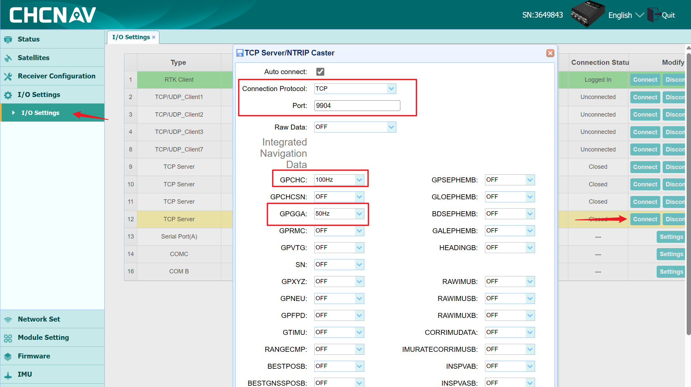
    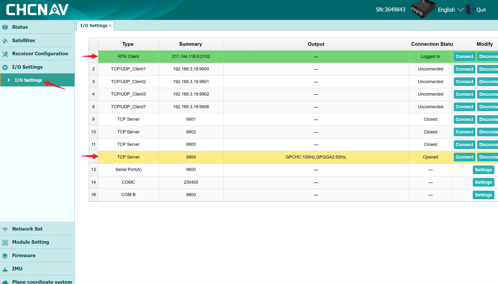
- Start the industrial control computer. Press Ctrl+Alt+t to open the terminal. Type "nc 192.168.1.110 9904" and press Enter. If there is data output, it indicates successful TCP communication；
    
- If you need to use other parameters, please refer to the CGI-410 User Manual for further instructions.
    [CGI-410 User Manual](./image/CGI-410.pdf)