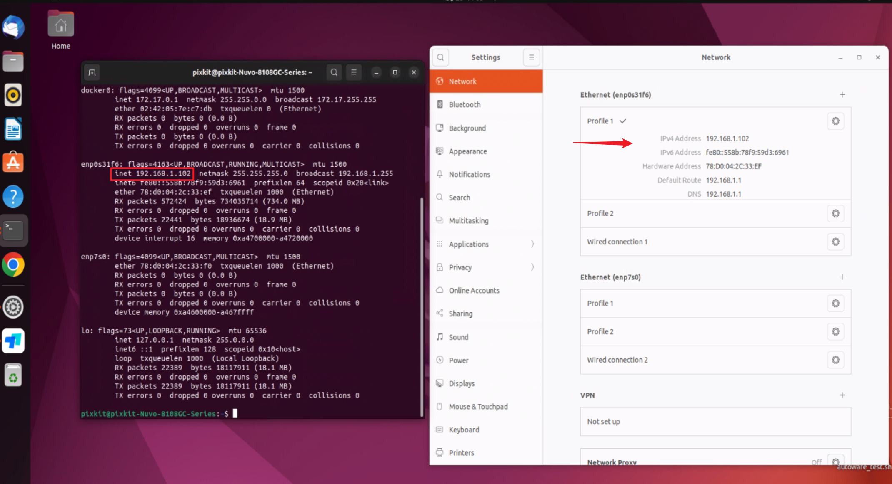
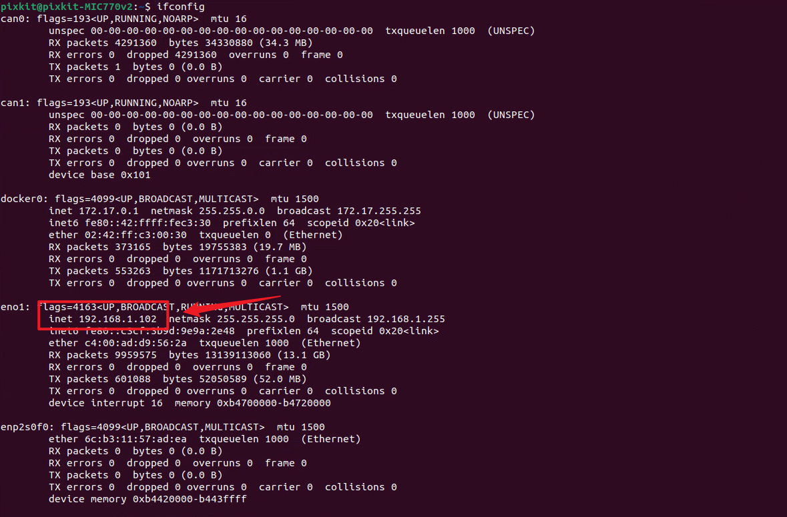
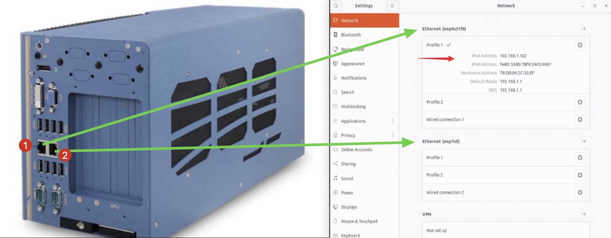
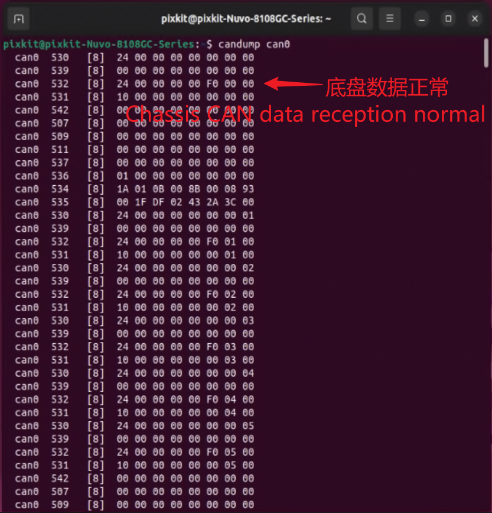
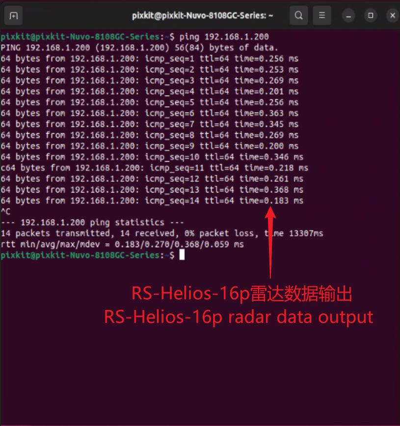
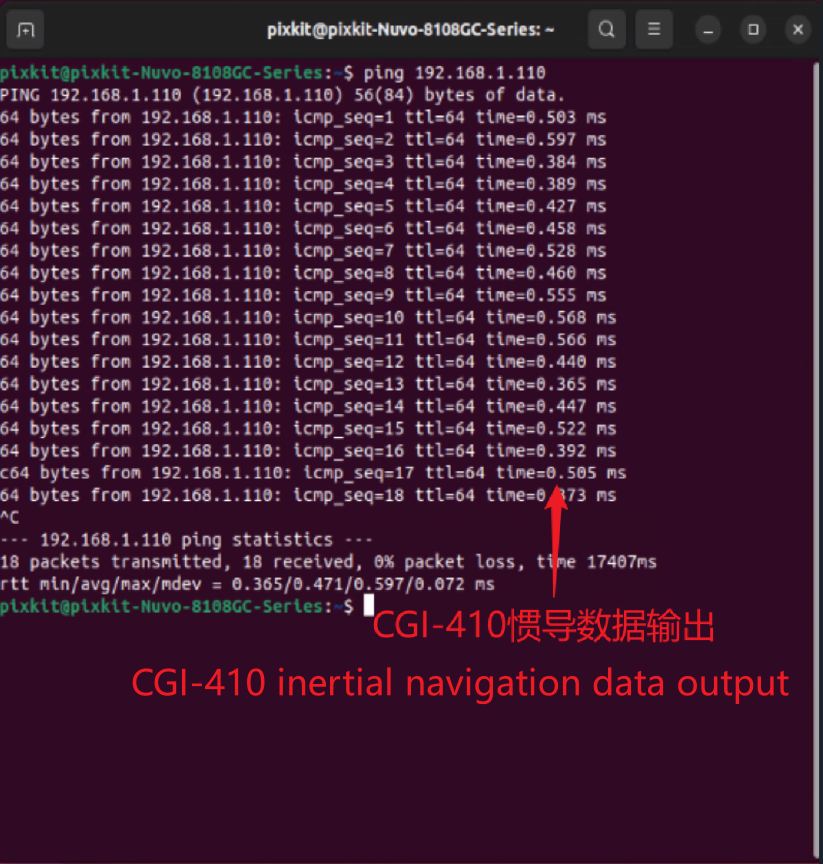
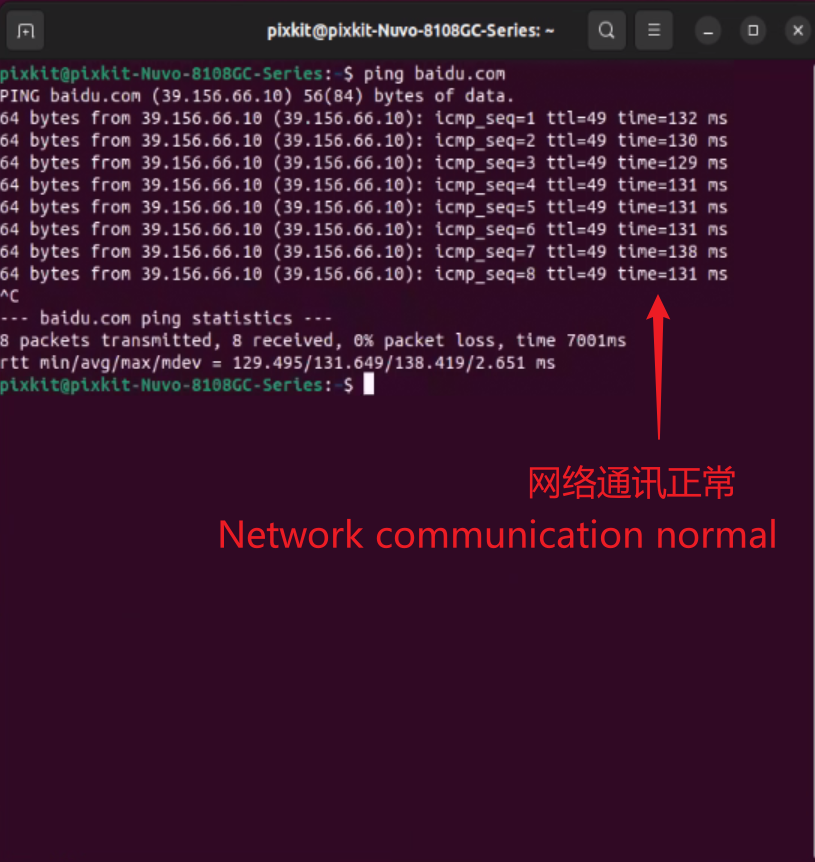

# IPC Installation
## Hardware Installation
## Device Wiring
## Hardware Parameter Check
- After completing the wiring, click the power button and wait a few seconds to access the login interface.
    
- Press Ctrl+Alt+t to start the terminal: username: pixkit, password: pixmoving.
- Check the static IP of the host: 192.168.1.102. If it is not correct, modify the static IP address; otherwise, there may be abnormal sensor data transmission.
    
- Set the static IP of the host: Open network settings, select the configuration port, click on IPV4, and modify the IP, gateway, subnet mask, and DNS according to the image. After completion, click on the top-right corner to apply.
    


Start the terminal with Ctrl+Alt+t and use the command "ifconfig" to check if the modification was successful.
    

> Correspondence between network ports and positions.
    
Note：This image is for reference only. If the industrial computer does not match the image, please ignore this image.

- Check the CAN data of the chassis.
```shell
candump can0
```
The terminal should output the data correctly.
    

- Check the LiDAR: RS-Helios-16P; 192.168.1.200.
```shell
ping 192.168.1.200
```
The terminal should output the data correctly.
    

- Check the inertial navigation system: CGI-410; 192.168.1.110
```shell
ping  192.168.1.110
```
The terminal should output the data correctly.
    

- If a router and IoT card are available, check if the internet connection is working properly.
```shell
ping baidu.com
```
The terminal should output the data correctly.
    
**Note 1**：To access the internet, the host IP needs to be set according to the router's IP address.

**Note 2**：If the sensor parameters cannot be output correctly, please refer to the corresponding hardware installation document and check the cable connections according to the operating instructions.