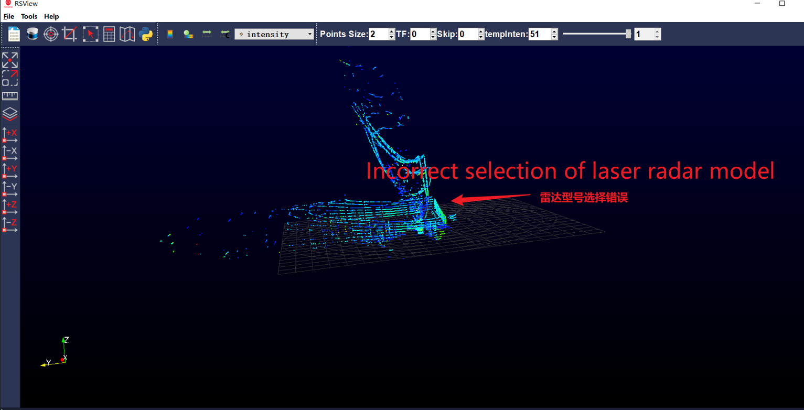

# LiDAR Installation
## Hardware Installation
## Device Wiring
## Hardware Parameter Configuration
### Device Information Detection

- Radar Model: RS-Helios-16P.
- RSView Visualization Software Usage.
- Click to download：[RS-Helios-16p Documentation](https://www.robosense.ai/resources-81).
- Set the radar IP address according to the operation manual. The default IP address is 192.168.1.200 (Do not modify).

#### Visualization display with rviz2
- To open the industrial computer, press Ctrl+Alt+t to launch the terminal and navigate to that path.
    

```shell 
source install/setup.bash 

ros2 run rslidar_sdk rslidar_sdk_node 
```
- Start the ROS2 driver.
    

- Start rviz2 to view point cloud data，modify the Fixed Frame to "rs16"，and add the point cloud topic.
    

    

- Startup sequence
    

#### RSView software

**Note**：RSView is the official software from Siemens. It is recommended to follow the instructions in the official RS documentation for usage. The information provided here is for reference purposes only, as the official software undergoes updates and iterations, resulting in potential differences in the user interface.

- Startup Device: Windows laptop with RJ45 Ethernet port.
- Setting the laptop's IPv4 IP address: 192.168.1.102.
    
- Disable the system firewall.
    
- Launch the RSView software (Download the corresponding software based on the radar model).
    
- Click on the radar icon to check if the point cloud data is displayed correctly.
    
    
    
- Support for web-based device information viewing, firmware updates, IP modification. Open a browser and enter 192.168.1.200 to access.
    