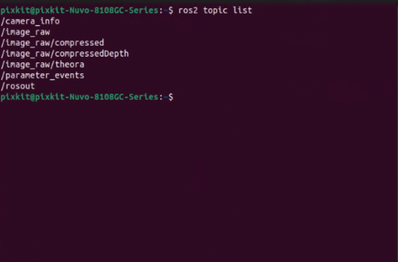

# Camera Installation
## Hardware Installation
## Device Wiring
## Hardware Startup
- Turn on the industrial computer and press Ctrl+Alt+t to launch the terminal.
```shell
source  ~/pix/pit-kit/Autoware/install/setup.bash 
ros2 launch pixkit_sensor_kit_launch camera_launch.py 
```
- Start the camera driver.
    
- View topic data.
```shell
ros2 topic list
```
Open a new terminal.
    
- Use the rqt package to view.
```shell
ros2 run rqt_image_view rqt_image_view
```
Enter the command in the terminal and press Enter. The visualization interface will automatically pop up.
    
**Note**：If you cannot output the topic list or view the visual image, please check the wiring or verify if the ROS driver has started successfully.