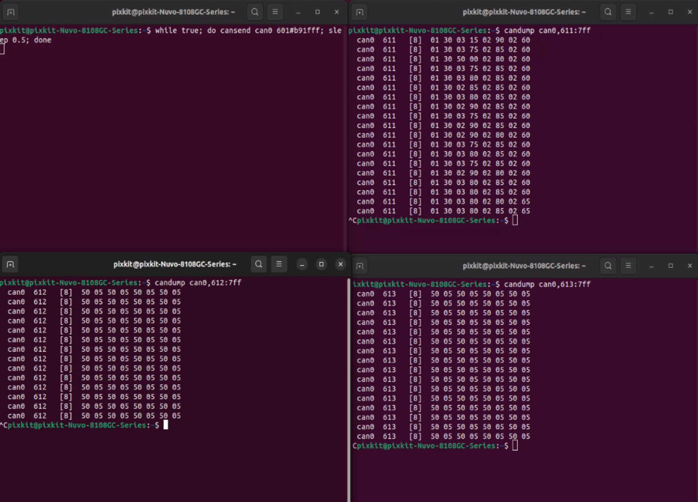

# Ultrasonic Radar Installation
## Hardware Installation
## Device Wiring
## Hardware Parameter Check
- Hardware installation has been completed.
- Launch terminal
    
```shell
Activate ultrasonic：while true; do cansend can0 601#b91fff; sleep 0.5; done
View data from probes 1~4：candump can0,611:7ff
View data from probes 5~8：candump can0,612:7ff
View data from probes 9~12：candump can0,613:7ff
```
- Reference document
[F40-16TR7B Ultrasonic Sensor CAN Usage Document](./image/F40-16TR7B超声波传感器.pdf)