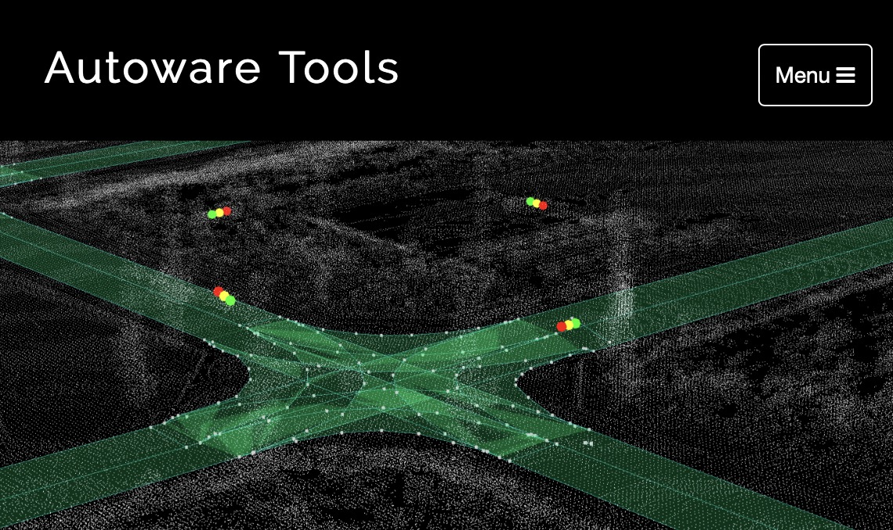
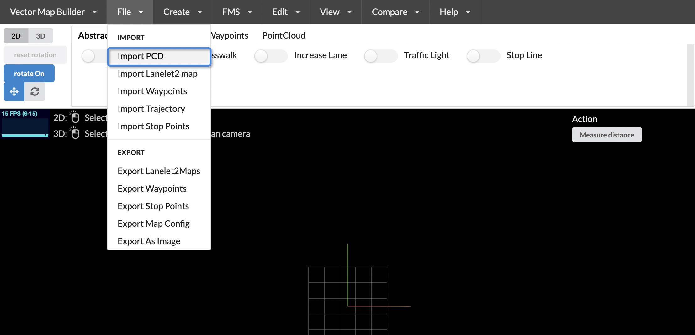
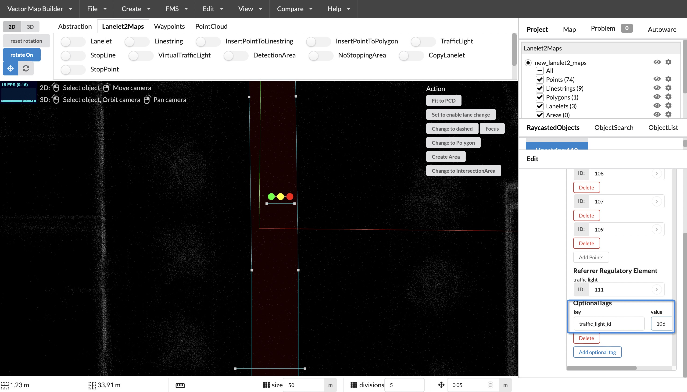

# Lanelet2 Map
## Overview

[Lanelet2](https://github.com/fzi-forschungszentrum-informatik/Lanelet2) is a C++ library for handling map data in the context of automated driving. It is designed to utilize high-definition map data in order to efficiently handle the challenges posed to a vehicle in complex traffic scenarios. Flexibility and extensibility are some of the core principles to handle the upcoming challenges of future maps.


## Lanelet2 primitives
The lanelet2 map is composed of some primitives, consisting of `node/point`, `linestring`, `polygon`, `lanelet`, `area`, and `regulatory element`.

### node
A node consists of a unique ID, latitude, longitude, height, and Cartesian coordinate system coordinates. It also has the ability to be extended by adding new features through setting the `k` tag and values through setting the `v` tag.
```xml
<node id="1" lat="" lon="">
  <tag k="mgrs_code" v="99XXX0000-2"/>
  <tag k="local_x" v="11.5354"/>
  <tag k="local_y" v="-184.0996"/>
  <tag k="ele" v="-0.2962"/>
</node>
```
The above example shows a node with an `ID` of 1, `local_x` as the x-coordinate, `local_y` as the y-coordinate, and `ele` as the height. It is used to form the basic structure of linestring and area.
### area
An area consists of a unique ID, a series of ordered node IDs, the type of area, and whether it is a mark of an area. It also has the ability to be extended by adding new features through setting the `k` tag and values through setting the `v` tag.
```xml
<way id="88">
  <nd ref="84"/>
  <nd ref="85"/>
  <nd ref="86"/>
  <nd ref="87"/>
  <tag k="type" v="detection_area"/>
  <tag k="area" v="yes"/>
</way>
```
For the example above, it describes a "way" object with an ID of "88" that includes references to four "node" objects with IDs "84", "85", "86", and "87". It also includes two tags: "type" with a value of "detection_area" and "area" with a value of "yes".

### linestring
A Linestring is composed of a series of ordered node IDs, linestring types, and extension types, and has the ability to be extended by setting additional properties through the `k` tag and their values through the `v` tag.
```xml
<way id="3">
  <nd ref="1"/>
  <nd ref="2"/>
  <nd ref="8"/>
  <nd ref="10"/>
  <tag k="type" v="line_thin"/>
  <tag k="subtype" v="solid"/>
</way>
```
In the example above, the Linestring has an ID of "3" and references the nodes "1", "2", "8", and "10" in that order. The linestring type is "line_thin", and optional linestring types and subtypes can be found in the table below.

| **type** | **subtype** | **description** | **lane change?** |
|----------|-------------|-----------------|------------------|
|line_thin | solid    | a solid lane marking | no       |
|line_thin | solid_solid | a double solid lane marking | no       |
|line_thin | dashed      | a dashed lane marking | yes        |
|line_thin | dashed_solid | a marking that is dashed on the left and solid on the right | left->right: yes |
|line_thin | solid_dashed | the other way around | right->left: yes |
|line_thick | same as above for thin |     |                  |
|curbstone | high        | a curbstone that is to high for a vehicle to drive over | no |
|curbstone | low         | curb that is low and can be driven for a vehicle | no |
|virtual   | -           | a non-physical lane boundary, intended mainly for intersections | no |
|road_border | -         | the end of the road. | no          |

### polygon
A Polygon is composed of a single linestring and can be extended by setting additional properties through the `k` tag and their values through the `v` tag.
```xml
<relation id="35">
  <member type="way" role="outer" ref="32"/>
  <tag k="type" v="multipolygon"/>
</relation>
```
### lanelet
A Lanelet is composed of a left and right linestring, references to regulatory elements and the lanelet type, and can be extended by setting additional properties through the `k` tag and their values through the `v` tag.
```xml
<relation id="48">
  <member type="way" role="left" ref="47"/>
  <member type="way" role="right" ref="44"/>
  <member type="way" role="centerline" ref="80"/>
  <member type="relation" role="regulatory_element" ref="89"/>
  <member type="relation" role="regulatory_element" ref="100"/>
  <tag k="type" v="lanelet"/>
  <tag k="subtype" v="road"/>
  <tag k="speed_limit" v="10"/>
  <tag k="location" v="urban"/>
  <tag k="one_way" v="yes"/>
</relation>
```
In the example above, the Lanelet has an ID of "48", with the left and right boundaries referencing Linestrings with IDs "47" and "44", respectively. The centerline references the Linestring with ID "80". The regulatory elements are referenced by relations with IDs "89" and "100". The lanelet type is "lanelet", with a subtype of "road". Additional properties such as "speed_limit", "location", and "one_way" are also set using the "k" and "v" tags. Optional tags for lanelet can be found in the table below.

| **subtype** | **location** | **description**                  | **Inferred Participants** | **Speed limit**  | 
|-------------|--------------|----------------------------------|------------------|------------------|
| **road**    | **urban**    | A part of a road in urban region | All vehicles and bikes | City speed limit |
| **road**    | **nonurban** | A part of a road in nonurban region | All vehicles and bikes | Nonurban speed limit |
| **highway** | **urban**    | A part of a highway in urban region | All vehicles  | Urban highway limit |
| **highway** | **nonurban**   | A part of a highway in nonurban region | All vehicles  | Nonurban highway limit |
| **play_street** | **-**    | A part of a play street          | Vehicles, bikes, pedestrians | play street speed limit |
| **emergency_lane** | **-** | Lane for emergency vehicles      | Emergency vehicles | Average emergency vehicle speed |
| **bus_lane** | **urban**       | Lane for buses                   | Bus, Emergency, Taxi | City speed limit |
| **bus_lane** | **nonurban**       | Lane for buses                   | Bus, Emergency, Taxi | Nonurban speed limit |
| **bicycle_lane** | **-**   | A lane that is usable only for bikes | Bikes        | Average bike speed |
| **exit**    | **urban**    | Exit area of a house or garage that crosses the crosswalk   | Vehicles, bikes, pedestrians | Urban speed limit |
| **walkway** | **-**        | A part of a way for pedestrians  | Pedestrians      | Average pedestrian walking speed |
| **shared_walkway** | **-** | A way shared by bikes and pedestrians | Bikes, Pedestrians | Average bike/pedestrian speed |
| **crosswalk** | **-**      | A part of a crosswalk            | Pedestrians      | Average pedestrian walking speed |
| **stairs**  | **-**        | Well ... stairs                  | Pedestrians      | Average pedestrian walking speed |

### regulatory element
"Regulatory element is composed of a series of linestrings and regulatory element types, and has expandability. New features can be added by setting the 'k' attribute in the tag, and the value of the new feature can be set by setting 'v'.
```xml
<relation id="100">
  <member type="way" role="refers" ref="95"/>
  <member type="way" role="ref_line" ref="92"/>
  <member type="way" role="light_bulbs" ref="99"/>
  <tag k="type" v="regulatory_element"/>
  <tag k="subtype" v="traffic_light"/>
</relation>
```
In the example below, the `regulatory element` with `id` 100 refers to linestring with `id` 95 as the reference line for the `traffic light`, `linestring` with `id` 92 as the stop line, and `linestring` with `id` 99 as the light bulb. The `type` is `regulatory_element` and the `subtype` is `traffic_light`. The `subtypes` of `regulatory elements` are shown in the table below.

| **subtype** | **description**                  |
|-------------|----------------------------------|
|traffic_sign|traffic sign|
|traffic_light|traffic light|
|speed_limit|speed limit sign|

## lanelet2 Map Making

### Drawing Tool
Use the [Vector Map Builder tool](https://tools.tier4.jp/feature/vector_map_builder_ll2/) developed by [Tier Iv Inc](https://tier4.jp/en/) for map making.


### Importing Point Cloud Maps
Before making a map, you need to import a point cloud map as a reference for the geometric features of the vector map. [Making Pointcloud map](./pointcloud-map.md)

1. click on `file`-`Import PCD`


2. click on `browser` to select the PCD file


3. After selecting the PCD file, click `import`


4. The pointcloud map is imported into the map visualization box


### Creating a Lanelet2 Map
1. Click on the `create` menu, `create_lanelet2Map`


### Editing a Lanelet
1. Find the road and see the drivable area between the curbs

2. Click on the `lanelet` button in the menu above to enter the `lanelet` editing mode

3. Click on the initial point of the `lanelet` in the drivable area on the map

4. Move the mouse to select the next `lanelet` node. You can select multiple nodes in the curved section to ensure smooth curves

5. Deselect the `lanelet` button to exit `lanelet editing mode`

6. Modify the Lanelet Width
- You can use the `Change Lanelet Width` in the `Action` section on the right to modify the lanelet width


- You can click on a `node` to move it in 3D and change the width of the lanelet


### Editing a Parking Lot
When an autonomous vehicle enters parking mode, the parking lot is converted into a `parking_lot`.
1. Find the parking lot area and use the `linestring` tool to draw the parking lot area

2. Deselect the `linestring` drawing tool, click the `Change to Polygon` button on the right to convert the `linestring` to a `polygon`

3. set `type` to `parking_lot` in the attribute box on the right


### Edit traffic lights
1. Select a `lanelet` and choose the `trafficlight` tool from the toolbar above

2. Click on the selected `lanelet` to generate a `linestring` with `type` as `stop_line`, a `linestring` with `type` as `traffic_light`, and a `linestring` with `type` as `light_bulbs`. You can move the position of these components, but the direction of the `traffic_light` cannot be changed. This is because the direction of the `traffic_light` is considered as a filtering factor in the traffic signal detection process.

3. Set the `sub_type` of the `traffic_light` to `red_yellow_green`. There is a key named `heigh`t which represents the rectangular ROI with the `linestring` of the `traffic_light` as the length and the `height` as the width. Therefore, you can adjust the value of height accordingly.

4. Add an `optional_tag` named `traffic_light_id` to the `light_bulbs` with the value set to the ID of the `traffic_light` `linestring`.

5. Adjust the color of the `light_bulbs`. Click on a light bulb to set the color to `red`, `green`, or `yellow` in the attribute editor on the right.


## Reference
 - [https://www.autoware.org/_files/ugd/984e93_9978752488284f4ab6853f83a0c044bc.pdf?index=true](https://www.autoware.org/_files/ugd/984e93_9978752488284f4ab6853f83a0c044bc.pdf?index=true)
 - [https://github.com/fzi-forschungszentrum-informatik/Lanelet2](https://github.com/fzi-forschungszentrum-informatik/Lanelet2)
 - [https://tools.tier4.jp/feature/vector_map_builder_ll2/](https://tools.tier4.jp/feature/vector_map_builder_ll2/)
 - [https://autowarefoundation.github.io/autoware-documentation/main/design/autoware-interfaces/components/planning/#lanelet2-map](https://autowarefoundation.github.io/autoware-documentation/main/design/autoware-interfaces/components/planning/#lanelet2-map)