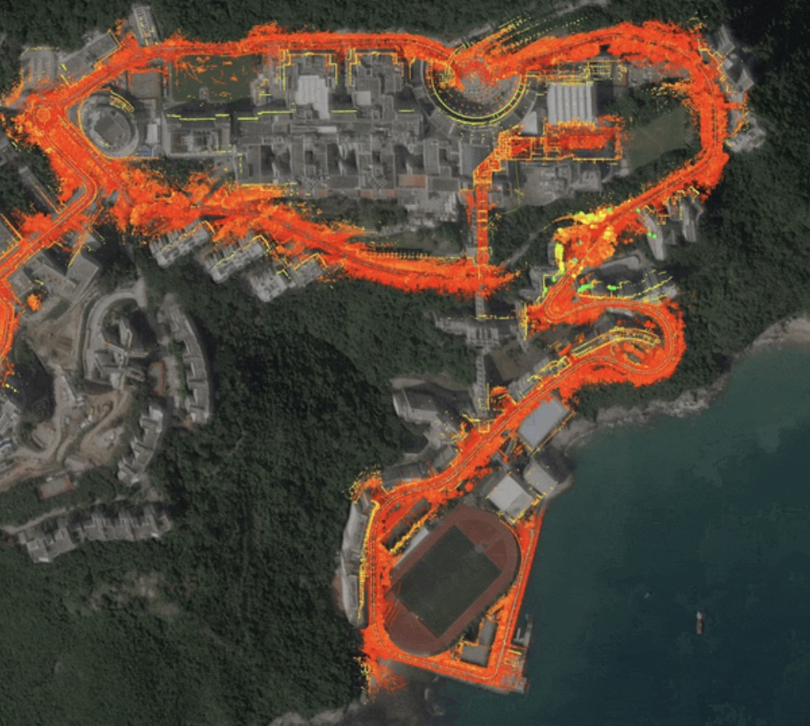
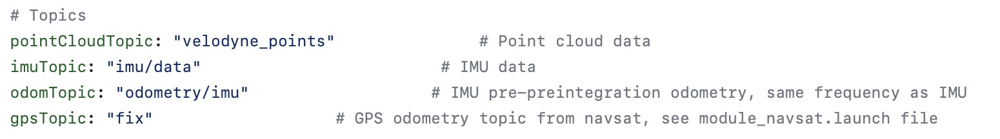
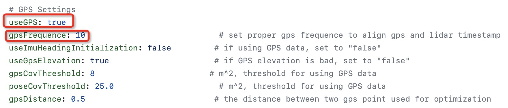
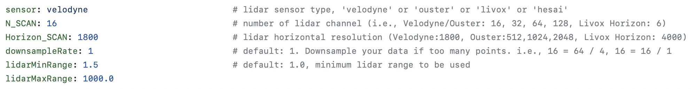
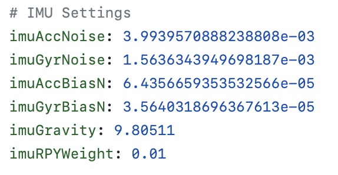
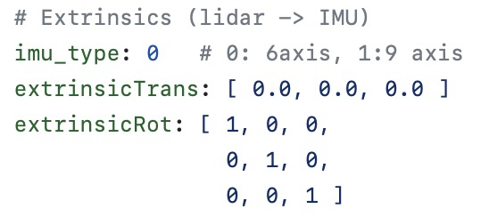

# Poincloud Mapping 
## LIO-SAM-6AXIS

### step-1: Install Docker
[install docker](https://docs.docker.com/engine/install/ubuntu/)

### step-2: Install Nvidia Docker
[install nvidia docker](https://docs.nvidia.com/datacenter/cloud-native/container-toolkit/install-guide.html)

### step-3: build docker image
- Clone the repository (repository map needs to be modified)
```shell
git clone https://github.com/pixmoving-moveit/LIO_SAM_6AXIS.git # clone repository
cd lio_sam_6axis # enter the repository folder
```
- Build Docker image using Dockerfile in the repository
```shell
sudo docker build - < Dockerfile -t lidar_mapping
```

### step-4: Run the Image
```shell
docker run -it --net=host --gpus all --name lidar_mapping -v $HOME/shared_dir:/home/lidar_mapping/data lidar_mapping /bin/zsh
```
If you need multiple terminal windows for operation, you can enter the container through the following command
```shell
docker exec -it lidar_mapping /bin/zsh
```
### step-5: Build Mapping Workspace
Create a workspace
```shell
mkdir mapping_ws
cd mapping_ws
mkdir src
cd src
git clone https://github.com/pixmoving-moveit/LIO_SAM_6AXIS.git
cd ..
```
Compile the package
```shell
cd ~/mapping_ws
catkin_map
```
### step-6: Sensor Calibration
Before mapping, you need to prepare the intrinsic parameters of your IMU and the extrinsic parameters of LiDAR and IMU.

- [Calibrate IMU Intrinsics](../sensor-calibration/IMU-calibration.md)
- [Calibrate Extrinsics of LiDAR and IMU](../sensor-calibration/LiDAR-IMU-calibration.md)

### step-7: Modifying configuration files
launch file
```xml
<launch>
    <arg name="project" default="lio_sam_6axis"/>
    <arg name="bag_path" default="/media/xchu/e81eaf80-d92c-413a-a503-1c9b35b19963/home/xchu/data/hkust/outdoors/hkust_20201105full.bag"/>
    <arg name="sequence" default="hkust_campus"/>

    <!--set your own Parameters -->
    <!--    <rosparam file="$(find lio_sam_6axis)/config/params_ouster.yaml" command="load"/>-->
    <rosparam file="$(find lio_sam_6axis)/config/params_vlp.yaml" command="load"/>

    <!--- LOAM -->
    <param name="saveDirectory" type="string" value="$(find lio_sam_6axis)/data/"/>
    <param name="configDirectory" type="string" value="$(find lio_sam_6axis)/config/"/>
    <rosparam param="sequence" subst_value="true">$(arg sequence)</rosparam>
    <include file="$(find lio_sam_6axis)/launch/include/module_loam.launch"/>

    <!--- Robot State TF -->
    <include file="$(find lio_sam_6axis)/launch/include/module_robot_state_publisher.launch"/>

    <!--show satellite-->
    <!--set your orgin gps lla  22.3387279108228 114.263622199692 87.7310562180355 -->
    <node pkg="rostopic" type="rostopic" name="fake_gps_fix"
          args="pub gps/fix sensor_msgs/NavSatFix '{ header: auto, latitude: 22.3387279108228, longitude: 114.263622199692, altitude:  87.7310562}'"
          output="screen"/>

    <!--- Run Navsat -->
    <node pkg="lio_sam_6axis" type="lio_sam_6axis_gpsOdometry" name="lio_sam_6axis_gpsOdometry" output="log"/>

    <!--- Run Rviz-->
    <node pkg="rviz" type="rviz" name="$(arg project)_rviz"
          args="-d $(find lio_sam_6axis)/launch/include/config/vlp.rviz"/>

    <node pkg="rosbag" type="play" name="bag_play" args="$(arg bag_path) --clock -d 5 -r 2.0"/>

</launch>
```

You need to modify the corresponding parameter file according to the launch file. Taking the above launch file as an example, the parameter file used is `$(find lio_sam_6axis)/config/params_vlp.yaml`, so the relevant parameters should be modified in this file.

- The `msg` configuration for your sensor needs to be modified.


|**Parameter**|**Msg Type**|**Description**|
|--|--|--|
|pointCloudTopic|sensor_msgs/Pointcloud2|Topic for LiDAR point cloud|
|imuTopic|sensor_msgs/Imu|Topic for IMU|
|odomTopic|nav_msgs/Odometry|Topic for IMU Odometry, no need to modify|
|gpsTopic|nav_msgs/NavSatFix|Topic for GNSS localization|

- If using GNSS, set `useGPS` to `true` and set the correct GPS frequency in `gpsFrequence`


- LiDAR parameters


|**Parameter**|**Description**|
|--|--|
|sensor|Type of LiDAR, options: `velodyne`, `ouster`, `livox`, `hesai`|
|N_SCAN|Number of channels of pointcloud, 16 for 16-beam LiDAR|
|Horizon_SCAN|Horizontal resolution of LiDAR (Velodyne:1800, Ouster:512,1024,2048, Livox Horizon: 4000)|
|downsampleRate|Downsampling rate, such that N_SCAN/downsampleRate=16|
|lidarMinRange|Minimum range of point cloud, default is 1.5|
|lidarMaxRange|Maximum range of point cloud, default is 1000.0|

- IMU intrinsics，refer to [IMU Calibration](../sensor-calibration/IMU-calibration.md) to obtain IMU intrinsics


|**Parameter**|**Description**|
|--|--|
|imuAccNoise|Mean of 3-axis accelerometer white noise (m/s^2)|
|imuGyrNoise|Mean of 3-axis gyroscope white noise (rad/s)|
|imuAccBiasN|Mean of 3-axis accelerometer bias (m/s^2)|
|imuGyrBiasN|Mean of 3-axis gyroscope bias (rad/s)|
|imuGravity|Local gravity acceleration (m/s^2)|
|imuRPYWeight|Euler angle weight, default is 0.01|

- IMU extrinsics, refer to [LiDAR-IMU Calibration](../sensor-calibration/LiDAR-IMU-calibration.md)


|**Parameter**|**Description**|
|--|--|
|imu_type|Type of IMU (0: 6-axis, 1: 9-axis)|
|extrinsicTrans|Translation matrix|
|extrinsicRot|Rotation matrix|

### step-8: Run mapping program
Run mapping launch file
```shell
roslaunch lio_sam_6axis run.launch
```
Play rosbag
```shell
rosbag play -r 3.0 [path of bag file]
```

### step-9: Save map
```shell
rosservice call /lio_sam_6axis/save_map
```
After saving the map, the following files can be found in the map folder:

|**name**|**描述**|
|--|--|
|global_map_lidar.pcd|Pointcloud map, already converted to ENU direction if using GNSS|
|origin.txt|Latitude, longitude, and altitude of the origin of pointcloud map|

## References
- [LIO_SAM_6AXIS](https://github.com/JokerJohn/LIO_SAM_6AXIS)

- [creating maps for Autoware](https://autowarefoundation.github.io/autoware-documentation/pr-335/how-to-guides/creating-maps-for-autoware/open-source-slam/fast-lio-lc/)