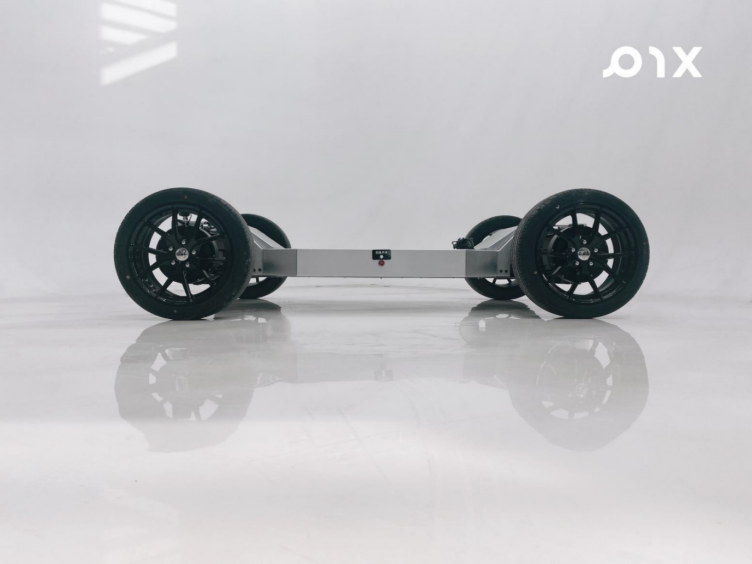

# PIX Chassis User Manual

## PIXLOOP DRIVE-BY-WIRE Chassis HOOKE

## Forword

Thank you very much for choosing our PIX products, your recognition and satisfaction are our greatest motivation.

PIXLOOP HOOKE drive-by-wire chassis is a pure drive-by-wire chassis created by [PIX Moving](https://www.pixmoving.com) for engineers. It is a drive-by-wire chassis for L4 low-speed autonomous driving in the parks. The chassis features a new steering pattern and a new way of driving. The power of the whole chassis is provided by a 72V power battery and a 12V maintenance-free lead-acid battery. The whole chassis is constructed of high-strength steel. The steering and power of the chassis can be easily controlled through the remote control, and the PIXLOOP chassis can be equipped with an autonomous driving system. This manual will use the HOOKE 4-wheel driving and 4-wheel steering version to introduce each function of the chassis in details while allowing you to quickly use this product.

## Disclaimer

1. This manual has included various function introductions and instructions as much as possible at the time of printing. However, due to continuous improvement of product functions and design changes, there may still be discrepancies with the product you purchased. Due to product updates, there may be deviations between this manual and the actual product in terms of color, appearance, etc., please refer to the actual product.

2. In order to protect the legitimate rights and interests of users, please be sure to read the instruction manual we provide with this product carefully before using this product. The chassis provider reserves the right to update the above documents. Please read this manual carefully before use and operate this product according to the manual.

3. This product is not suitable for use by persons under the age of 18 or other persons who do not have full capacity for civil conduct. Please avoid contact with this product by the above-mentioned persons, and please pay special attention when operating in places where the above-mentioned persons appear.

4. Once you start using this product, it is deemed that you have read, understood, recognized and accepted all the terms and contents of the product manual and disclaimer. The user promises to be responsible for his own behavior and all the consequences arising therefrom.

5. In the process of using this product, please be sure to strictly abide by and implement the requirements including but not limited to the instructions. For all personal injuries, accidents, property losses, legal disputes, and other adverse events that cause conflicts of interest caused by violations of the use behaviors suggested in the manual or force majeure, the user shall bear the relevant responsibilities and losses, and the product provider will We do not assume any responsibility.

6. The chassis provider will not bear any responsibility for any violation of laws and regulations that occurs directly or indirectly when the user uses this product.

## Outline
- [Product Introduction](product-introduction.md)
- [Usage and Development](usage-and-development.md)
- [Vehicle Safety Mechanism](vehicle-safety-mechanism.md)
- [Specs of Chassis](specs.md)
- [FAQ](FAQ.md)
- [Mauntenance and Precautions](maintenance-and-precautions.md)
- [Ater-sale Service & Technical Support](after-sale-service-and-technical-support.md)