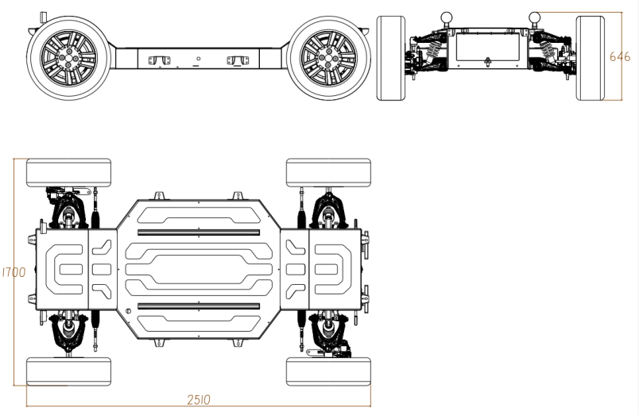

# Specs of Chassis

## 1 The overall specs of the chassis

| Dimensions (mm)                                  | 2510×1700×646                                                |
| -------------------------------------------------------- | ------------------------------------------------------------ |
| Wheelbase (mm)                                    | 1900                                                         |
| Front/Rear Wheel Track (mm)                    | 1465/1465                                                    |
| Front/Rear Overhang (mm)                        | 237/237                                                      |
| Min Ground Clearance (mm)                 | 175/170                                                      |
| Min Turning Radius (m)                          | 3/6                                                          |
| Curb Weight (kg)                                | 450/420                                                      |
| Max Allowable Load Mass  (kg)                | 500/400                                                      |
| Full Load Mass (kg)                             | 950/820                                                      |
| Normal Speed (Km/h)                           | ≤40                                                          |
| Max Speed (Km/h) No Load                  | 60/55                                                        |
| Max Gradability(%) No Load                    | 30/20                                                        |
| Acceleration Time (s)(0-30Km) No Load | 4.5/9                                                        |
| Inner/Outer Wheel Steering Angle (°)           | 30/27                                                        |
| Suspension Type                                     | Front & Rear Double Wishbone Independent Suspension |
| IP Level                                            | IP56                                                         |
| Suspension Spring Stroke (mm) Full Load    | 30±3                                                         |
| Frame Material                                       | High Strength Steel                                      |
| Drive Style                                          | Four-Wheel Drive                                         |
| Cruising Range (Km) No Load                  | 70                                                           |

## 2 Specs of Steering System

The steering system is mainly composed of the steering power supply system, the steering gear assembly and the steering gear controller. The power supply of the steering gear is provided by the 12V DC standard on-board system, and the steering gear and the controller meet the standards of mass-produced vehicles.

| Rated Power (KW)                       | 0.5                                                       |
| ------------------------------------------------ | --------------------------------------------------------- |
| Rated Torque(N.M)                      | 4.5                                                       |
| Rated Rotating Speed (r/min)         | 1050                                                      |
| Operating Voltage (V)                    | 10.8~14                                                   |
| Steering Range (°)                    | ±450                                                      |
| Steering Structure                          | Drive-by-wire Electric Steering                     |
| Steering Type                               | Ackerman Steering                                    |
| Steering Mode                               | Four-wheel/Wedge Steering                          |
| Operating Temperature (℃)                | -40~105                                                   |
| Communication Speed (kps)             | 500                                                       |
| Steering Accuracy  (°)                   | 1                                                         |
| Response Time (ms)                      | ≤150                                                      |
| Max Output Force of Steering Rod(N) | 10000                                                     |
| Communication Protocol                       | CAN2.0B                                                   |
| Steady-state error (°)                   | ±1                                                        |
| Overshoot (°)                             | ≤15                                                       |
| Control Method                               | Target Steering Wheel Angle & Angular Velocity |
| Toe-in (mm)                               | 5                                                         |

## 3 Specs of Braking System

Compared with the traditional automobile braking system, the braking system of the chassis reduces the number of actuators related to manual braking, and the braking of the whole chassis is completed by electronic control. The main components of the brake system include: brake power supply system, brake hydraulic oil pipe circuit, brake disc and electronic caliper. In addition to hydraulic braking, the vehicle also provides electronic parking functions.

| Braking Type for Driving                                | Drive-by-wire Hydraulic Braking  |
| ------------------------------------------------------------- | -------------------------------------- |
| Braking Type for Parking                                | Electronic Parking System        |
| Overshoot(Mpa)                                       | 0.5                                    |
| Brake Type                                               | Disc                                 |
| otor Type                                                | Permanent Magnet Brushless Motor |
| Rated Power (KW)                                     | 0.45                                   |
| Rated Torque(N.M)                                   | 2.3                                    |
| Rated Rotating Speed (r/min)                      | 1700                                   |
| Operating Voltage (V)                                 | 9~14                                   |
| Response Time (ms)                                   | ≤200                                   |
| Communication Protocol                                    | CAN2.0B                                |
| Max Braking Pressure (Mpa)                         | 7                                      |
| Max Pressure Build-up Time(ms)                   | ≤300ms                                 |
| Control Method                                            | target pressure loop-close     |
| Control precision (Mpa)                             | 0.1                                    |
| Steady-state Error (Mpa)                            | 0.3                                    |
| Operating Temperature (℃)                             | -40 ~ 85                               |
| Max Braking Distance (m)Full load@30km/h | ≤6                                     |

## 4 Specs of Power System

The power system is mainly composed of 72V DC power supply battery, power battery distribution box, hub motor, hub motor controller, vehicle control system and connecting wiring harness. The power system parameters are as follows.

| Rated Power (KW)                | 4×3/2×3                                                                     |
| ---------------------------------------- | --------------------------------------------------------------------------- |
| Rated Torque(N.M)              | 4×126/2×126                                                                 |
| Rated Rotating Speed (r/min) | 230                                                                         |
| eak Power(KW)                  | 4×3.8/2×3.8                                                                 |
| Peak Torque (N.M)              | 4×180                                                                       |
| Peak Rotating Speed (r/min)  | 550                                                                         |
| Rated Voltage (V)                | 72V                                                                         |
| Cooling Method                       | Wind                                                                     |
| Speed Control Accuracy (km/h) | 0.1                                                                         |
| Motor Size (mm)                 | ø280                                                                        |
| Responding Speed (ms)           | ≤200ms                                                                      |
| Steady-state Error (km/h)     | 0.2                                                                         |
| Communication Protocol               | CAN2.0B                                                                     |
| Drive motor type                   | Permanent Magnet Brushless DC Motor                                |
| Overshoot (km/h)               | 0.4                                                                         |
| Control Method                       | Accelerator Pedal Opening (Torque Control & Speed Control) |

## 5 Specs of Power Supply System

| Power Battery Type                                                                | Ternary Lithium Battery   |
| --------------------------------------------------------------------------------------- | ----------------------------- |
| Rated Voltage of Battery System (V)                                         | 72                            |
| Rated Capacity of Battery System (AH)                                     | 100/150                       |
| Battery System Energy (kW.h)                                               | 7.2/10.8                      |
| Max Output Power of Battery System(KW)(less than or equal to 60S) | 25                            |
| Over-discharge Protection Method for Power Battery                            | BMS                           |
| Overcharge Protection Method for Power Battery                                | BMS                           |
| Charging Method                                                                     | C Slow Charge            |
| Charging Time (h)                                                                | 6                             |
| Cooling Method                                                                      | Natural Cooling           |
| Low Voltage Starting Power                                                        | 12V Lead-acid Battery |

## 6 Dimension Drawing

