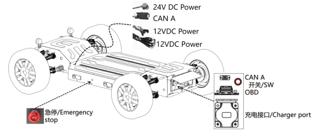

# Usage and development

## 1 Remote Control Chassis

### Chassis power on

- Open the rear inspection cover of the chassis body

- Press the chassis power switch, the chassis enters initialization and self-test, it takes about 5 seconds, and starts after the self-test is completed.

> Tip: The switch has its own indicator light. The switch open light is red and the chassis off light if off.

### Connect the remote control

Rotate the power switch of the wireless remote control to the ON position, turn on the switch of the remote control, and it is in the remote control takeover mode. The button is in the park and neutral positions, and the left and right push rods are in the middle position, so that the remote control is powered on and enters the remote control takeover mode. After the startup is successful, the page of the remote control is displayed as follows:

> Tip: If there is an abnormality, please check the emergency stop and the remote control button. Refer to the [common problems](./FAQ.md) to deal with, and proceed to the next step after confiming that there is no error.

### Chassis shutdown

After ensuring that the vehicle is parked correctly, activate the parking button of the remote control, turn off the power button of the remote control, and press the power button of the chassis to ensure that the vehicle is powered off.

## 2 Charging

The charging environment should be kept dry and ventilated. There should be no combustibles within 2 meters around the chassis and charging equipment. Follow the steps below to charge

1. Power off the chassis

2. Connecting the Portable Charger to the Chassis Charging Socket.

3. Connect to AC power (The voltage standard in China is 220V)

### Status of the indicator light

- Red and green flash alternately (one second interval), the battery is not connected, and the battery cannot be detected;

- The red indicator light flashes once per second, the fan is running, and the battery capacity is <80%;

- The yellow light/(green light) indicator flashes once every second, and the battery power is ≥80%

- Green light is always on (power off) battery power = 100%

1. When the indicator light of the charger is green, it means that the charging is completed.

2. Unplug the power connector of the charger.

3. Unplug the charging port connector of the charger.

## 3 Development Use

### 3.1 Upper Pod Development Support

#### Reserved mounting point

Hardware mount points. The chassis provides convenient hardware installation points, and customers can quickly and easily install brackets and equipment according to the arranged installation points, examples are as follows:

The connection is recommended to use the following specifications to install the connection material:

- Shrapnel nut, the reference specification of which is European standard 20M5.
- The installation guide, the specification of which is the European standard 2040 profile.
- Bolt, the reference specification of which is M5×10.

#### Chassis boundary model

The model contains two formats of cgr and 3dxml, which are deparameter formats, and customers can open them with current mainstream 3D engineering software, including but not limited to Dassault CATIA, UG, and Autodesk. CGR needs to be opened in insert mode when opening in CATIA.

Note that this file cannot be distributed at will, and some parts and objects are different, so it can only be used as a reference.

### 3.2 Autonomous Driving Application

The chassis provides common power supply for autonomous driving, dedicated CAN interface, standard chassis open automatic driving protocol and corresponding DBC files.

The cumulative output rated power of the power interface is 12V500W, 24V300W, and the interface type refers to "Product Overview-Switch Interface".

Provide two dedicated CAN interfaces for autonomous driving, plug-in model DB9, CAN2.0B communication, belonging to the chassis CAN-A

Provide standard chassis autonomous driving CAN protocol and corresponding DBC files.

When turning on the autonomous driving function, you need to switch the autonomous driving mode on the remote control.

### 3.3 Advanced Rights (Optional)

Support distributed drive research and development, realize advanced motion control, and open lighting control interface. The advanced driving interface is a control interface for studying the chassis dynamics model and optimizing the dynamics model according to your actual application. After the advanced mode is enabled, the main control algorithm and logic of the VCU can be bypassed, and instructions can be issued directly to each motion actuator. This item needs to be opened when purchasing an order, and conventional vehicles do not have this function.