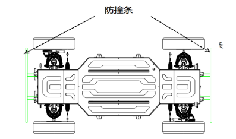
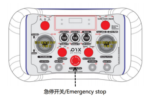
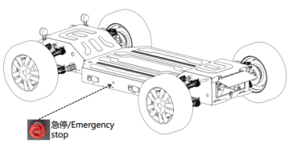

# Vehicle Safety Mechanism

## 1 Prevent The Wrong Touch

In order to ensure the driving safety of the vehicle, the accelerator push rod of the remote control is equipped with a misoperation mechanism, that is, the chassis does not move when the accelerator pusher is pushed violently, preventing the vehicle from "jumping out" rapidly.

> Note: For the sake of safety, please ensure that there are no pedestrians and obstacles within 10M in front and behind the chassis when driving the vehicle remotely, and always pay attention to dangerous situations, and be ready to take over at any time. It is recommended that the remote control be responsible for normal testing.

## 2 Collision Sensor (Optional)

The standard chassis has reserved anti-collision strip wire harness interfaces in the front compartment and rear compartment of the chassis body.

Chassis equipped with anti-collision strips has an anti-collision strip at the front and rear respectively, which can sense the pressure between the anti-collision strip and the chassis body to determine whether a collision has occurred. The minimum trigger force of the collision sensor is ≤50N, and the chassis immediately enters the emergency braking state after triggering , the vehicle enters the emergency braking mode, and the chassis will brake with the maximum braking force. In this mode, the vehicle cannot move and cannot be controlled. The emergency braking state can be released when the chassis loses contact with the collision object or the deformation of the anti-collision strip recovers (the internal switch is disconnected).

## 3 Remote Control Emergency Stop

- When the chassis encounters an emergency, press the emergency stop button in the middle of the remote control to start the emergency stop of the chassis and the parking brake, and the remote control interface will display "ESTOP!".

- Turn the emergency stop button to the right to release the emergency stop function. After the emergency stop, the chassis' turn signal flashes twice, and the tail light is brightly lit, and the emergency stop is released and resumed.

## 4 Emergency Stop Switch on Chassis

- The function of the emergency stop switch is to provide an emergency stop signal to the vehicle, and the button is located on the left side of the chassis body.

- Press the emergency stop switch on the body to trigger emergency braking, the chassis enters the emergency braking state, and the chassis will brake with the maximum braking force.

- After the emergency stop, the chassis ‘turning lights flash twice, and the tail light is brightly lit, and the emergency stop is released and resumed. In the state of emergency braking, the gear of the chassis is neutral, and the accelerator drive is invalid. Turn the emergency stop button clockwise to release the emergency braking state.

