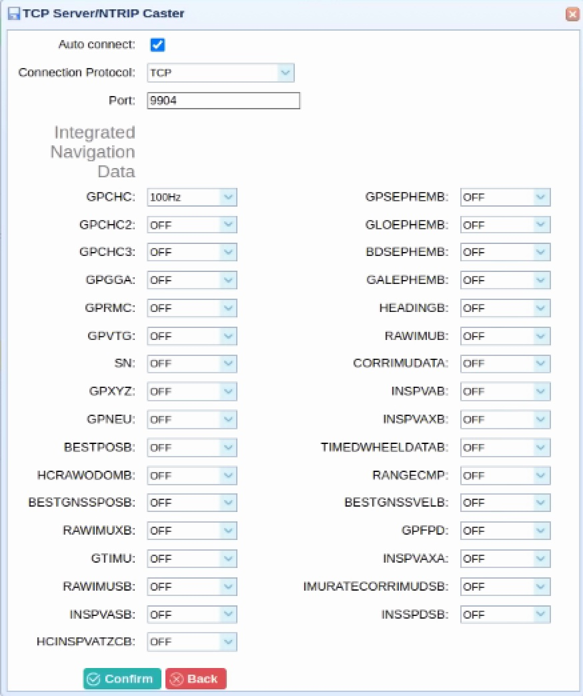
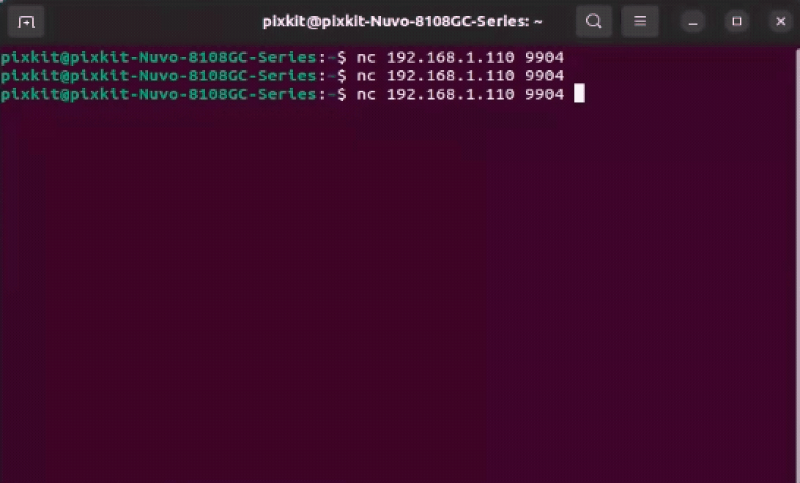
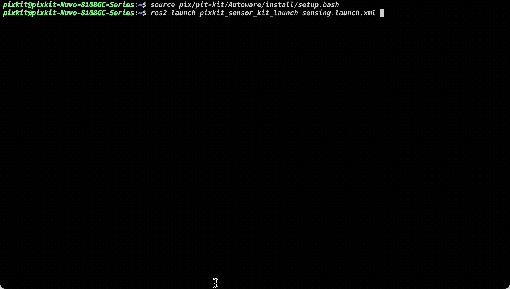
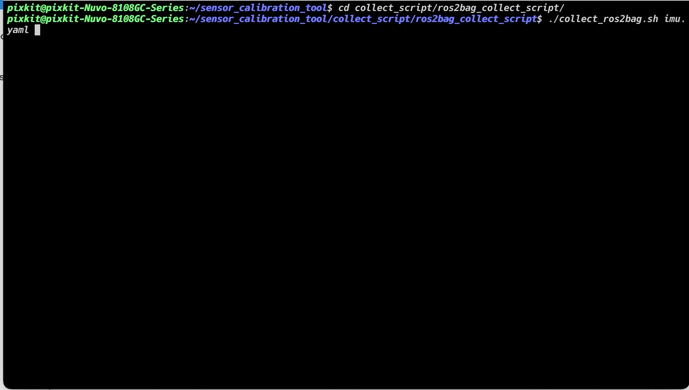
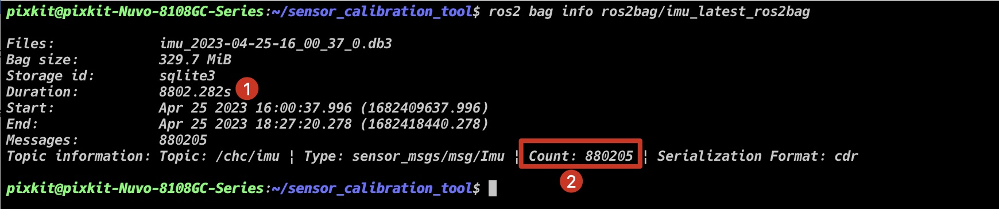
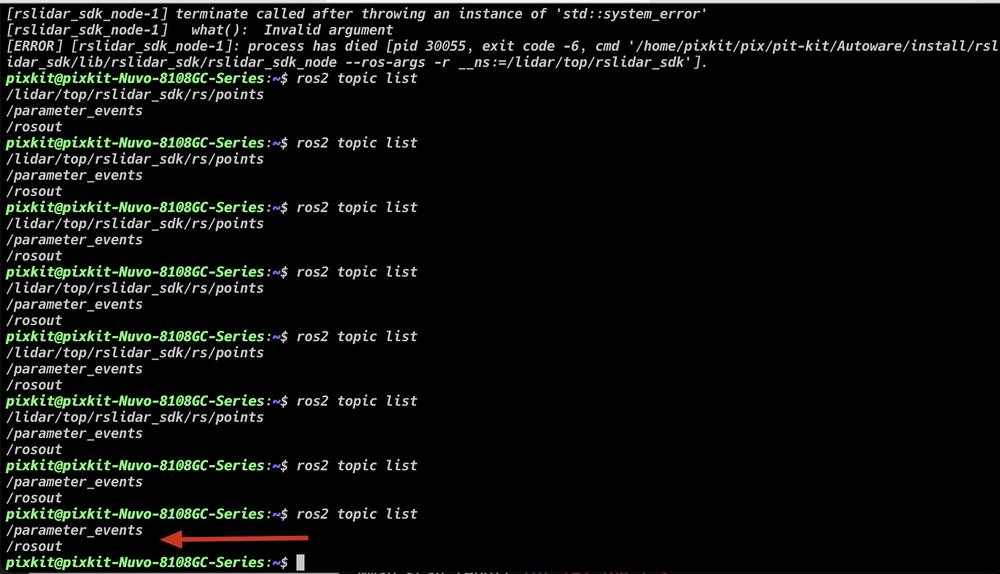
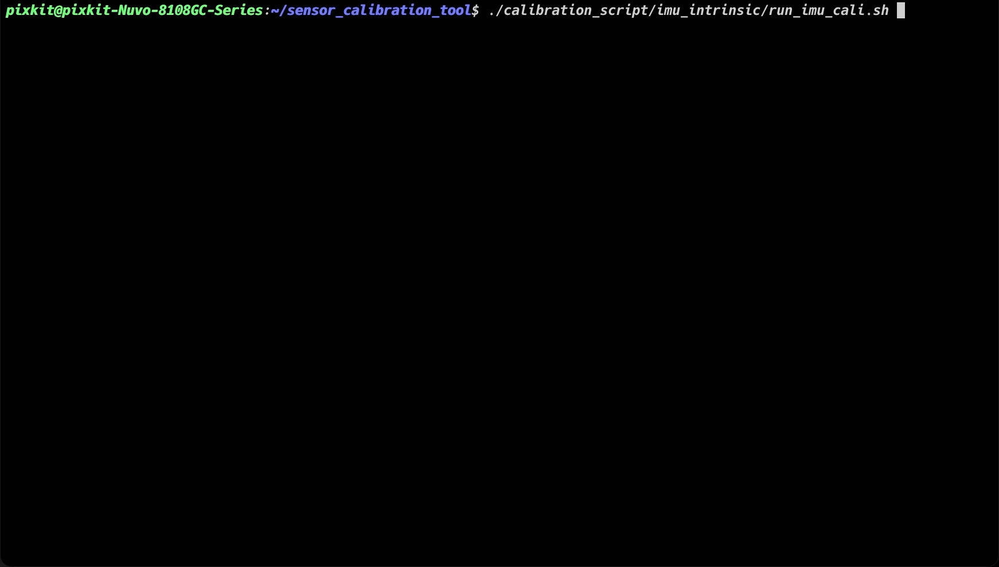

# IMU Calibration

## Overview

IMU (Inertial Measurement Unit) is one of the important sensors in autonomous driving vehicles, which can measure the acceleration and angular velocity information of the vehicle in three-dimensional space. In order to ensure accurate control and positioning of autonomous driving vehicles, it is necessary to perform intrinsic calibration of IMU. The purpose of intrinsic calibration is to precisely measure the error parameters of the measuring equipment, including the biases, scale factors, non-orthogonality, etc. of the accelerometer and gyroscope. Intrinsic calibration can improve the accuracy of IMU, thereby improving the positioning accuracy and control accuracy of autonomous driving vehicles.

## Prerequisites
- Completed [calibration tool installation](./%E6%A0%87%E5%AE%9A%E5%B7%A5%E5%85%B7%E5%AE%89%E8%A3%85.md)
- Prepared hardware:
    - [Huace CHC® CGI-410](https://www.huace.cn/product/product_show/467)
- Data Type: `sensor_msgs/msg/Imu`
- Data Requirement: Only record `angular_velocity` and `linear_acceleration`.

> As long as the data requirement is met, imu calibration can also be performed on ros2bag data from other sensors.

## Calibration Steps
> Note: Keep the industrial computer without running other ROS programs to prevent the sensor from being occupied.

### Step 1: Configure the `Huace CHC® CGI-410` and check whether the combination navigation is connected to the industrial computer.
1. Open the `google_chrome` browser.
2. Enter the website: `192.168.1.110`.
3. Click in sequence: `I/O setting` -> `TCP Server/NTRIP Caster4` -> <kbd>Disconnect</kbd> -> <kbd>Connect</kbd>.



4. Open the terminal and enter: `nc 192.168.1.110 9904` to determine whether the combination navigation is connected to the industrial computer.



### Step 2: Record IMU data preparation.
- Recording time: 2 hours.
- On a horizontal surface, the vehicle is placed stationary.
- Start the sensor.

```shell
source pix/pit-kit/Autoware/install/setup.bash
ros2 launch pixkit_sensor_kit_launch sensing.launch.xml
```


- Start recording.
```shell
cd collect_script/ros2bag_collect_script/
./collect_ros2bag.sh imu.yaml
cd -
```


- Recording success.
```
ros2 bag info ros2bag/imu_latest_ros2bag
```
> Check whether the recording time `Duration` is greater than `2hr` (2 hours) [8802.282/3600=1.45h]

> Check whether `Count` and [Duration multiplied by frequency] are roughly the same: indicating that the data has not been lost too much.

> - imu frequency is 100hz--8802.282*100=8802282



### Step 3: Launch the calibration program script.
- Stop the sensor program that is running.
> Enter `ros2 topic list`, and only two topics are left, indicating that no programs are running.



- Run the calibration script.

```shell
./calibration_script/imu_intrinsic/run_imu_cali.sh
```


### Step 4: Check the calibration results.
```shell
# Output the result.
cat ./calibration_script/imu_intrinsic/output/output_imu_intrinsic.yaml
```

### Calibration Result
> Mapping of imu intrinsic calibration file parameters

| xsens_imu_param.yaml | param.yaml |
| ---- | ---- |
| `gyr_n` | `imuGyrNoise` |
| `gyr_w` | `imuGyrBiasN` |
| `acc_n` | `imuAccNoise` |
| `acc_w` | `imuAccBiasN` |


sensor_calibration_tool/shared_folder/pix_data/imu/result/xsens_imu_param.yaml
```
Gyr:
    unit: " rad/s"
    avg-axis:
    gyr_n: 1.5059072284923697e-03
    gyr_w: 4.3430855283551206e-05
    x-axis:
    gyr_n: 1.6901233770452774e-03
    gyr_w: 5.0850707578827144e-05
    y-axis:
    gyr_n: 1.3392742394140514e-03
    gyr_w: 3.7654685426892668e-05
    z-axis:
    gyr_n: 1.4883240690177805e-03
    gyr_w: 4.1787172844933785e-05
Acc:
    unit: " m/s^2"
    avg-axis:
    acc_n: 5.9215155351791055e-03
    acc_w: 1.3379378640306186e-04
    x-axis:
    acc_n: 6.0017230453598448e-03
    acc_w: 1.0726720420556991e-04
    y-axis:
    acc_n: 6.7689914243794181e-03
    acc_w: 1.6961241589651517e-04
    z-axis:
    acc_n: 4.9938321357980535e-03
    acc_w: 1.2450173910710051e-04
```

calibration_script/imu_intrinsic/config/param.yaml
```
# IMU Settings
imuAccNoise: 5.9215155351791055e-03
imuGyrNoise: 1.5059072284923697e-03
imuAccBiasN: 1.3379378640306186e-04
imuGyrBiasN: 4.3430855283551206e-05
```


## NEXT
Now that you have completed the `camera intrinsic calibration`, proceed to [LiDAR-IMU Calibration](./LiDAR-IMU-calibration.md).