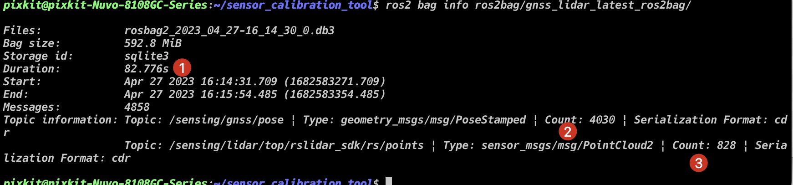
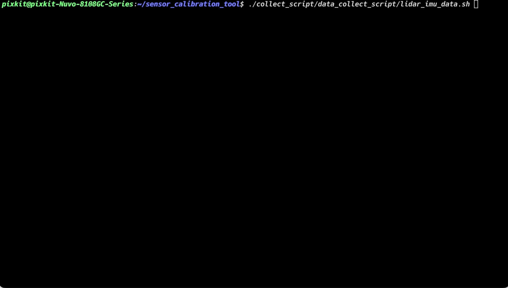
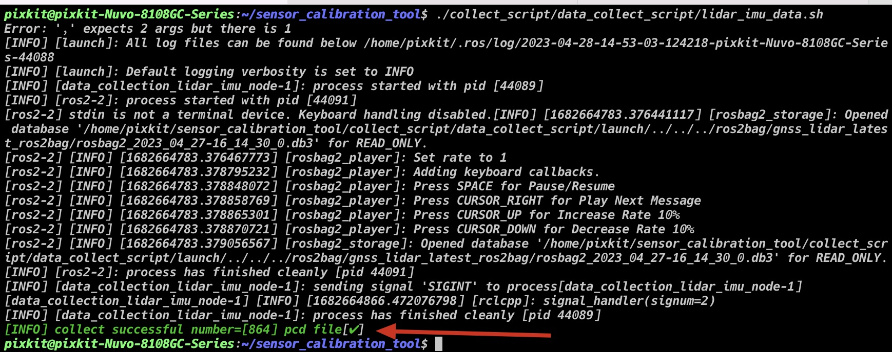
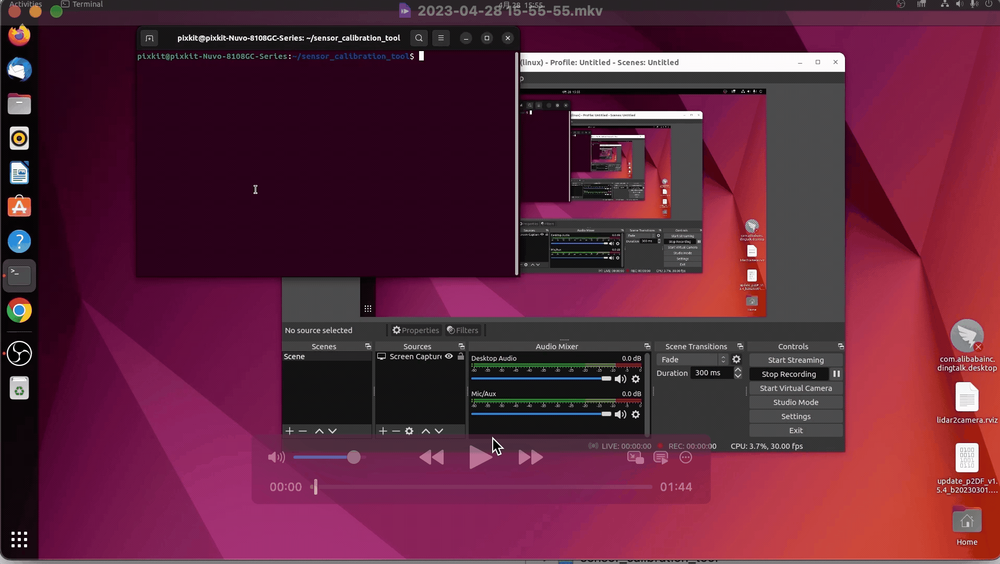
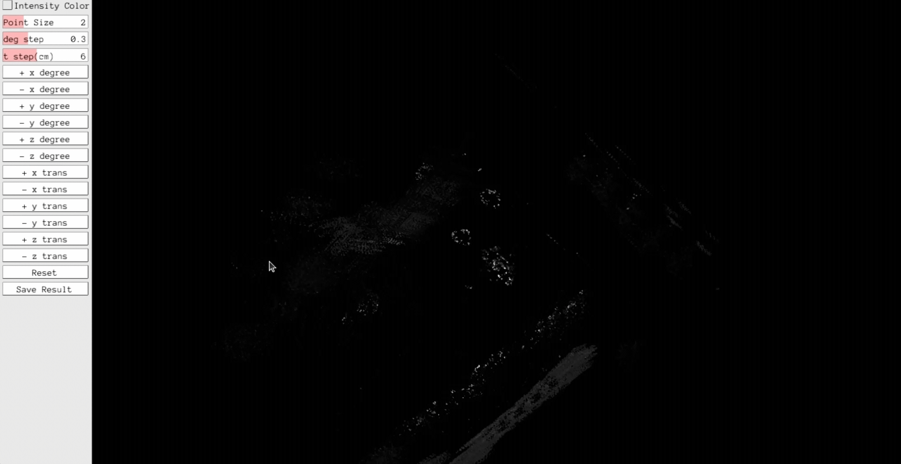
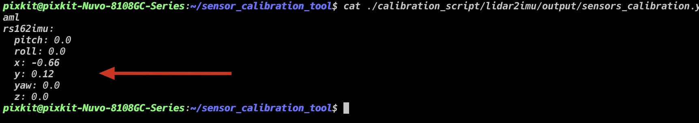

# LiDAR IMU Calibration

## Overview
LiDAR-IMU Calibration is the process of registering data from a LiDAR (Light Detection and Ranging) and an Inertial Measurement Unit (IMU) to align their data in time and space. This process solves the problem of temporal and spatial errors between the two sensors, improving the accuracy and stability of applications such as SLAM, localization, and mapping.

LiDAR and IMU are commonly used sensors in the field of robotics. LiDAR is used to acquire 3D point cloud data of the environment, while IMU measures the robot's attitude (including angle and angular velocity). By calibrating the data from the two sensors, their relative position, attitude, and temporal relationship can be accurately determined, enabling more accurate and stable robot positioning, navigation, and mapping.

During the calibration process, a set of data is collected with known poses (such as rotation and translation), and the data is processed to determine the relative pose and time offset between the two sensors. This process requires multiple calculations and optimizations and is usually assisted with tools such as calibration boards.

It should be noted that different LiDARs and IMUs may have different error and noise characteristics, so the calibration process needs to be adjusted and optimized according to the specific sensors to achieve the best results.

## Prerequisites
- Completed [Tool Installation](./Tool-Installation.md)
- Hardware prepared:
    - [CHC® CGI-410](https://www.huace.cn/product/product_show/467)
    - Top-mounted LiDAR [RS-Helios-16P]
    - Combination navigation and positioning status `Navigation Combination`

## Starting Calibration
### Step 1: Data Collection
- Start the sensor

```shell
source pix/pit-kit/Autoware/install/setup.bash
ros2 launch pixkit_sensor_kit_launch sensing.launch.xml
```


- Start recording

```shell
cd collect_script/ros2bag_collect_script/
./collect_ros2bag.sh gnss_lidar.yaml
cd -
```

- Recording success indicator

> Recording requirements:
>   - Vehicle driving in a figure-eight pattern for three laps


```shell
ros2 bag info ros2bag/gnss_lidar_latest_ros2bag
```

> Check if `Count` and [Duration times frequency] are approximately the same: indicates that data loss is minimal.

> - GNSS frequency is 50 Hz--82.776 * 50 = 4138.8
> - LiDAR frequency is 10 Hz--82.776 * 10 = 827.76



### Step 2: Data Processing
- Start processing
```
./collect_script/data_collectscript/lidar_imu_data.sh
```


- Processing success indicator




### Step 3: Start Calibration

> Mouse click to move the viewpoint

> Mouse double-click to rotate the viewpoint



#### Extrinsics Adjustment
| Button | Description | 
| --- | --- | 
| +x degree | Adjust the roll angle | 
| +y degree | Adjust the pitch angle | 
| +z degree | Adjust the yaw angle |
| +x trans | Adjust the x-axis displacement | 
| +y trans | Adjust the y-axis displacement |
| +z trans | Adjust the z-axis displacement | 



#### Success Indicator

```shell
cat ./calibration_script/lidar2imu/output/sensors_calibration.yaml
```



## NEXT
Now that you have completed the `LiDAR-IMU calibration`, you can proceed with the [LiDAR-LiDAR calibration](./LiDAR-LiDAR-calibration.md).