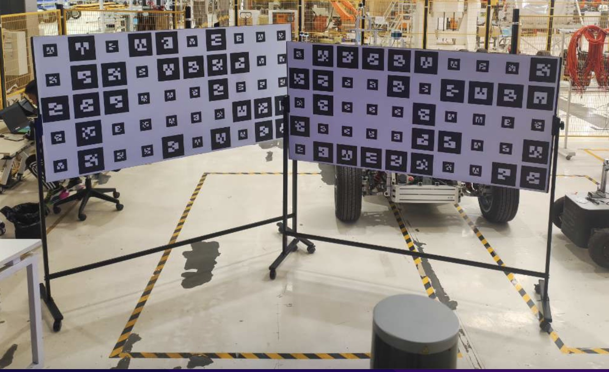
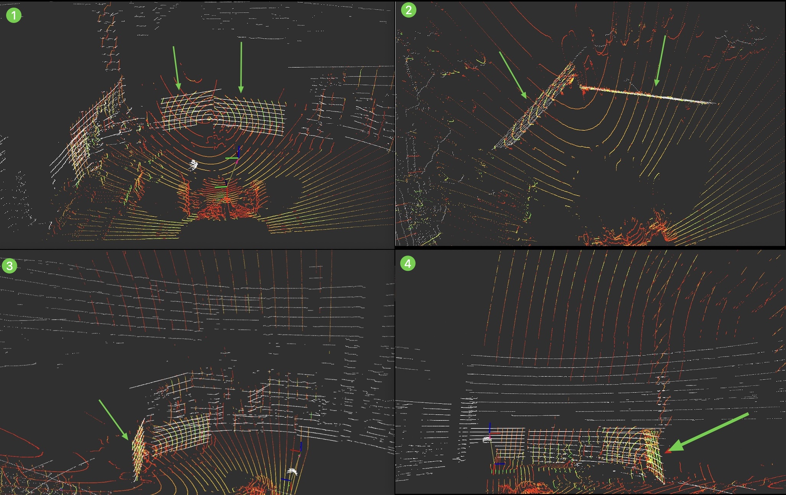

# LiDAR-LiDAR Calibration

## Overview
This document provides instructions for calibrating the top laser radar [RS-Helios-16P] and the front blind spot radar [RS-Bpearl] using the lidar-to-lidar calibration tool.

## Prerequisites
- The calibration tool has been installed, as described in [Calibration Tool Installation](./Calibration-Tool-Installation.md).
- The following hardware is available:
    - Top laser radar [RS-Helios-16P]
    - Front blind spot radar [RS-Bpearl]

## Calibration Steps

### Step 1: Select Calibration Site
- Prepare two 1.8m X 0.9m wooden boards.
- Place the two wooden boards in the common viewing area of the two lidars.
- Place the two wooden boards at a 120-degree angle.


> If there are no such wooden boards, a corner of a wall can also be used as a reference.

### Step 2: Launch the Calibration Program

```shell
./calibration_script/lidar2lidar/run_lidar2lidar.sh
```


### Step 3: Check Calibration Results

> Observe rviz2. Calibration is complete when the white point cloud and the colored point cloud in the [left view|right view|top view|front view] overlap completely.

> - White point cloud: Top lidar.
> - Colored point cloud: Front blind spot lidar.

