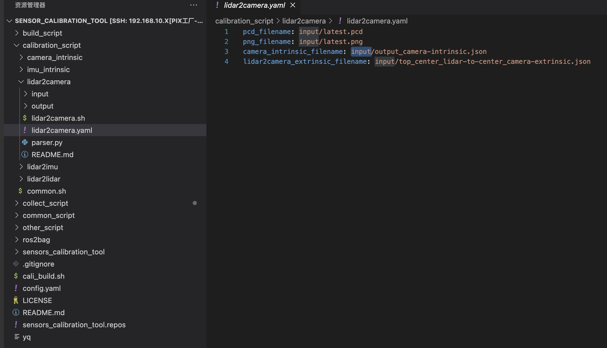

# LiDAR Camera calibration

## Overview

The calibration of LiDAR to camera is used to register the 3D point cloud data of the LiDAR with the 2D image data of the camera, so as to achieve three-dimensional perception of objects. Through the calibration of LiDAR and camera, their relative position and posture, as well as the transformation matrix between them, can be determined, so that the three-dimensional point cloud data collected by LiDAR can be mapped to the camera image, and the image information collected by the camera can be converted into three-dimensional coordinate information. This is very important for applications such as autonomous driving and robot vision, which can achieve accurate perception and understanding of the environment.

## Objectives of this chapter

- Understand extrinsic calibration
- Master the calibration skills of LiDAR to camera
- Calibrate qualified extrinsic parameters

## Calibration of the vehicle
- hook 
    - Top LiDAR [RS-Helios-16P]
    - Front camera [SG2-OX03CC-5200-GMSL2F-H120]

## Prerequisites

- Completed [camera intrinsic calibration](./camera-intrisics-calibration.md)
- Find a suitable calibration scene
    - There is a sedan in the camera image
    - There is a utility pole in the camera image
    - There is a wall with windows in the camera image


## Start calibration

### step-1: Collect calibration data
#### Start collecting

#### Start recording.
```shell
# Enter the docker container
./docker.sh  exec
# Execute the recording script
./get_pcd_png.sh
# ctrl+c -  Shortcut key to end recording
```


#### Check whether the recorded data has been recorded successfully.
```shell
# ctrl+d Exit the container
# Ensure successful data recording
ll ./shared_folder/pix_data/
ll ./shared_folder/pix_data/latest/pcd/
ll ./shared_folder/pix_data/latest/png/
```


### step-2:Start the calibration program
#### File structure


| Script | Description | Note |
| --- | --- | --- |
| lidar2camera.sh | Script for starting calibration program | N/A |
| lidar2camera.yaml | Configuration file for calibration program | Input parameters for calibration program |
| config/center\_camera-intrinsic.json | Camera intrinsic file | Automatically filled in after completing [camera intrinsic calibration](./camera-intrisics-calibration.md) |
| config/top\_center\_lidar-to-center\_camera-extrinsic.json | Initial extrinsic file | Default value can be used |
| config/parser.py | Script to generate sensors\_calibration.yaml file | Generates parameter file usable by Autoware |
| config/sensors\_calibration.yaml | Extrinsic parameter file | Parameter file usable by Autoware |
| config/example.jpg | Example result of calibration output | Automatically filled in after completing [camera intrinsic calibration](./camera-intrisics-calibration.md) |
| config/example.txt | Example result of calibration output | Automatically filled in after completing [camera intrinsic calibration](./camera-intrisics-calibration.md) |

#### calibration_script/lidar2camera/lidar2camera.yaml 



| Parameter Name | Parameter Function |
| --- | --- |
| pcd\_path | The input path of point cloud data required by the calibration program. |
| png\_path | The input path of images required by the calibration program. |


### Start calibration

```shell
./calibration_script/lidar2camera/lidar2camera.sh
```


### step-3: Intrinsics/Extrinsics configuration


You can see that in the picture, the utility pole, the vehicle plate and the point cloud of the window are all aligned. This is the result of calibration. If you want to achieve such a result, you need to adjust the parameters to achieve such a calibration effect. You need to click the program button to fine-tune it.

#### Extrinsics Adjustment

| Button | Description |
| --- | --- |
| +x degree | Adjust the roll angle |
| +y degree | Adjust the pitch angle |
| +z degree | Adjust the yaw angle |
| +x trans | Adjust the x-axis translation |
| +y trans | Adjust the y-axis translation |
| +z trans | Adjust the z-axis translation |

#### Camera Intrinsic Adjustment

| Button | Description |
| --- | --- |
| \+ fy | The camera intrinsic can be left at default |
| \+ fx | The camera intrinsic can be left at default |

<kbd>Intensity Color</kbd>: LiDAR intensity is a parameter that records the intensity of the laser beam's return, which allows us to see the intensity of the point cloud under different materials.

<kbd>Overlap Filter</kbd>: Eliminates overlapping LiDAR points within 0.4m in depth.

<kbd>deg step</kbd> <kbd>t step</kbd> <kbd>fxfy scale</kbd>: These three buttons can adjust the step size of each click or keyboard input - default is recommended.

<kbd>point size</kbd>: Adjusts the size of LiDAR points in the projected image.

<kbd>Reset</kbd>: Click this button to reset all manual adjustments and restore the initial parameters.

<kbd>Save Image</kbd>: When the calibration is completed, click this button, and the calibration image, extrinsics and intrinsics matrix will be stored in `calibration_script/lidar2camera/config` by default.

### step-4: Verify the calibration results
- file1：`~/pix/pit-kit/Autoware/install/individual_params/share/individual_params/config/default/pixkit_sensor_kit/sensors_calibration.yaml`
- file2：`~/pix/pit-kit/Autoware/install/pixkit_sensor_kit_description/share/pixkit_sensor_kit_description/config/sensors_calibration.yaml`

- Blying results: `calibration_script/lidar2camera/config/sensors_calibration.yaml`


Step 1: Back up `file 2` and `file 2`
Step 2: Fill in the `description result` into `Document 2` and `Document 2`

## NEXT
Now that you have completed `LiDAR Camera calibration`, you can move on to [IMU calibration](./IMU-calibration.md)