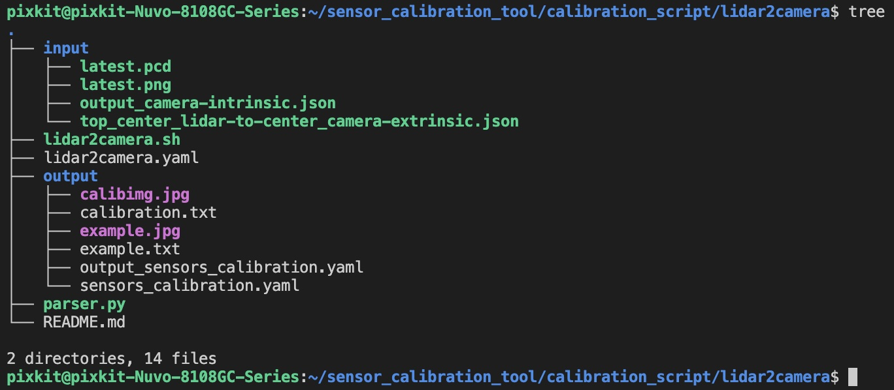

# LiDAR Camera calibration

## Overview

The calibration of LiDAR to camera is used to register the 3D point cloud data of the LiDAR with the 2D image data of the camera, so as to achieve three-dimensional perception of objects. Through the calibration of LiDAR and camera, their relative position and posture, as well as the transformation matrix between them, can be determined, so that the three-dimensional point cloud data collected by LiDAR can be mapped to the camera image, and the image information collected by the camera can be converted into three-dimensional coordinate information. This is very important for applications such as autonomous driving and robot vision, which can achieve accurate perception and understanding of the environment.

## Objectives of this chapter

- Understand extrinsic calibration
- Master the calibration skills of LiDAR to camera
- Calibrate qualified extrinsic parameters

## Calibration of the vehicle
- hook 
    - Top LiDAR [RS-Helios-16P]
    - Front camera [SG2-OX03CC-5200-GMSL2F-H120]

## Prerequisites

- Completed [camera intrinsic calibration](./camera-intrisics-calibration.md)
- Find a suitable calibration scene
    - There is a sedan in the camera image
    - There is a utility pole in the camera image
    - There is a wall with windows in the camera image


## Start calibration
> Completed [camera intrinsic calibration](./camera-intrisics-calibration.md) -> `step-3 Signs of success`

### step-1: Collect calibration data
```shell
./calibration_script/lidar2camera/lidar2camera.sh
```

#### Check if the collected data is successfully collected
```shell
ll ros2bag/pcd_png_data
```


### step-2: Start the Calibration Program
#### File structure


| Script | Description | Remarks |
| ---- | ---- | ---- |
|lidar2camera.sh | Calibration program startup script | None |
|lidar2camera.yaml | Calibration program configuration file | Input parameters for the calibration program |
|parser.py|Generate sensors_calibration.yaml file| Generate parameters file for Autoware|
|input|Raw data for calibration| Raw data required by the calibration program |
|input/output_camera-intrinsic.json| Camera intrinsic file| Output file from [camera intrinsic calibration](./camera%E5%86%85%E5%8F%82%E6%A0%87%E5%AE%9A.md) |
|input/top_center_lidar-to-center_camera-extrinsic.json| Initial extrinsic file| Default is sufficient |
|output/sensors_calibration.yaml| Extrinsic parameter file| Parameters file for Autoware |
|output/example.jpg| Example output of calibration | |
|output/example.txt| Example output of calibration | |


#### calibration_script/lidar2camera/lidar2camera.yaml 


| Parameter Name | Parameter Function | Source |
| ---- | ---- | --- |
| pcd_path | Path of input image required by the calibration program | ros2bag/pcd_png_data/latest.pcd |
| png_path | Path of input point cloud required by the calibration program | ros2bag/pcd_png_data/latest.png |
| camera_intrinsic_filename | Input camera intrinsic file required by the calibration program | calibration_script/camera_intrinsic/output/output_camera-intrinsic.json |
| lidar2camera_extrinsic_filename | Input lidar-to-camera extrinsic file required by the calibration program | Default is sufficient |

### Copy calibration raw data to input folder
|Copy File|
| -- |
|ros2bag/pcd_png_data/latest.pcd > calibration_script/lidar2camera/input/latest.pcd|
|ros2bag/pcd_png_data/latest.png > calibration_script/lidar2camera/input/latest.png|
|calibration_script/camera_intrinsic/output/output_camera-intrinsic.json > calibration_script/lidar2camera/input/output_camera-intrinsic.json|

### Start calibration

```shell
./calibration_script/lidar2camera/lidar2camera.sh
```


### step-3: Parameter Configuration

In the figure, the point clouds of the electric pole, the vehicle plate, and the window are aligned. This is a calibrated result. To achieve such a result, you need to adjust the parameters to achieve this calibration effect. Click the program button to fine-tune it.

#### Extrinsic Adjustment
| Button | Description | 
| --- | --- | 
| +x degree | Roll angle adjustment | 
| +y degree | Pitch angle adjustment | 
| +z degree | Yaw angle adjustment |
| +x trans | X-axis displacement adjustment | 
| +y trans | Y-axis displacement adjustment |
| +z trans | Z-axis displacement adjustment | 

#### Camera Intrinsic Adjustment
| Button | Description |
| --- | --- | 
| \+ fy | Default value for camera intrinsic | 
| \+ fx | Default value for camera

<kbd>Intensity Color</kbd>: The intensity of LiDAR is a parameter that records the strength of the laser beam return, and it shows the intensity of the point cloud under different materials.

<kbd>Overlap Filter</kbd>: Eliminates the overlapping LiDAR points with a depth within 0.4m.

<kbd>deg step</kbd> <kbd>t step</kbd> <kbd>fxfy scale</kbd>: These three buttons can adjust the step size of each click or keyboard input - default is recommended.

<kbd>point size</kbd>: Adjusts the size of LiDAR points in the projected image.

<kbd>Reset</kbd>: Click this button to reset all manual adjustments and restore the initial parameters.

<kbd>Save Image</kbd>: Click this button after the calibration is finished to save the calibrated image, external and internal parameter matrices in the default directory.

### Step-4: Validate the calibration results
- Fill in the calibration results in the parameter configuration file
    - File 1: `~/pix/pit-kit/Autoware/install/individual_params/share/individual_params/config/default/pixkit_sensor_kit/sensors_calibration.yaml`
    - File 2: `~/pix/pit-kit/Autoware/install/pixkit_sensor_kit_description/share/pixkit_sensor_kit_description/config/sensors_calibration.yaml`
    - Calibration Results: `calibration_script/lidar2camera/config/sensors_calibration.yaml`

Step 1: Backup `File 1` and `File 2`.

Step 2: Fill in the `Calibration Results` in both `File 1` and `File 2`.

- Start the simulation to view the results
```shell
~/autoware_sim.sh
```


## NEXT
Now that you have completed `LiDAR Camera calibration`, you can move on to [IMU calibration](./IMU-calibration.md)