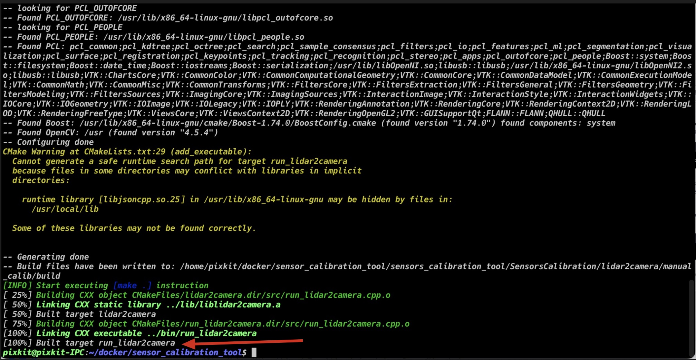
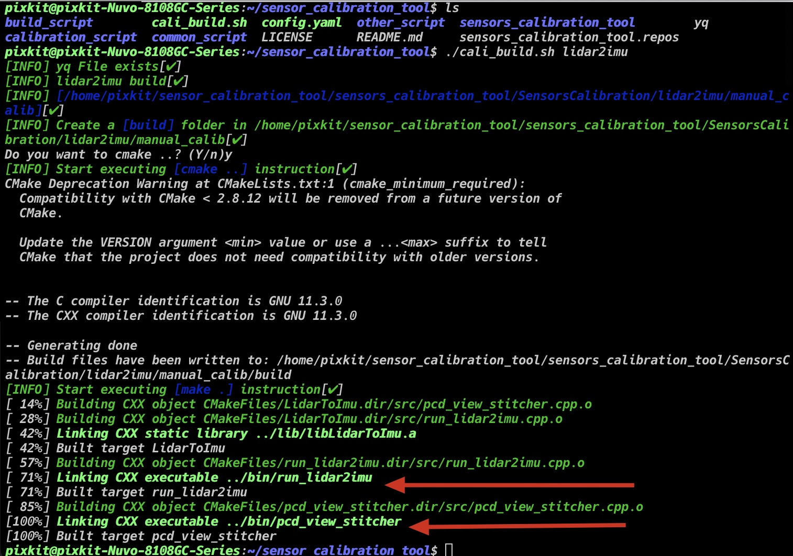
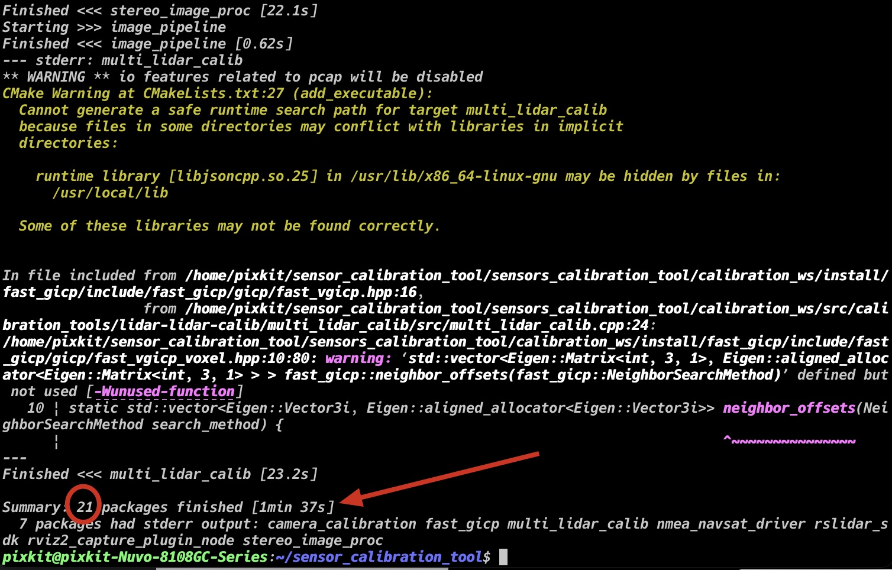
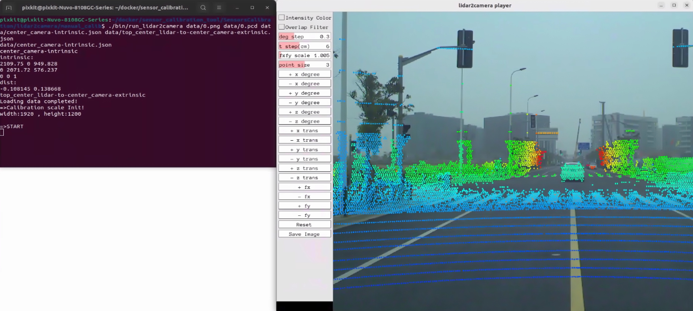

# Installation of Calibration Toolset

> For users who have purchased pixkit, this step has been completed for you. Please proceed to [camera intrinsic calibration](./camera-intrisics-calibration.md)

## Overview
- ROS2 data collection package
- ROS2 calibration package
- Calibration executable files

## Prerequisites
- Ubuntu 22.04
- Linux kernel == 5.19.0-40-generic
- ROS2: [Humble](https://docs.ros.org/en/humble/index.html)
- [Autoware](https://github.com/pixmoving-moveit/Autoware/tree/feature/pixkit_sensors)


## Installation
### Step 1: Clone the code repository
```shell
git clone -b feature/deploy-calibration-tools https://github.com/pixmoving-moveit/sensor_calibration_tool.git
mkdir sensors_calibration_tool
vcs import sensors_calibration_tool < sensors_calibration_tool.repos --recursive
```

### Step 2: Install Dependencies

#### Install dependencies `[apt]`

```shell
# Camera intrinsic calibration tool
sudo apt install ros-$ROS_DISTRO-camera-calibration-parsers
sudo apt install ros-$ROS_DISTRO-camera-info-manager
sudo apt install ros-$ROS_DISTRO-launch-testing-ament-cmake

# IMU intrinsic calibration
sudo apt-get install libdw-dev 
```

#### Install dependencies `[source]`
- [gflags](https://github.com/gflags/gflags)
- [jsoncpp](https://github.com/open-source-parsers/jsoncpp)
- [Pangolin](https://github.com/stevenlovegrove/Pangolin/tree/v0.6) -- branch==v0.6
- [fast_gicp](https://github.com/SMRT-AIST/fast_gicp)


### Step 3: Build

| Calibration Name | Calibration Program | Program Address |
|  ----  | ----  | ----  |
| lidar2camera | Executable program for lidar-to-camera calibration | /sensors_calibration_tool/SensorsCalibration/lidar2camera/manual_calib/ |
|lidar2imu|Executable program for lidar-to-IMU calibration|sensors_calibration_tool/SensorsCalibration/lidar2imu/manual_calib/ |
|calibration_ws|Executable programs for camera intrinsic and lidar-to-lidar calibration|sensors_calibration_tool/calibration_ws/ |

#### build script commands

``` shell
./cali_build.sh [function_name]
# parameters as follows
# help: Help document
# calibration_ws
#    - Calibration data acquisition package
#    - IMU intrinsic calibration package
#    - Camera intrinsic calibration package
#    - Lidar-to-lidar calibration package
# lidar2camera
# lidar2imu
```

#### build lidar2camera tool

```shell
./cail_build.sh lidar2camera
```


#### build lidar2imu tool

```shell
./cail_build.sh lidar2imu
```


#### build calibration_ws

```shell
./cail_build.sh calibration_ws
```

> The building of `calibration_ws` has successfully built, if you can see the message in the terminal below. `21 packages have been completed`



### Step 4: verify calibrating tools
> Verify whether the executable programs for lidar-to-camera and lidar-to-IMU calibration have been compiled successfully by executing the following command:

```shell
# Execute the command and the output should be similar to the following image
cd ./sensors_calibration_tool/SensorsCalibration/lidar2camera/manual_calib/
./bin/run_lidar2camera data/0.png data/0.pcd data/center_camera-intrinsic.json data/top_center_lidar-to-center_camera-extrinsic.json
cd -
```


## NEXT

Now that you have completed the `calibration tool installation`, you can proceed to

- [camera intrinsic calibration](./camera-intrisics-calibration.md)

## Frequently Asked Questions
### Q1: Error occurs when executing `step-2: docker deployment - build docker image`
- Analysis: Some files were not downloaded successfully due to network issues
- Solution: Repeat `step-2: docker deployment - build docker image` again