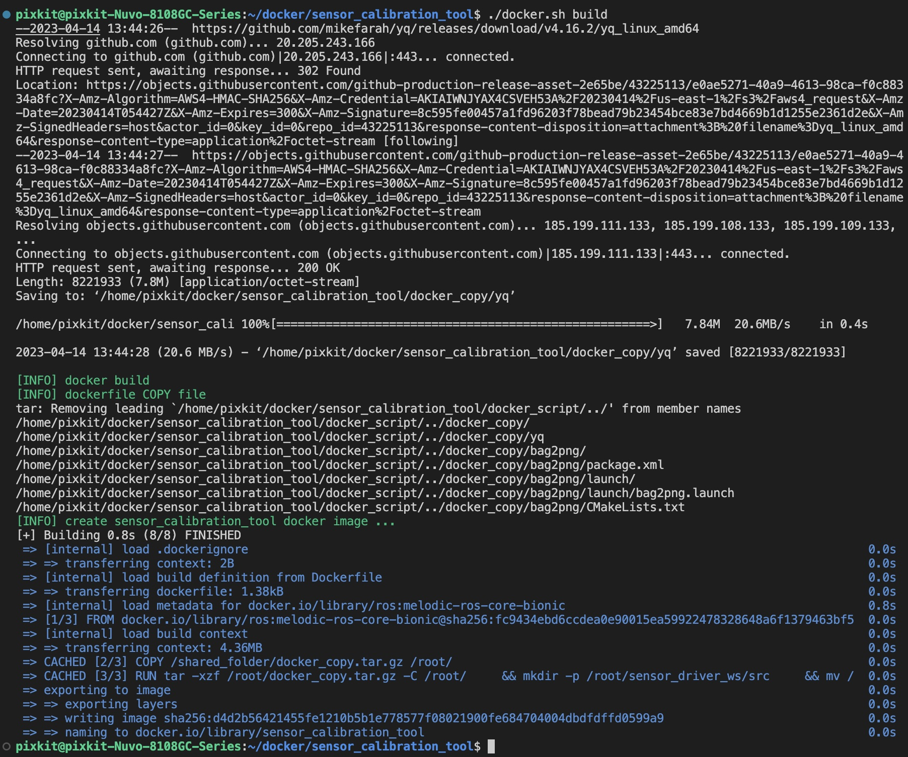
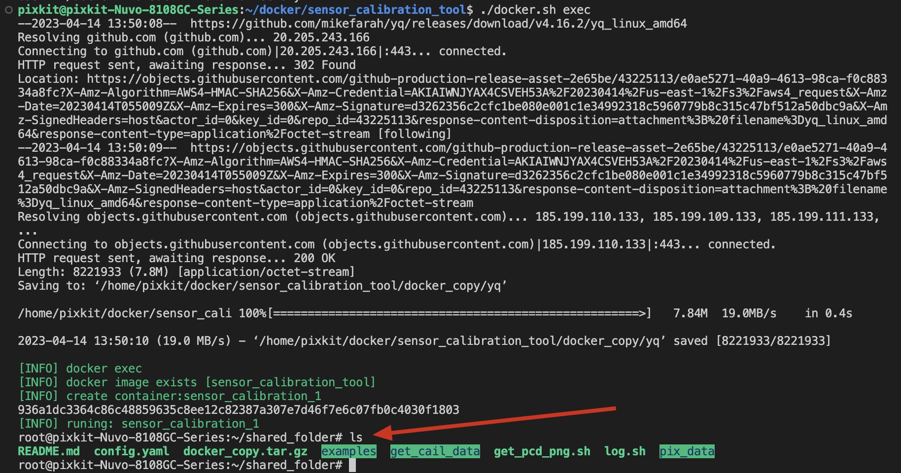
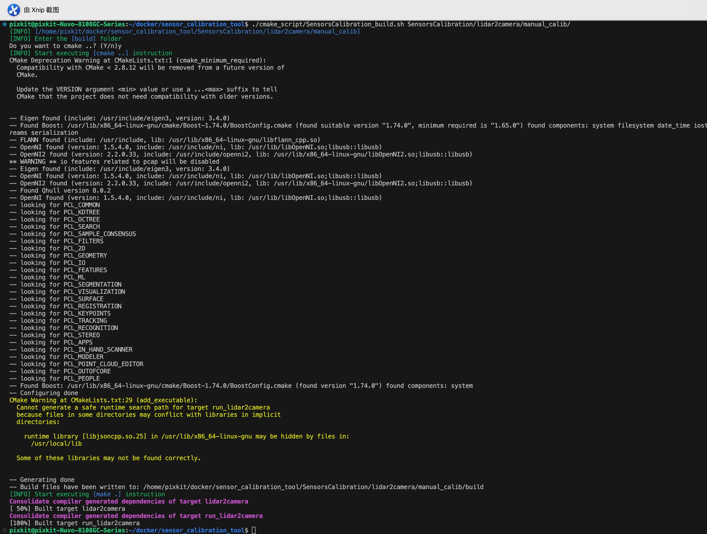
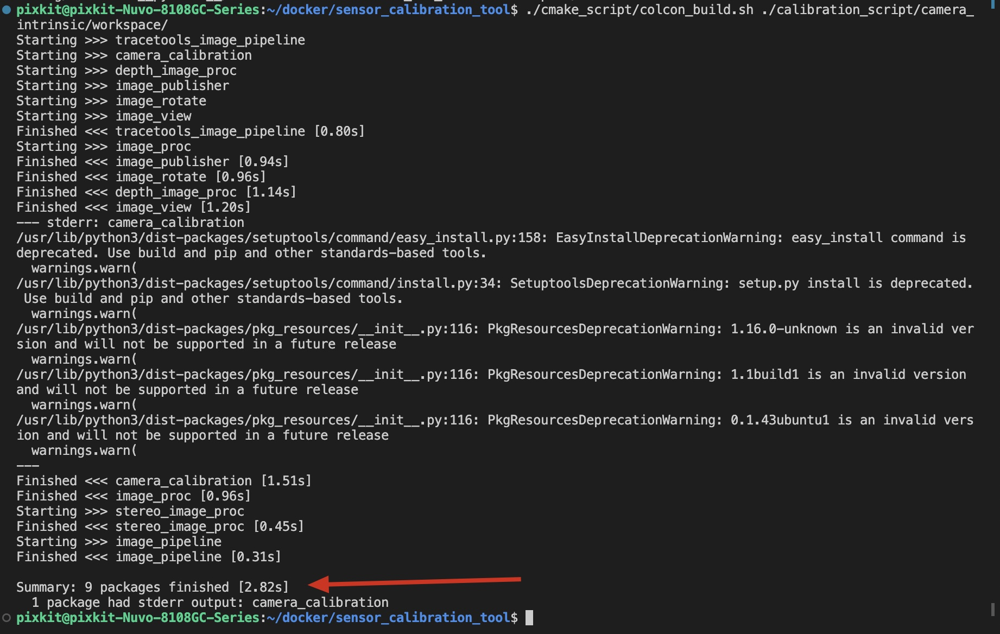
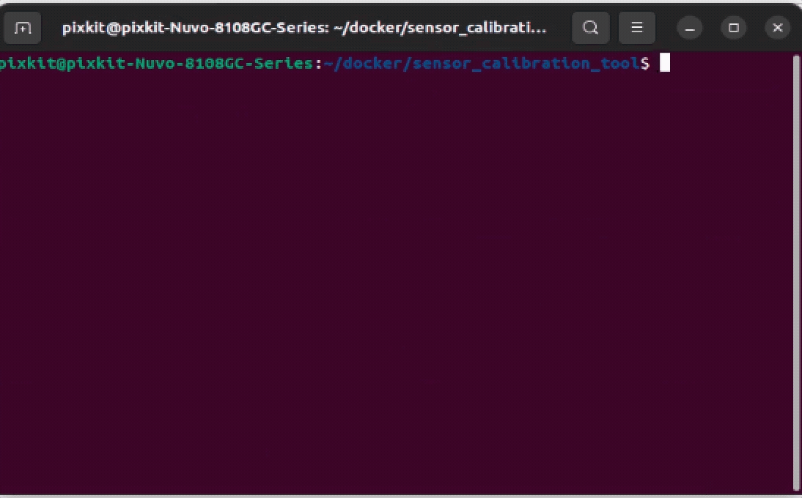

# Installation of Calibration Toolset
> For users who have purchased pixkit, this step has been completed for you. Please proceed directly to [camera intrinsic calibration](./camera-intrisics-calibration.md)
## Overview
Deploy the calibration toolset using docker and source code compilation

The purpose of docker deployment is:

- Collect calibration raw data of the camera and the main LiDAR, with the format of png images and pcd point cloud files

The purpose of source code compilation deployment is:

- Calibrate the collected sensor data

## Prerequisites
- ubuntu22.04
- Linux kernel == 5.19.0-40-generic
- ROS2: Humble


## Installation and Deployment
### Step 1: Docker Deployment - Install Docker
[install docker](https://docs.docker.com/engine/install/ubuntu/)

### Step 2: Docker Deployment - Build Docker Image
- Clone the code repository

- clone Github code repository
```shell
git clone https://github.com/pixmoving-moveit/sensor_calibration_tool.git
cd sensor_calibration_tool
git submodule init
git submodule update
```

- Use Dockerfile in the repository to build a docker image

> ./docker.sh [option]

> option ：

> - build : Compile the dockerfile file and generate a docker image
> - exec : nter the docker container
```shell
./docker.sh build
```



- step-2成功标志
```shell
./docker.sh exec
```



### step-3: Source code deployment - `SensorsCalibration`Calibration tool set
|  Program name   | Program path | Explain
|  ----  | ----  | ----  |
| lidar2camera/manual_calib | SensorsCalibration/lidar2camera/manual_calib/ | LiDAR to the external reference calibration of the camera

- Installation dependency
    - c++14
    - [gflags](https://github.com/gflags/gflags)
    - [jsoncpp](https://github.com/open-source-parsers/jsoncpp)
    - [Pangolin](https://github.com/stevenlovegrove/Pangolin/tree/v0.6) -- branch==v0.6
    - Cmake
    - opencv4
    - eigen 3
    - PCL >= 1.11

- Start compiling

> ./cmake_script/SensorsCalibration_build.sh [build_path]

> build_path If you want to calibrate the `Lidar to Camera`, input the calibration path in the above list.

```shell
# LiDAR-to-camera calibration executable file
./cmake_script/SensorsCalibration_build.sh SensorsCalibration/lidar2camera/manual_calib/
```


- step-3 Signs of success

```shell
# Execute the instruction, as shown in the figure below.
cd ./SensorsCalibration/lidar2camera/manual_calib/
./bin/run_lidar2camera data/0.png data/0.pcd data/center_camera-intrinsic.json data/top_center_lidar-to-center_camera-extrinsic.json
cd -
```


### step-4: Source code deployment - `In-camera reference calibration tool`
- Installation dependency
```shell
sudo apt install ros-$ROS_DISTRO-camera-calibration-parsers
sudo apt install ros-$ROS_DISTRO-camera-info-manager
sudo apt install ros-$ROS_DISTRO-launch-testing-ament-cmake
```

- Start compiling
```
./cmake_script/colcon_build.sh ./calibration_script/camera_intrinsic/workspace/
```


- step-4 Signs of success
```shell
# Instruction execution effect, as shown in the figure below
./calibration_script/camera_intrinsic/test.sh 
```



## NEXT
Now that you have completed the `calibration tool installation`, you can proceed to:
- [camera intrinsic calibration](./camera-intrisics-calibration.md)

## Frequently Asked Questions
### Q1: Error occurs when executing `step-2: docker deployment - build docker image`
- Analysis: Some files were not downloaded successfully due to network issues
- Solution: Repeat `step-2: docker deployment - build docker image` again


