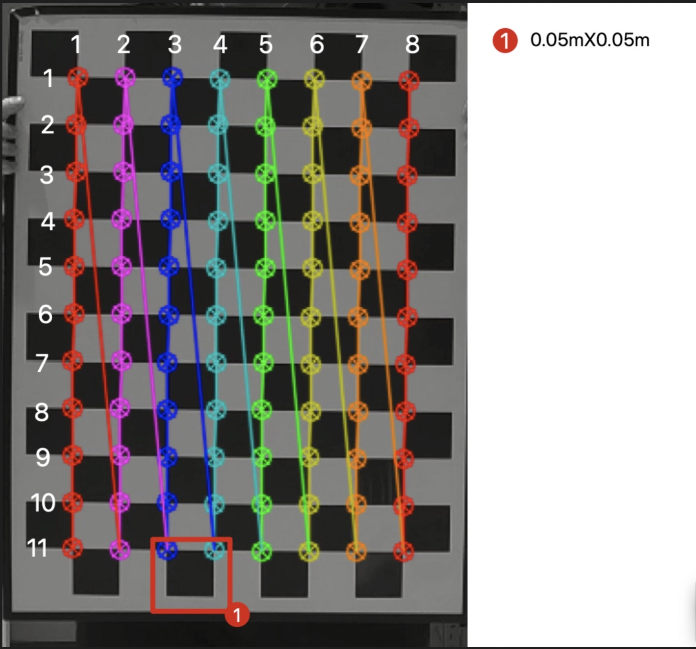
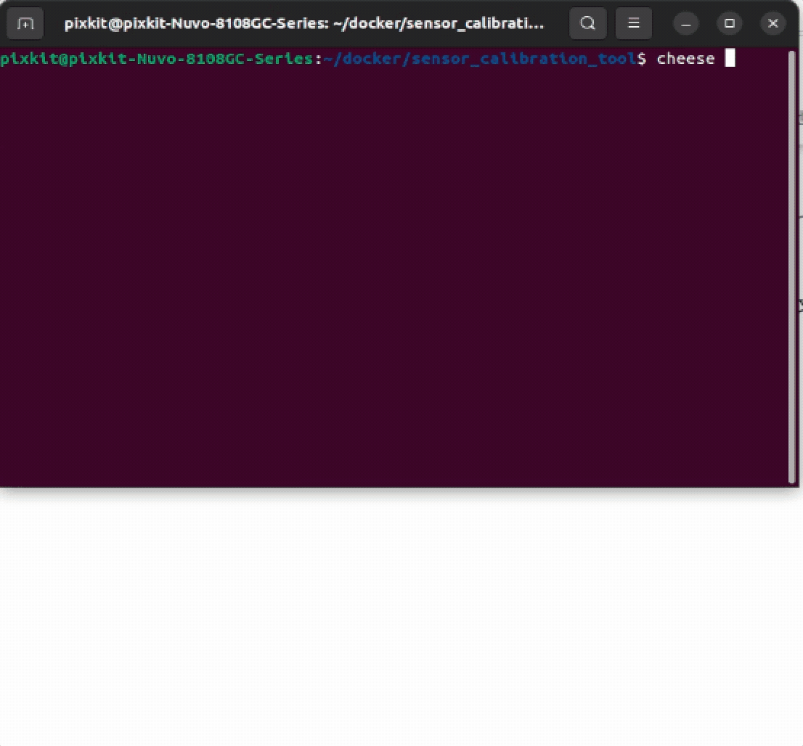
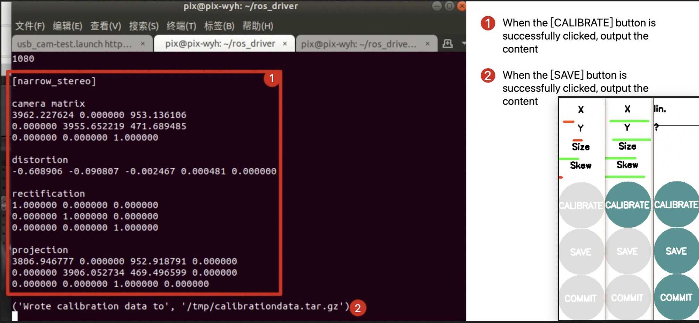

# Camera Intrisics Calibration

## Overview
Camera intrinsic calibration is an important task in computer vision. Its purpose is to determine the intrinsics of the camera, such as the focal length, optical center, and distortion parameters. These intrinsics are key factors in camera imaging, which can affect the quality and geometric shape of the image.

Intrinsic calibration can be completed by shooting a series of images of known objects (such as a chessboard). By analyzing these images, the camera's intrinsic parameters can be derived and saved as camera calibration parameters. Once the camera's intrinsic parameters are known, images can be corrected to eliminate distortion and correct the geometric shape of the image. This can make computer vision algorithms more accurate in analyzing and understanding images.

Camera intrinsic calibration is necessary in many computer vision applications. For example, accurate camera parameters are required in fields such as 3D reconstruction, object tracking, and virtual reality. In addition, intrinsic calibration is also an important task in fields such as robot vision and autonomous driving.

## Prerequisites
- Completed [calibration tool installation](./calibration_tool_installation.md)
- Prepare calibration board
    - 8x11 corner points
    - Small square 0.05m X 0.05mX
    - Material: diffuse aluminum profile


## Start calibration
> Make sure no other program is using the camera, and execute the following steps after restarting the industrial control computer

### step-1: Check if the camera is connected to the industrial control computer

```shell
# Open Ubuntu's built-in camera software `cheese`
cheese
```

> Because the color space of the camera image is different from the default color space of the software, a color error is generated, which does not affect the subsequent operation.



### step-2: Start the calibration program

> Turn off cheese software to prevent the camera from being occupied.

```shell
./calibration_script/camera_intrinsic/run_usb_cam.sh 
```


### step-3: The calibration process

> If the calibration is proficient, the calibration will be completed in 2-3 minutes. 

| Parameter | Description | Button | Description |
| --------- | ----------- | ------ | ----------- |
| X         | The position of the camera's optical center on the X-axis of the image plane | CALIBRATE | Click this button to start calibration |
| Y         | The position of the camera's optical center on the Y-axis of the image plane | SAVE | Click this button to save the calibration result |
| Size      | The scaling factor of the pixel size | COMMIT | Click this button to exit the calibration program |
| Skew      | The non-perpendicular inclination angle of the image plane |         |        |

> The longer the calibration process takes, the longer the program calculation time after clicking the three buttons, so wait for the program after clicking, do not click repeatedly.

- <kbd>CALIBRATE</kbd> button:
    - After the X-Y-Size-Skew four parameters meet the standards, the button will change from gray to green, indicating that it can be clicked.
    - Click this button to start calculating the calibration result, successful flag-terminal output result.
- <kbd>SAVE</kbd> button:
    - After clicking the <kbd>CALIBRATE</kbd> button, the terminal output will change from gray to green, indicating that it can be clicked.
    - Click this button to save the calibration result, successful flag-terminal output result.
- <kbd>COMMIT</kbd> button:
    - After clicking the <kbd>CALIBRATE</kbd> button and the terminal output, the button will change from gray to green, indicating that it can be clicked.
    - Click this button to exit the calibration program, successful flag-terminal output result, program GUI interface exits.




- Calibration of parameter `X`: achieved by moving the calibration board left and right.
- Calibration of parameter `Y`: achieved by moving the calibration board up and down.
- Calibration of parameter `Size`: achieved by flipping the calibration board up and down when it is near the camera.
- Calibration of parameter SKew: achieved by flipping the calibration board up and down and left and right.


### step-4: Verification of successful calibration

> The compressed file `/tmp/calibrationdata.tar.gz` will be output, and the creation time should be the most recent.

> Note: You can make a copy, but please do not move or delete the file.

```shell
ll -h /tmp/calibrationdata.tar.gz
# -rw-rw-r-- 1 pixkit pixkit 0  Apr 14 16:59 /tmp/calibrationdata.tar.gz
```

## NEXT
Now that you have completed `camera intrinsic calibration`, you can proceed to [LiDAR-camera calibration](./LiDAR-camera-calibration.md).