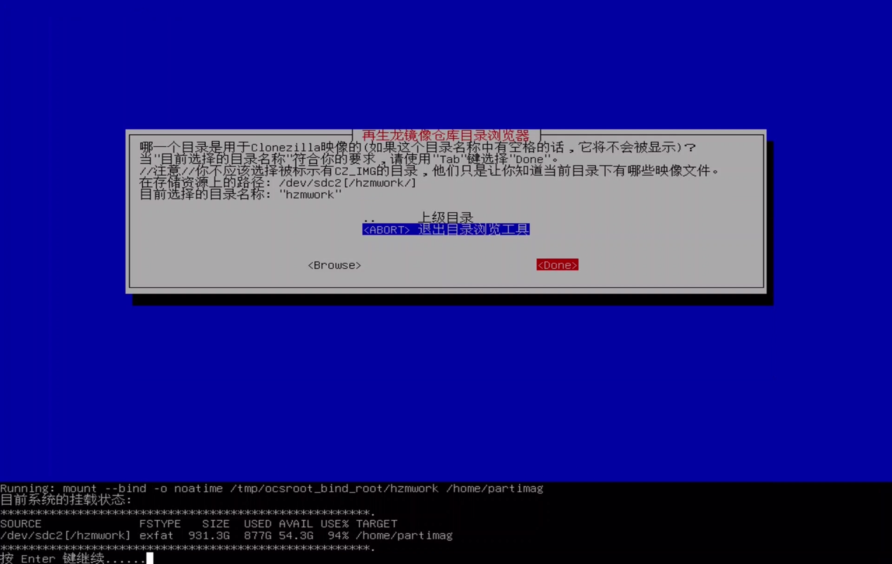

# Backup OS Image

 
> Basic principle: Make a mirror image of the IPC（You need to prepare another hard disk larger than 100g）
> Statement: To prevent the user from installing other drivers in IPC or destroying the system configuration during software, which will result in the inability to run the autopilot and start the driver, the original system can be restored through the backup image (the original image of the system has been attached to the U disk). Users can also back up their own system image, and can use the hard disk to save the image of IPC.

## Prerequisites

- [Clonezilla boot U disk production](https://clonezilla.nchc.org.tw/clonezilla-live/liveusb.php#windows-method-b)

##  To create a backup system image, follow these steps:
### step-1：Insert the USB drive and press F12 during startup (a wired keyboard can be used for this operation) to enter the flashing startup interface.

### step-2：Use hard disk for mirroring（select first）

### step-3：Select the Chinese interface (you can also choose other languages)

### step-4：Keep

### step-5：Start Clonezilla(frist)

### step-6：Save image file to hard disk

### step-7：Select the first one when using a hard disk

### step-8：Insert hard drive

### step-9：When the hard disk is recognized，ctrl+c

### step-10：Select the hard drive just mounted

### step-11：Select the first

### step-12：Select the directory to save

### step-13：Done Enter

### step-14：Default the first option(Beginner)

### step-15：Savedisk 

### step-16：Name the file 

### step-17：Compress storage in zip(zip)  
  
### step-18：Default the first   
  
### step-19：Default the first  
  
### step-20：Default the first  
  
### step-21：Select——poweroff  
   
### step-22：Start copying   
    
### step-23：Wait for the automatic shutdown to complete

**Note**: 1. You need to prepare a hard disk to store your image.
2.The U disk is used as a boot disk, and the user needs to provide a hard disk when it needs to save its own image. Do not make any modifications, add or save other files on the U disk, so as not to damage the environment of the startup disk.
 
## QUOTATION
[Backup Image Video](https://www.youtube.com/watch?v=8-7w5zwD9M4)