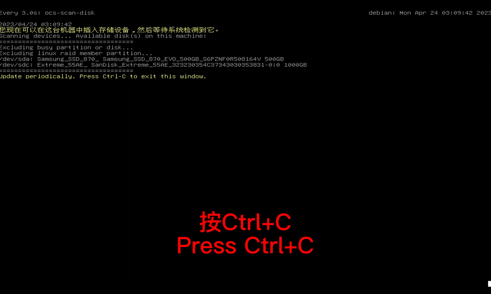

# Flash-OS-image

> Basic principle：Flash the system backup image to IPC
> Statement：When the industrial computer system is damaged, missing files make it impossible to run the autopilot, or the system cannot be entered due to a black screen, you can use a U disk to restore the industrial computer system and restore the factory settings.

## Prerequisites

- [Clonezilla boot U disk production](https://clonezilla.nchc.org.tw/clonezilla-live/liveusb.php#windows-method-b)
- [Backup OS Image](./backup-OS-image.md)

## According to the following steps
### step-1：Insert the USB drive and press F12 during startup (a wired keyboard can be used for this operation) to enter the flashing startup interface.

### step-2：Select the second option when using a USB flash drive to restore the image

### step-3：Select the Chinese interface (you can also choose other languages)

### step-4：Keep

### step-5：Start Clonezilla(frist)

### step-6：The image comes from the USB drive
 
### step-7：Read to U disk(dev/sdb)
 
### step-8：When the hard disk is recognized，ctrl+c
 
### step-9：Select U disk when inserting
 
### step-10：Select the image file in the U disk
 
### step-11：Default the first option(Beginner)

### step-12：Select the third option to restore the image of the U disk to the industrial computer
 
### step-13：Select the image name that needs to be restored    
  
### step-14：System Disk Location
 
### step-15：Check before restore

### step-16：select——poweroff

### step-17：Waiting to read mirror

### step-18：Enter y

### step-19：Wait for the flash (about 10 minutes) 
 
### step-20：The system automatically shuts down - flashing has been completed

**Note**： This U disk is only recommended to restore the image, do not make any modification, add or save other files, so as not to damage the environment of the startup disk.

## QUOTATION
[Clonezilla 再生龍](https://clonezilla.nchc.org.tw/intro/)
[Make Image Video](https://www.youtube.com/watch?v=YEFt2LPSYMk)

