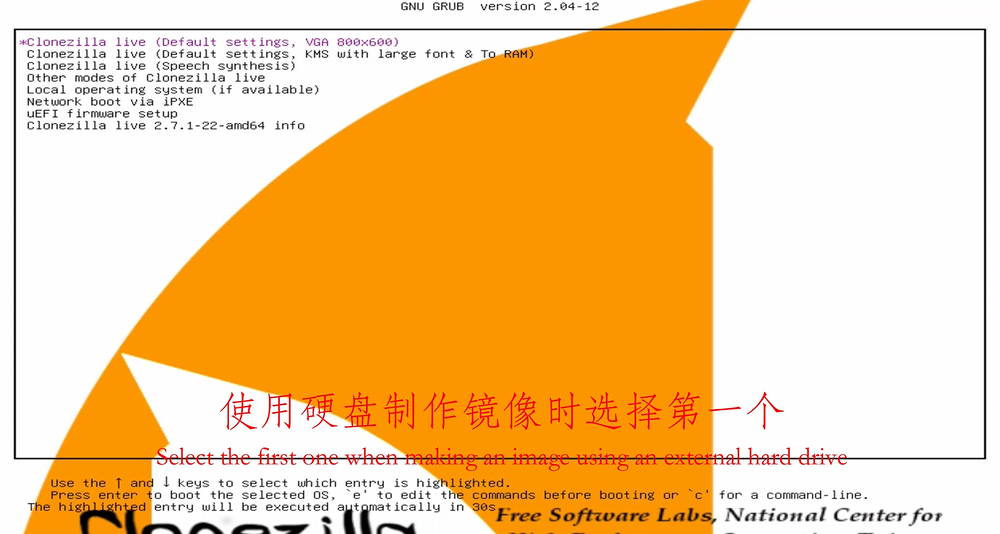
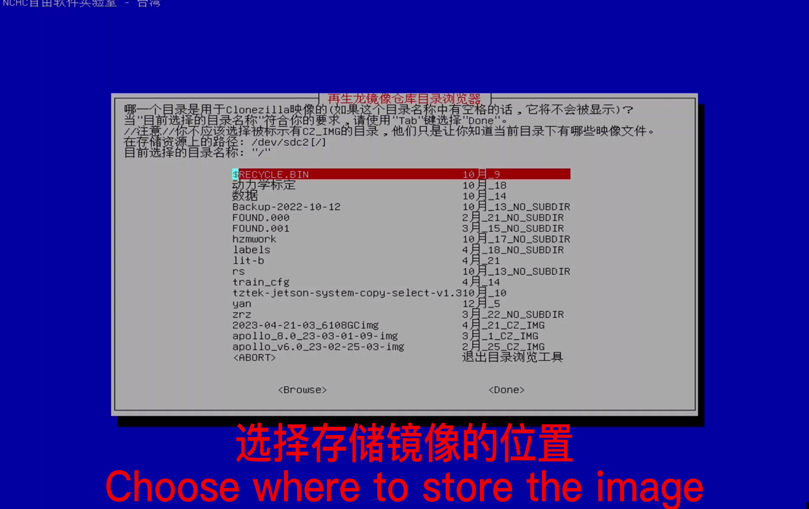
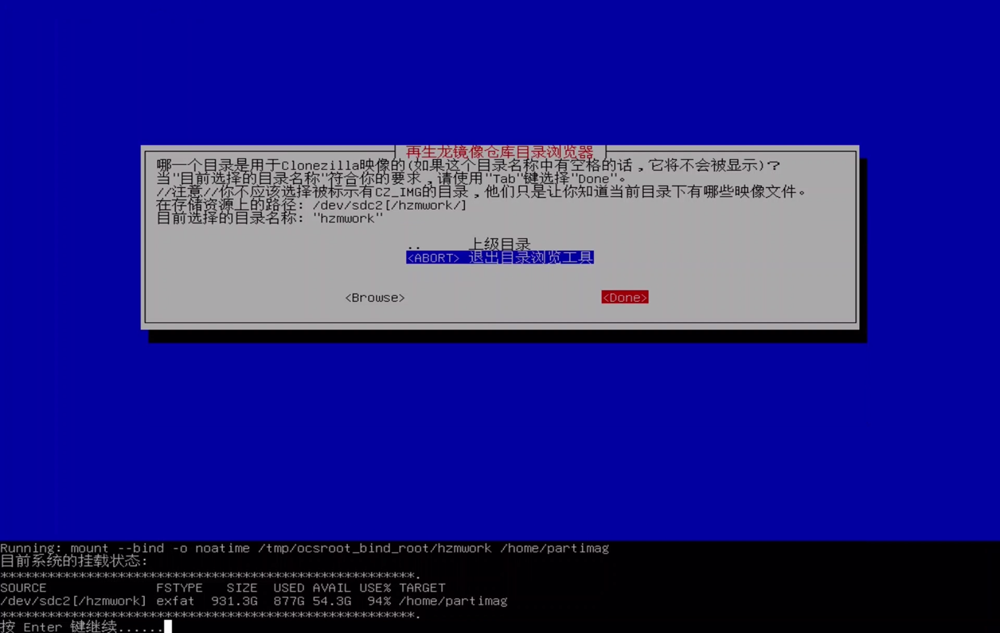
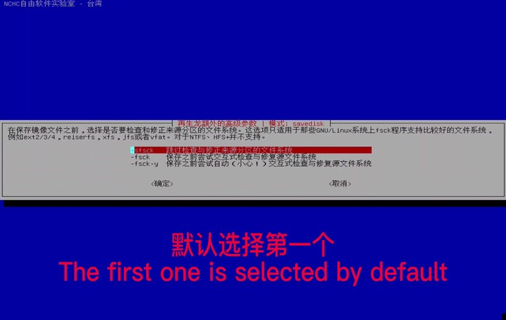
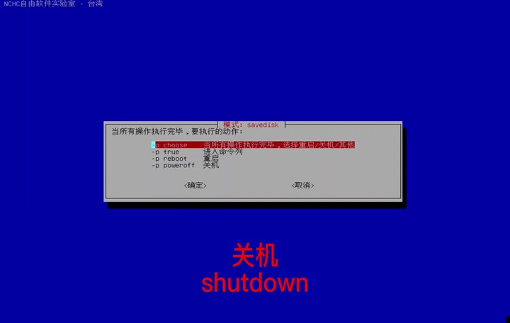

# Backup OS Image

 
> Basic principle: Make a mirror image of the IPC（You need to prepare another hard disk larger than 100g）
> Statement: To prevent the user from installing other drivers in IPC or destroying the system configuration during software, which will result in the inability to run the autopilot and start the driver, the original system can be restored through the backup image (the original image of the system has been attached to the U disk). Users can also back up their own system image, and can use the hard disk to save the image of IPC.
> References：<https://www.youtube.com/watch?v=8-7w5zwD9M4>

##  To create a backup system image, follow these steps:
1.Insert the USB drive and press F12 during startup (a wired keyboard can be used for this operation) to enter the flashing startup interface.

2.Use hard disk for mirroring（select first）

3.Select the Chinese interface (you can also choose other languages)

4.Keep

5.Start Clonezilla(frist)

6.Save image file to hard disk

7.Select the first one when using a hard disk

8.Insert hard drive

9.When the hard disk is recognized，ctrl+c

10.Select the hard drive just mounted

11.Select the first

12.Select the directory to save

13.Done Enter

14.Default the first option(Beginner)

15.Savedisk 

16.Name the file 

17.Compress storage in zip(zip)  
  
18.Default the first   
  
19.Default the first  
  
20.Default the first  
  
21.Select——poweroff  
   
22.Start copying   
   
23.Wait for the automatic shutdown to complete

**Note**: 1. You need to prepare a hard disk to store your image.
2.The U disk is used as a boot disk, and the user needs to provide a hard disk when it needs to save its own image. Do not make any modifications, add or save other files on the U disk, so as not to damage the environment of the startup disk.
 
