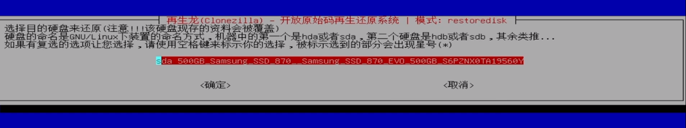
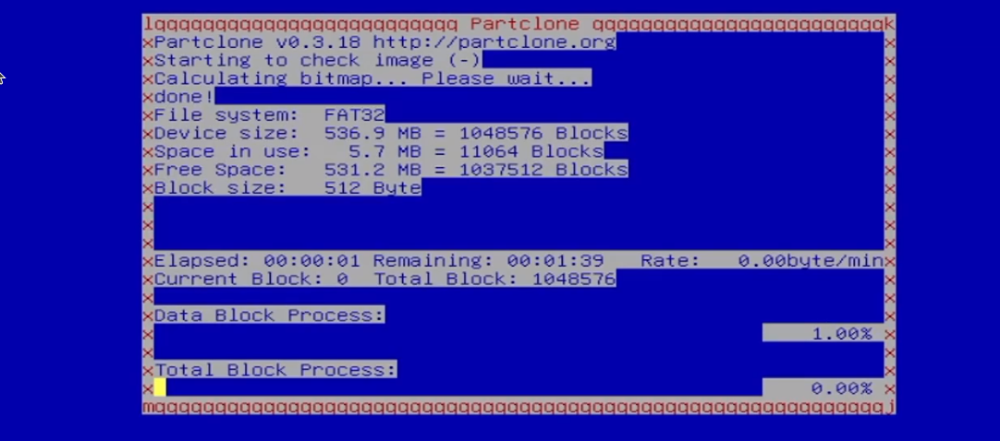

# Flash-OS-image

> Basic principle：Flash the system backup image to IPC
> Statement：When the industrial computer system is damaged, missing files make it impossible to run the autopilot, or the system cannot be entered due to a black screen, you can use a U disk to restore the industrial computer system and restore the factory settings.
> References：<https://www.youtube.com/watch?v=YEFt2LPSYMk>

## According to the following steps
1.Insert the USB drive and press F12 during startup (a wired keyboard can be used for this operation) to enter the flashing startup interface.

2.Select the second option when using a USB flash drive to restore the image

3.Select the Chinese interface (you can also choose other languages)

4.Keep

5.Start Clonezilla(frist)

6.The image comes from the USB drive
 
7.Read to U disk(dev/sdb)
 
8.ctrl+c
 
9.Select U disk when inserting
 
10.Select the image file in the U disk
 
11.Default the first option(Beginner)

12.Select the third option to restore the image of the U disk to the industrial computer
 
13.Select the image name that needs to be restored    
  
14.System Disk Location
 
15.Check before restore

16.select——poweroff

17.Waiting to read mirror

18.Enter y

19.Wait for the flash (about 10 minutes) 
 
20.The system automatically shuts down - flashing has been completed

**Note**： This U disk is only recommended to restore the image, do not make any modification, add or save other files, so as not to damage the environment of the startup disk.

